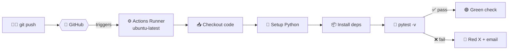
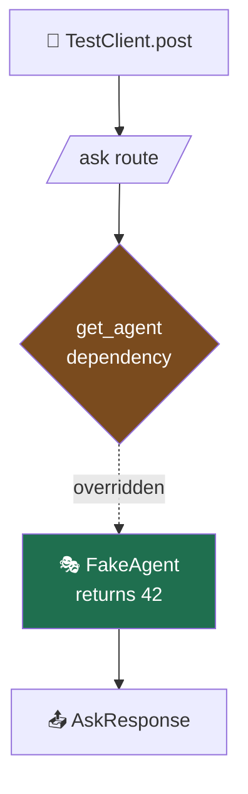
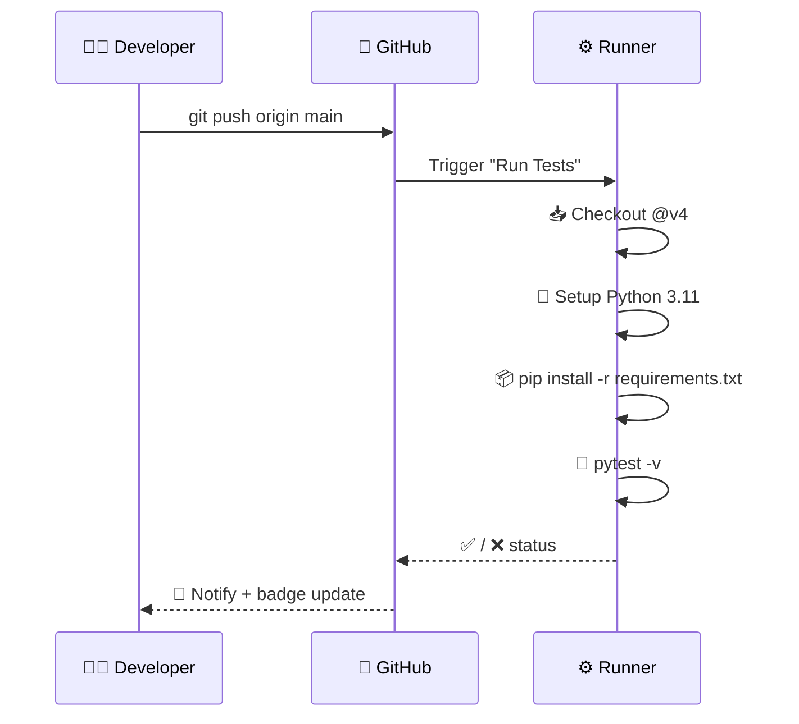

# 🧪 Testing a FastAPI App with a GitHub Actions Pipeline

> A minimal, copy-paste guide to automatically test your API on every push. Built around a FastAPI + LangChain (Groq) `/ask` endpoint. ⚙️

---

## 🗺️ The Big Picture



Every `push` or `pull_request` to `main` spins up a fresh Ubuntu machine, installs your app, and runs the tests. You get a ✅ or ❌ next to your commit automatically.

---

## 📁 Project Structure

```
devops-demo/
├── 📄 main.py                      # FastAPI app
├── 🧪 test_main.py                 # Tests (we add this)
├── 📋 requirements.txt             # Dependencies
└── 📂 .github/
    └── 📂 workflows/
        └── ⚙️ pipeline.yml         # The CI pipeline
```

---

## 1️⃣ The API — `main.py`

A typed FastAPI endpoint that wraps a Groq LLM agent.

```python
from fastapi import FastAPI, Depends
from pydantic import BaseModel
from langchain_groq import ChatGroq
import os

app = FastAPI(title="ReAct Agent API", version="1.0.0")

class AskRequest(BaseModel):
    question: str

class AskResponse(BaseModel):
    answer: str

def get_agent():
    # your Day-7 agent, built once and reused
    return ChatGroq(model="llama-3.3-70b-versatile",
                    api_key=os.environ["GROQ_API_KEY"], temperature=0)

@app.post("/ask", response_model=AskResponse)      # 📍 typed in AND out
async def ask(req: AskRequest, agent=Depends(get_agent)):
    result = agent.invoke(req.question)            # (your ReAct loop here)
    return AskResponse(answer=result.content)
```

> 💡 **Key idea:** `get_agent` is a **dependency** (`Depends`). That means tests can swap it for a fake — no real API calls, no `GROQ_API_KEY` needed to pass tests.

---

## 2️⃣ The Dependencies — `requirements.txt`

```txt
fastapi==0.115.0
uvicorn[standard]==0.30.6
pydantic==2.9.2
langchain-groq==0.2.0
langchain-core==0.3.0
httpx==0.27.2          # 👈 needed by TestClient
pytest==8.3.3          # 👈 the test runner
```

---

## 3️⃣ The Tests — `test_main.py`

FastAPI ships with `TestClient`, so you can hit endpoints **in-process** — no server, no network. We override the agent dependency with a stub so tests are fast, free, and deterministic. 🎯

```python
from fastapi.testclient import TestClient
from main import app, get_agent

# 🎭 Fake agent — mimics ChatGroq's .invoke().content
class FakeResult:
    content = "42"

class FakeAgent:
    def invoke(self, question):
        return FakeResult()

# 🔁 Swap the real Groq agent for the fake one
app.dependency_overrides[get_agent] = lambda: FakeAgent()

client = TestClient(app)

# ✅ Happy path: valid request returns a typed answer
def test_ask_returns_answer():
    resp = client.post("/ask", json={"question": "meaning of life?"})
    assert resp.status_code == 200
    assert resp.json() == {"answer": "42"}

# 🚫 Validation: missing field → 422 Unprocessable Entity
def test_ask_requires_question():
    resp = client.post("/ask", json={})
    assert resp.status_code == 422

# 📐 Schema: response always matches AskResponse
def test_response_shape():
    resp = client.post("/ask", json={"question": "hi"})
    assert list(resp.json().keys()) == ["answer"]
```

### 🧩 How the test isolation works



> ⚡ Because the real `ChatGroq` is never called, tests need **no secrets** and run in milliseconds.

---

## 4️⃣ The Pipeline — `.github/workflows/pipeline.yml`

```yaml
name: Run Tests

on:                        # 🎯 When to run
  push:
    branches: [main]
  pull_request:
    branches: [main]
  workflow_dispatch:       # ▶️ Manual "Run" button

jobs:
  test:
    runs-on: ubuntu-latest
    env:
      GROQ_API_KEY: ${{ secrets.GROQ_API_KEY }}   # 🔐 from repo secrets
    steps:
      - name: 📥 Checkout code
        uses: actions/checkout@v4

      - name: 🐍 Set up Python
        uses: actions/setup-python@v5
        with:
          python-version: "3.11"

      - name: 📦 Install dependencies
        run: |
          python -m pip install --upgrade pip
          pip install -r requirements.txt

      - name: 🧪 Run tests
        run: pytest -v
```

### ⏱️ Pipeline step sequence



---

## 5️⃣ 🔐 Add the Secret (optional)

Even though tests mock the agent, the workflow references `GROQ_API_KEY`. To add it:

`Repo` → ⚙️ **Settings** → 🔒 **Secrets and variables** → **Actions** → **New repository secret**

| Field | Value |
|-------|-------|
| 🏷️ Name | `GROQ_API_KEY` |
| 🔑 Secret | `gsk_your_key_here` |

> 🛡️ Secrets are encrypted and **never** printed in logs.

---

## 6️⃣ 🚀 Run It

```bash
# Run tests locally first 🖥️
pytest -v

# Then push — the pipeline runs automatically ☁️
git add .
git commit -m "test: add API tests + CI"
git push origin main
```

Watch it live under the **▶️ Actions** tab of your repo.

---

## 7️⃣ 🏅 Add a Status Badge

Drop this at the top of your `README.md`:

```markdown

```

Result: a live ✅ / ❌ badge that reflects your latest run.

---

## ✅ Recap

| Step | File | Purpose |
|------|------|---------|
| 1️⃣ | `main.py` | The API with a swappable dependency |
| 2️⃣ | `requirements.txt` | Pin deps (incl. `httpx`, `pytest`) |
| 3️⃣ | `test_main.py` | Fast, mocked, secret-free tests |
| 4️⃣ | `pipeline.yml` | Run tests on every push/PR |
| 5️⃣ | Repo Secret | Store `GROQ_API_KEY` safely |
| 6️⃣ | `git push` | Trigger the pipeline |
| 7️⃣ | Badge | Show build health |

> 🎓 **Takeaway:** Dependency injection (`Depends`) + `TestClient` = tests that run anywhere, instantly, without hitting a real LLM. The pipeline just automates what you'd run locally. 🔁
