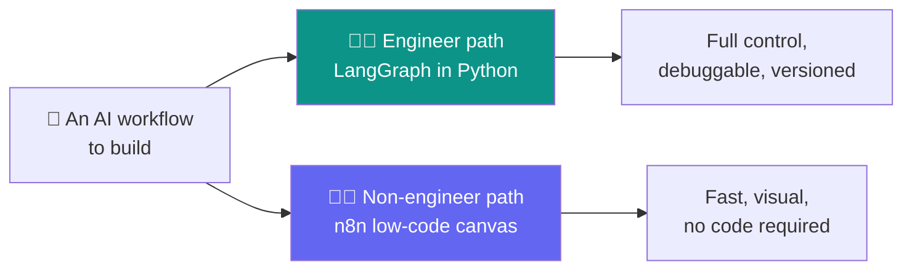
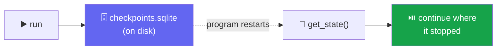
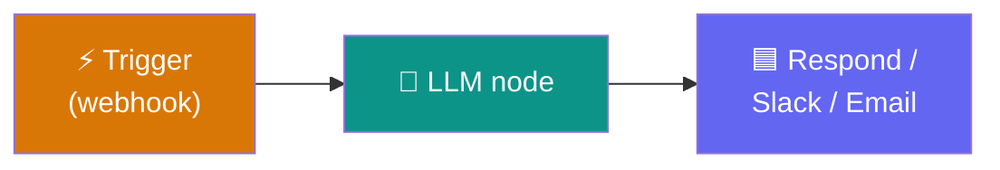
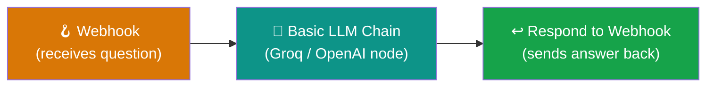
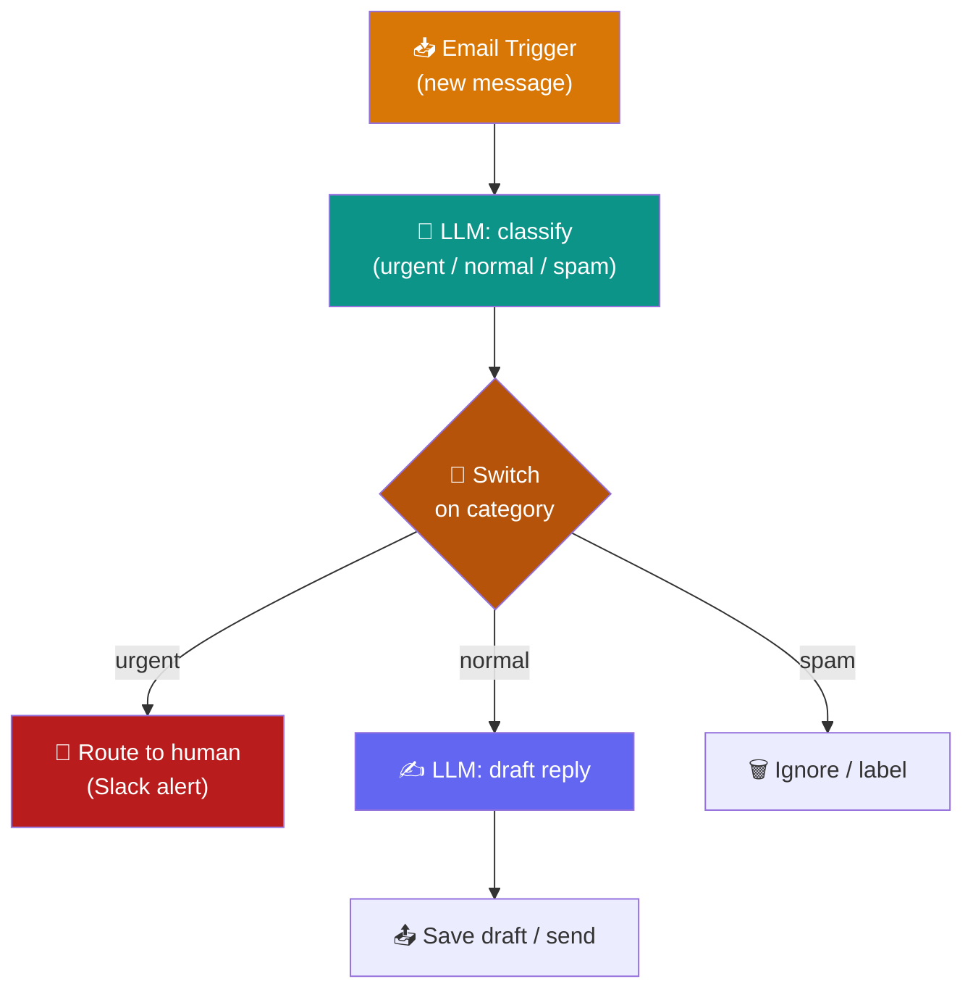

# 🔀 Day 10 — LangGraph Wrap-up + n8n Workflow Automation

### A debuggable agent for engineers, and a low-code AI workflow for everyone else

> **Where we are:** Days 8–9 built multi-agent graphs. Today we finish LangGraph by making an agent **fully debuggable** — saving its state to disk and inspecting exactly what happened — then take a hard turn into **n8n**, the low-code layer that lets *non-engineers* build AI workflows by dragging boxes instead of writing Python.
>
> **Modules:** M6 wrap-up (2h) + M7 start (4h) · **Total: 6 hours** · 3 hands-on sessions
> **LLM backend:** [Groq](https://console.groq.com) · model **`llama-3.3-70b-versatile`** · key in the variable **`API_KEY`**

> [!WARNING]
> ⏳ **Model note (read once):** Groq marked `llama-3.3-70b-versatile` **deprecated** on 17 Jun 2026 — it still runs today but has a scheduled shutdown. Every example works now. If you hit a *"model decommissioned"* error, change **one line** — swap to `openai/gpt-oss-120b`. Nothing else changes.

---

## 📋 Table of Contents

1. [🎯 Two delivery paths: code vs low-code](#-1--two-delivery-paths-code-vs-low-code)
2. [🗣️ Plain-English vocabulary](#️-2--plain-english-vocabulary)
3. [💾 Session 1 — LangGraph checkpointing to disk](#-3--session-1--langgraph-checkpointing-to-disk-m6-wrap-up)
4. [🔎 Session 1 (cont.) — Inspecting what happened](#-4--session-1-cont--inspecting-what-happened)
5. [🧰 Session 2 — n8n: setup & core concepts](#-5--session-2--n8n-setup--core-concepts-m7-start)
6. [🪝 Session 2 (cont.) — Your first useful workflow](#-6--session-2-cont--your-first-useful-workflow)
7. [📧 Session 3 — AI email triage in n8n](#-7--session-3--ai-email-triage-in-n8n-m7)
8. [⚖️ Code vs low-code: when each wins](#️-8--code-vs-low-code-when-each-wins)
9. [🧯 Common errors & fixes](#-9--common-errors--fixes)
10. [🎓 Recap, outcome & cheat sheet](#-10--recap-outcome--cheat-sheet)

---

## 🎯 1 · Two delivery paths: code vs low-code

Everything so far has been **Python**. That's the right tool when you need full control — but most organizations also have people who will *never* open a code editor: analysts, ops staff, marketers. They still need AI automation. 🧑‍💼

Today you learn **both delivery paths** so you can hand the right one to the right person:



- 💾 **Morning (LangGraph):** turn your agent from a *black box* into a *glass box* — persist its state to disk and inspect every step.
- 🧰 **Afternoon (n8n):** build the *same kind* of AI workflow by dragging nodes on a canvas — no Python at all.

> 💡 **The goal isn't "which is better."** It's knowing which path fits the person and the problem. We'll compare them head-to-head in [§8](#️-8--code-vs-low-code-when-each-wins).

---

## 🗣️ 2 · Plain-English vocabulary

| Term | Emoji | Plain meaning | Analogy |
|------|:-----:|---------------|---------|
| **Checkpoint** | 💾 | A saved snapshot of graph state | A save-game file |
| **SqliteSaver** | 🗄️ | A checkpointer that writes to a disk file | The save slot on disk |
| **State history** | 🔎 | The full list of every checkpoint in a run | The replay timeline |
| **Trace** | 🐾 | The step-by-step record of what the agent did | A flight recorder |
| **n8n** | 🧰 | A visual, low-code workflow builder | LEGO for automations |
| **Trigger** | ⚡ | The event that *starts* an n8n workflow | The doorbell |
| **Node** | 🟦 | One box/step in an n8n workflow | One action |
| **Expression** | 🔗 | A `{{ }}` placeholder that pulls data from a prior node | A mail-merge field |

---

## 💾 3 · Session 1 — LangGraph checkpointing to disk (M6 wrap-up)

### 3.1 · From in-memory to on-disk

On Day 8 we used `InMemorySaver` — great, but it **vanishes when the program stops**. To make an agent *truly* resumable across restarts, save checkpoints to a **file** with `SqliteSaver`. Same graph, one line different. 🗄️

```python
!pip install -q langchain langchain-groq langgraph langgraph-checkpoint-sqlite
```

```python
import sqlite3
from langgraph.checkpoint.sqlite import SqliteSaver

# 🗄️ a real file on disk — survives restarts
conn = sqlite3.connect("checkpoints.sqlite", check_same_thread=False)
memory = SqliteSaver(conn)

graph = builder.compile(checkpointer=memory)   # 👈 the only change
```

> ⚠️ **Security note:** if you self-host with the SQLite checkpointer, keep `langgraph-checkpoint-sqlite` at **3.0.1+** (older versions had a patched SQL-injection issue). Never pass raw user input into a state-history *filter*.

### 3.2 · Run, stop, restart, resume

Because state now lives in a file, you can **close the whole program** and still pick up exactly where you left off — just reuse the same `thread_id`.

```python
config = {"configurable": {"thread_id": "session-1"}}

# ▶️ first run (maybe the program stops here)
graph.invoke({"question": "Draft a plan for a science fair"}, config)

# ...restart Python entirely, reconnect the SAME file...
conn = sqlite3.connect("checkpoints.sqlite", check_same_thread=False)
graph = builder.compile(checkpointer=SqliteSaver(conn))

# 🔎 the state is still there
snapshot = graph.get_state(config)
print("Resumed state:", snapshot.values)
```

**✅ What you'll see:** after a full restart, `get_state` returns the saved values — proof the agent's memory now lives on disk, not just in RAM.



---

## 🔎 4 · Session 1 (cont.) — Inspecting what happened

A black-box agent is a nightmare to debug. Checkpointing gives you a **trace**: every step it took, in order. `get_state_history()` walks the full timeline. 🐾

```python
# 🐾 every checkpoint, newest first
for snap in graph.get_state_history(config):
    step = snap.metadata.get("step")
    nxt  = snap.next            # which node runs next
    print(f"step {step} · next={nxt} · keys={list(snap.values)}")
```

**✅ What you'll see:** a numbered list of every state the graph passed through — you can pinpoint *exactly* which step changed which value, and where things went wrong.

> 💡 **This is the whole point of the morning.** The faculty leave with a **debuggable agent, not a black box.** In production, teams pipe this same trace data into a dashboard (LangSmith-style) to watch every agent run — but the trace itself is already right here in `get_state_history()`.

### 4.1 · Time-travel debugging (bonus)

Each snapshot has a `config` you can pass back to **resume from that exact point** — rerun from step 3 instead of the start. That's "time travel," and it falls out of checkpointing for free. ⏪

```python
history = list(graph.get_state_history(config))
old = history[2]                              # some earlier checkpoint
graph.invoke(None, old.config)                # ⏪ replay from there
```

---

## 🧰 5 · Session 2 — n8n: setup & core concepts (M7 start)

### 5.1 · What is n8n, really?

> **n8n** (say "n-eight-n") is an open-source, visual workflow builder. You drag **nodes** onto a canvas and connect them with lines. Data flows left to right. It has ~70 built-in **AI/LangChain nodes**, so you can build agentic workflows **without writing Python.** 🧱

Three concepts run everything:

| Concept | Emoji | What it does |
|---------|:-----:|--------------|
| **Trigger** | ⚡ | Starts the workflow (a webhook call, a schedule, a new email) |
| **Node** | 🟦 | One step — call an LLM, send a Slack message, transform data |
| **Expression** | 🔗 | `{{ $json.field }}` pulls data from a previous node into this one |



### 5.2 · Getting n8n running with `npx` ⭐

The fastest way to start — **one command, nothing to install permanently.** You only need [Node.js](https://nodejs.org) (v18 or newer) on your machine.

```bash
npm install n8n -g
n8n
```

That's it. 🎉 `npx` downloads n8n, runs it, and prints something like:

```text
Editor is now accessible via:
http://localhost:5678/
```

Open **http://localhost:5678** in your browser and you'll see the n8n canvas. 🖼️

**What just happened?**

| Piece | 🔍 What it does |
|-------|-----------------|
| `npx` | Node's "run a package without installing it" tool |
| `n8n` | The package it fetches and runs |
| First run | Downloads n8n (takes a minute), then starts the editor |
| Later runs | Much faster — it's cached |

> 💡 **Your workflows are safe.** Even though `npx` doesn't "install" n8n, your workflows and credentials are saved to a folder called `~/.n8n` in your home directory. Stop the server with **Ctrl+C**, run `npx n8n` again tomorrow, and everything is still there. ✅

**Useful variations:**

```bash
npx n8n                  # ▶️ just start it
npx n8n@latest           # ⬆️ force the newest version
npx n8n start --tunnel   # 🌍 start with a public webhook URL (see below)
```

> ⚠️ **Keep the terminal open.** n8n runs *in* that terminal window. Close it (or press Ctrl+C) and the server stops. Reopen with `npx n8n`.

#### 🌍 The localhost problem (and the `--tunnel` fix)

Your n8n is at `http://localhost:5678`. That address means *"this computer"* — so an outside service (Slack, Stripe, a webhook from a friend) **cannot reach it**. 🚫

For **Session 2's webhook**, you'll test with `curl` from your own machine, so plain `npx n8n` works fine. But the moment you want an *external* service to call your workflow, run:

```bash
npx n8n start --tunnel
```

n8n then prints a **public URL** that forwards to your laptop. Use that for testing only — never production. 🔒

#### Other ways to run n8n (for reference)

- ☁️ **n8n Cloud** — sign up at [n8n.io](https://n8n.io). No install, public webhook URLs included. Best for non-technical colleagues.
- 🐳 **Docker** — for long-running/self-hosted setups:
  ```bash
  docker run -it --rm -p 5678:5678 -v ~/.n8n:/home/node/.n8n docker.n8n.io/n8nio/n8n
  ```

> 🎯 **For this workshop, `npx n8n` is all you need.** It's the shortest path from zero to a working canvas.

### 5.3 · The n8n mental model vs LangGraph

You already know this shape! n8n's **trigger → nodes → response** is the *same idea* as LangGraph's **START → nodes → END** — just drawn on a canvas instead of written in code. 🔁

| LangGraph (code) | n8n (low-code) |
|------------------|----------------|
| `START` | ⚡ Trigger node |
| a node function | 🟦 a node on the canvas |
| `state["x"]` | 🔗 `{{ $json.x }}` expression |
| `add_edge(a, b)` | drawing a line a → b |

---

## 🪝 6 · Session 2 (cont.) — Your first useful workflow

**Goal:** a webhook that receives a question, asks the LLM, and returns the answer — an instant AI API endpoint, zero Python. 🪝

### 6.1 · Build it in 4 nodes



**Step by step:**

1. ⚡ **Add a Webhook node.** Set method to **POST**. n8n gives you a **Test URL** and a **Production URL**. Click **Listen for test event**.
2. 🤖 **Add a Basic LLM Chain node** (or the AI Agent node). Attach a **Chat Model** sub-node and pick your provider (Groq, OpenAI, etc.). In the prompt, reference the incoming question with an **expression**:
   ```
   Answer this clearly: {{ $json.body.question }}
   ```
3. ↩️ **Add a "Respond to Webhook" node** and set its body to the LLM's output:
   ```
   {{ $json.text }}
   ```
4. ▶️ **Test it.** Send a request to the Test URL:
   ```bash
   curl -X POST "<YOUR_TEST_WEBHOOK_URL>" \
     -H "Content-Type: application/json" \
     -d '{"question": "What is n8n in one sentence?"}'
   ```

**✅ What you'll see:** the LLM's answer comes straight back in the `curl` response. You just built an AI endpoint by connecting 3 boxes. 🎉

> 💡 **Test vs Production URL:** the Test URL shows live data in the editor (great for debugging) but expires after ~120 seconds of listening. When it works, **publish** the workflow and switch to the **Production URL**.

---

## 📧 7 · Session 3 — AI email triage in n8n (M7)

Now the real-world payoff: a workflow that **reads incoming emails, classifies them, drafts replies, and routes urgent ones to a human** — the kind of automation a support team actually wants. And still **no Python.** 🎯

### 7.1 · The flow



### 7.2 · Build it, node by node

1. 📥 **Email Trigger node** (Gmail/IMAP) — fires on each new email. The email's subject and body arrive as `{{ $json.subject }}` and `{{ $json.text }}`.
2. 🤖 **LLM node — classify.** Prompt it to return a category:
   ```
   Classify this email as exactly one word — urgent, normal, or spam:
   Subject: {{ $json.subject }}
   Body: {{ $json.text }}
   ```
3. 🔀 **Switch node** — reads the classification and sends the flow down one of three branches (the low-code version of a **conditional edge** from Day 8!).
4. 🙋 **Urgent → Slack node:** post an alert to your team's channel for **human review**.
5. ✍️ **Normal → LLM node:** draft a polite reply using the email body, then a **Gmail node** saves it as a draft (or sends).
6. 🗑️ **Spam →** label and stop.

**✅ What you'll see:** send yourself a test email and watch it flow through — classified, then either drafted, escalated, or dropped, all automatically.

> 💡 **Notice the parallels to Days 8–9:** the Switch node *is* a conditional edge. The human-review branch *is* human-in-the-loop. You already understand the architecture — n8n just makes it clickable for non-engineers. 🧩

### 7.3 · Bonus: the "watch a folder, summarize, Slack it" flow

A second classic, built the same way: a **trigger** watches a folder for new PDFs → an **LLM node** summarizes each one → a **Slack node** posts the summary. Three nodes, enormous time savings. 📄→💬

---

## ⚖️ 8 · Code vs low-code: when each wins

Same task, two ways. Neither is "better" — they fit different people and problems.

| | 🧑‍💻 Pure code (LangGraph) | 🧰 Low-code (n8n) |
|---|---------------------------|-------------------|
| 👥 Who builds it | Engineers | Anyone (ops, analysts) |
| ⚡ Speed to first version | Slower (write + wire) | Very fast (drag nodes) |
| 🎛️ Control & flexibility | Total | Bounded by available nodes |
| 🔧 Custom logic | Anything Python can do | Needs a Code node for the tricky bits |
| 🧪 Version control / testing | Git, unit tests, CI | Harder (visual, export JSON) |
| 🔌 Integrations | You write them | 400+ built-in |
| 🐛 Debugging | Full traces, checkpoints | Visual run data per node |

> 🎯 **The judgment:**
> - **Low-code wins** for standard "connect A to B with an LLM in the middle" automations that non-engineers own — email triage, notifications, file processing.
> - **Code wins** when you need custom logic, tight control, rigorous testing, or complex multi-agent orchestration — the stuff from Days 8–9.
> - **They combine:** many teams prototype in n8n, then drop into a **Code node** (or call a LangGraph service via HTTP) for the hard 10%.

---

## 🧯 9 · Common errors & fixes

| 😱 Symptom | 🔎 Cause | ✅ Fix |
|-----------|----------|--------|
| `get_state` empty after restart | Different DB file or `thread_id` | Reconnect the **same** `.sqlite` file + same `thread_id` |
| `database is locked` (SQLite) | Concurrent access | Add `check_same_thread=False`; for real load use Postgres |
| `npx n8n` → "command not found" | Node.js not installed | Install Node.js v18+ from [nodejs.org](https://nodejs.org) |
| n8n stops when I close the terminal | It runs *in* that terminal | Keep it open; restart with `npx n8n` |
| n8n webhook "not registered" | Workflow in test mode / not published | Click **Listen for test event**, or publish for the Production URL |
| Webhook works in editor, not live | Using the Test URL in production | Switch to the **Production URL** and publish |
| External service can't reach localhost | n8n on `localhost` | Run `npx n8n start --tunnel` or use n8n Cloud |
| Lost my workflows after restart | Looking in the wrong place | They're in `~/.n8n` — they persist across `npx` runs |
| Expression returns blank | Wrong path into prior node's JSON | Check the node's output panel; fix `{{ $json.… }}` path |
| `model decommissioned` | Groq deprecated the model | Switch to `openai/gpt-oss-120b` |

> 💡 **n8n debugging tip:** click any node after a run to see its **exact input and output JSON**. It's the visual equivalent of `print(state)` — the fastest way to fix a broken expression.

---

## 🎓 10 · Recap, outcome & cheat sheet

You now command **both** delivery paths. 🏆

- 💾 **`SqliteSaver`** — persist graph state to a disk file that survives restarts.
- 🔎 **`get_state()` / `get_state_history()`** — inspect the full trace; debug, don't guess.
- ⏪ **Time travel** — resume from any past checkpoint using its `config`.
- 🧰 **n8n** — visual, low-code AI workflows: **trigger → nodes → response**.
- 🔗 **Expressions** — `{{ $json.field }}` pipes data between nodes.
- 🔀 **Switch node** = conditional edge · **human branch** = human-in-the-loop (same ideas, clickable).
- ⚖️ **Choose deliberately** — low-code for standard automations owned by non-engineers; code for control, testing, and complex orchestration.

### 📋 Cheat sheet

```python
# 💾 LANGGRAPH: PERSIST TO DISK
import sqlite3
from langgraph.checkpoint.sqlite import SqliteSaver
conn = sqlite3.connect("checkpoints.sqlite", check_same_thread=False)
graph = builder.compile(checkpointer=SqliteSaver(conn))

config = {"configurable": {"thread_id": "session-1"}}
graph.invoke(inputs, config)                 # runs + auto-saves
graph.get_state(config)                       # 🔎 current state
list(graph.get_state_history(config))         # 🐾 full trace
```

```bash
# 🧰 N8N: START IT
npx n8n                  # → open http://localhost:5678
npx n8n start --tunnel   # → public URL for external webhooks
# workflows persist in ~/.n8n  ·  stop with Ctrl+C
```

```text
🧰 N8N: THE FIRST WORKFLOW
⚡ Webhook (POST)  →  🤖 Basic LLM Chain  →  ↩️ Respond to Webhook
    prompt:  Answer this: {{ $json.body.question }}
    test with:  curl -X POST <TEST_URL> -d '{"question":"..."}'
    then publish → use the Production URL
```

### 🎯 Day 10 Outcome
> **Faculty have a complete, debuggable LangGraph agent on one side, and a low-code AI workflow on the other** — covering both the engineer and non-engineer delivery paths, so they can hand the right tool to the right person.

### 🚀 Next — Day 11: Retrieval-Augmented Generation (RAG)
> We give both paths *memory of documents* — connecting agents and n8n flows to vector stores so they can answer from your own knowledge base with cited sources. 📚
