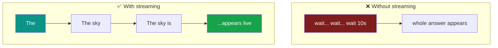
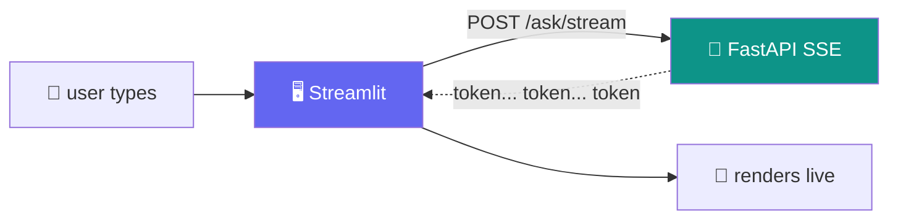
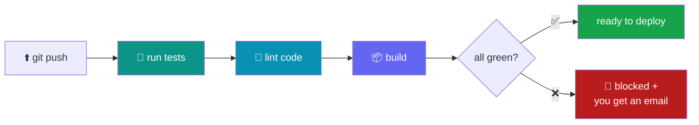

# 🚀 Day 11 — Production AI Services with FastAPI & Streamlit

### From "it works on my laptop" to "it serves users"

> **Where we are:** You've built agents, graphs, and workflows. But they all live in a notebook on *your* machine. Today we wrap them in a real **backend** (FastAPI), give them a real **frontend** (Streamlit) with live token streaming, and set up **CI/CD** (GitHub Actions) — plus the production hygiene that separates a demo from a service people can actually use.
>
> **Module:** M7 · **Total: 6 hours** · 3 hands-on sessions
> **LLM backend:** [Groq](https://console.groq.com) · model **`llama-3.3-70b-versatile`** · key in the variable **`API_KEY`**

> [!WARNING]
> ⏳ **Model note (read once):** Groq marked `llama-3.3-70b-versatile` **deprecated** on 17 Jun 2026 — it still runs today but has a scheduled shutdown. Every example works now. If you hit a *"model decommissioned"* error, change **one line** — swap to `openai/gpt-oss-120b`. Nothing else changes.

---

## 📋 Table of Contents

1. [🎯 What "ready for users" actually means](#-1--what-ready-for-users-actually-means)
2. [🗣️ Plain-English vocabulary](#️-2--plain-english-vocabulary)
3. [⚙️ Setup](#️-3--setup)
4. [🔌 Session 1 — FastAPI fundamentals](#-4--session-1--fastapi-fundamentals)
5. [🤖 Session 1 (cont.) — Wrap the ReAct agent in `POST /ask`](#-5--session-1-cont--wrap-the-react-agent-in-post-ask)
6. [🌊 Session 2 — Streaming responses (SSE)](#-6--session-2--streaming-responses-sse)
7. [🖥️ Session 2 (cont.) — A Streamlit front-end](#️-7--session-2-cont--a-streamlit-front-end)
8. [🔁 Session 3 — GitHub Actions CI/CD](#-8--session-3--github-actions-cicd)
9. [🛡️ Session 3 (cont.) — Production hygiene](#️-9--session-3-cont--production-hygiene)
10. [💥 Things that go wrong in production](#-10--things-that-go-wrong-in-production)
11. [🧯 Common errors & fixes](#-11--common-errors--fixes)
12. [🎓 Recap, outcome & cheat sheet](#-12--recap-outcome--cheat-sheet)

---

## 🎯 1 · What "ready for users" actually means

A notebook that prints an answer is a **demo**. A *service* is something a stranger can call, that stays up, tells you when it breaks, and doesn't leak your API key or bankrupt you. The gap between the two is today's whole lesson. 🌉


The four things that turn code into a service:

- 🔌 **A clean API** — a documented `POST /ask` anyone can call, with typed inputs and outputs.
- 🌊 **Streaming** — tokens appear as they're generated, so a 10-second answer *feels* instant.
- 🔁 **CI/CD** — every code change is automatically tested and built before it ships.
- 🛡️ **Hygiene** — logs, request IDs, secret handling, and cost awareness, so you can *operate* it.

> 💡 **Day 11 outcome:** you leave with a **production-shaped AI service** — proper API, streaming UI, basic CI/CD — and a real sense of what "ready for users" means.

---

## 🗣️ 2 · Plain-English vocabulary

| Term | Emoji | Plain meaning | Analogy |
|------|:-----:|---------------|---------|
| **FastAPI** | 🔌 | A Python framework for building web APIs | The kitchen that takes orders |
| **Endpoint** | 📍 | One URL your API answers (e.g. `/ask`) | A item on the menu |
| **Pydantic model** | 📦 | A typed shape for request/response data | An order form |
| **async** | ⚡ | Code that can wait without blocking others | A waiter serving many tables |
| **SSE** | 🌊 | Server-Sent Events — server pushes data in pieces | A ticker tape |
| **Streamlit** | 🖥️ | Turn a Python script into a web UI, fast | A no-fuss storefront |
| **CI/CD** | 🔁 | Auto-test & build on every code push | A quality checkpoint |
| **Secret** | 🔑 | A credential (API key) kept out of code | A key in a safe, not on the door |

---

## ⚙️ 3 · Setup

Today runs on your **own machine or a cloud VM** (not a notebook) — a real service needs a real server process. In a terminal:

```bash
pip install fastapi "uvicorn[standard]" streamlit requests \
            groq langchain langchain-groq python-dotenv sse-starlette
```

Store your key in a **`.env` file** (never in code):

```bash
# .env
GROQ_API_KEY=gsk_your_key_here
```

Load it in Python:

```python
import os
from dotenv import load_dotenv
load_dotenv()                       # reads .env
API_KEY = os.environ["GROQ_API_KEY"]
```

> 🔑 **The golden rule of secrets:** the key lives in `.env`, and `.env` goes in `.gitignore`. It must **never** reach GitHub. We'll come back to this in [§9](#️-9--session-3-cont--production-hygiene).

---

## 🔌 4 · Session 1 — FastAPI fundamentals

### 4.1 · Your first endpoint

**FastAPI** turns a Python function into a web endpoint. Save this as `main.py`:

```python
from fastapi import FastAPI

app = FastAPI(title="AI Service", version="1.0.0")

@app.get("/health")          # 📍 a GET endpoint at /health
def health():
    return {"status": "ok"}
```

Run it:

```bash
uvicorn main:app --reload    # --reload = restart on code change
```

Open **http://localhost:8000/health** → you'll see `{"status":"ok"}`. 🎉
Now open **http://localhost:8000/docs** → 🤯 **FastAPI auto-generated interactive API docs** (an OpenAPI spec) for free.

> 💡 **That free `/docs` page is a big deal.** Anyone integrating with your service gets a live, try-it-in-the-browser reference without you writing a word of documentation.

### 4.2 · Typed requests & responses with Pydantic

Real endpoints receive and return *structured* data. **Pydantic models** (from Day 7!) define the exact shape — and FastAPI validates it automatically. ✅

```python
from pydantic import BaseModel

# 📦 the shape of the incoming request
class AskRequest(BaseModel):
    question: str
    max_steps: int = 5          # optional, with a default

# 📦 the shape of the response we promise to return
class AskResponse(BaseModel):
    answer: str
    steps_used: int
```

If a caller sends the wrong type (say, a number where text is expected), FastAPI rejects it with a clear `422` error **before your code ever runs.** No manual validation. 🛡️

### 4.3 · async & dependency injection (the two power tools)

- ⚡ **`async def`** lets one server handle many requests at once. While one request waits on the LLM, others get served. Use it for anything that waits on the network.
- 🧩 **Dependency injection** — `Depends()` supplies shared resources (a model client, an API key check) to any endpoint that asks, without global variables.

```python
from fastapi import Depends
from langchain_groq import ChatGroq

def get_llm():                         # 🧩 a dependency
    return ChatGroq(model="llama-3.3-70b-versatile",
                    api_key=API_KEY, temperature=0)

@app.post("/echo")
async def echo(req: AskRequest, llm=Depends(get_llm)):
    reply = llm.invoke(req.question).content
    return {"answer": reply}
```

---

## 🤖 5 · Session 1 (cont.) — Wrap the ReAct agent in `POST /ask`

Now the payoff: take the **Day-7 ReAct agent** and expose it as a clean, documented endpoint. Anyone — a web app, a mobile app, a `curl` command — can now use your agent. 🎯

```python
from fastapi import FastAPI, Depends
from pydantic import BaseModel
from langchain_groq import ChatGroq
import os

app = FastAPI(title="ReAct Agent API", version="1.0.0")

class AskRequest(BaseModel):
    question: str

class AskResponse(BaseModel):
    answer: str

def get_agent():
    # your Day-7 agent, built once and reused
    return ChatGroq(model="llama-3.3-70b-versatile",
                    api_key=os.environ["GROQ_API_KEY"], temperature=0)

@app.post("/ask", response_model=AskResponse)      # 📍 typed in AND out
async def ask(req: AskRequest, agent=Depends(get_agent)):
    result = agent.invoke(req.question)             # (your ReAct loop here)
    return AskResponse(answer=result.content)
```

Test it from another terminal:

```bash
curl -X POST http://localhost:8000/ask \
  -H "Content-Type: application/json" \
  -d '{"question": "What is 47 * 89?"}'
```

**✅ What you'll see:** a clean JSON answer — and the same endpoint is now documented and testable at `/docs`. Your laptop agent just became a callable service. 🚀


---

## 🌊 6 · Session 2 — Streaming responses (SSE)

### 6.1 · Why streaming changes everything

A full answer might take 10 seconds. If the user stares at a spinner the whole time, it feels broken. **Streaming** sends each token *the moment it's generated*, so words appear live — the same trick that makes ChatGPT and Claude feel fast. The total time is identical; the *perceived* latency is dramatically better. ⚡



### 6.2 · A streaming endpoint

The mechanism is a **`StreamingResponse`** fed by an **async generator** that `yield`s tokens. We set the media type to `text/event-stream` (that's SSE — Server-Sent Events).

```python
from fastapi.responses import StreamingResponse
from langchain_groq import ChatGroq

def get_agent():
    return ChatGroq(model="llama-3.3-70b-versatile",
                    api_key=os.environ["GROQ_API_KEY"], temperature=0)

async def token_stream(question: str):
    llm = get_agent()
    # 🌊 .stream() yields chunks as the model produces them
    for chunk in llm.stream(question):
        text = chunk.content
        if text:
            yield f"data: {text}\n\n"      # SSE format: 'data: ...\n\n'
    yield "data: [DONE]\n\n"               # a sentinel so the client knows we're finished

@app.post("/ask/stream")
async def ask_stream(req: AskRequest):
    return StreamingResponse(
        token_stream(req.question),
        media_type="text/event-stream",    # 🌊 the SSE content type
    )
```

**✅ What you'll see:** hitting this endpoint returns tokens one chunk at a time, each as a `data:` line, ending with `[DONE]`.

> 💡 **The SSE format is dead simple:** each message is `data: <your text>` followed by a **blank line** (`\n\n`). The client reads lines until it sees your `[DONE]` sentinel. That's the entire protocol.

> ⚠️ **Two production gotchas:** (1) behind Nginx, add the header `X-Accel-Buffering: no` or events get buffered and arrive all at once. (2) Use `async def` so one slow stream doesn't block every other request.

---

## 🖥️ 7 · Session 2 (cont.) — A Streamlit front-end

**Streamlit** turns a plain Python script into a web app — no HTML, CSS, or JavaScript. We'll build a chat box that calls the streaming API and renders tokens as they arrive. Save as `app.py`:

```python
import streamlit as st
import requests

st.title("🤖 Ask the Agent")

question = st.text_input("Your question:")

if st.button("Ask") and question:
    # 🌊 stream=True keeps the connection open for chunks
    resp = requests.post(
        "http://localhost:8000/ask/stream",
        json={"question": question},
        stream=True,
    )

    placeholder = st.empty()          # a spot we'll keep re-filling
    answer = ""
    for line in resp.iter_lines():
        if line and line.startswith(b"data: "):
            token = line[6:].decode()     # strip the 'data: ' prefix
            if token == "[DONE]":
                break
            answer += token
            placeholder.markdown(answer)  # 🖥️ re-render live as tokens arrive
```

Run it (in a second terminal, with the API still running):

```bash
streamlit run app.py
```

**✅ What you'll see:** a browser opens with a chat box. Type a question, and the answer **types itself out live**, token by token. That's a real streaming AI UI — in ~20 lines. 🎉

> 💡 **Modern Streamlit shortcut:** `st.write_stream(generator)` renders a streaming generator automatically. The manual `placeholder.markdown()` loop above shows what's happening under the hood — useful to understand, even if you later use the shortcut.



---

## 🔁 8 · Session 3 — GitHub Actions CI/CD

### 8.1 · What CI/CD is, in one breath

> **CI/CD** = every time you push code to GitHub, a robot automatically **runs your tests, lints your code, and prepares a build** — *before* the change is allowed to ship. It catches mistakes so users never see them. 🤖

You define this robot in a single **YAML file** inside your repo at `.github/workflows/ci.yml`.



### 8.2 · The workflow file

```yaml
# .github/workflows/ci.yml
name: CI

on: [push, pull_request]          # 🔔 run on every push and PR

jobs:
  test:
    runs-on: ubuntu-latest
    steps:
      - uses: actions/checkout@v4          # 📥 grab the code
      - uses: actions/setup-python@v5      # 🐍 install Python
        with:
          python-version: "3.12"
      - run: pip install -r requirements.txt
      - run: ruff check .                  # 🎨 lint
      - run: pytest -q                     # 🧪 test
```

### 8.3 · A tiny test to run

CI needs something to check. A minimal `test_api.py` using FastAPI's built-in test client:

```python
from fastapi.testclient import TestClient
from main import app

client = TestClient(app)

def test_health():
    r = client.get("/health")
    assert r.status_code == 200
    assert r.json() == {"status": "ok"}
```

**✅ What you'll see:** push to GitHub → open the **Actions** tab → a live log shows tests + lint running. Green check = safe to ship; red X = you (not your users) find the bug. 🟢

> 💡 **Why this matters even for a small team:** CI is a safety net that never gets tired. It runs the same checks every single time, so "it worked when I tested it" stops being a source of production surprises.

---

## 🛡️ 9 · Session 3 (cont.) — Production hygiene

Four small habits separate a hobby project from an operable service:

### 🪵 1. Logging + request IDs
Give every request a unique ID and log its start/end. When something breaks, you can trace *exactly* which request and follow it through the logs.

```python
import logging, uuid
from fastapi import Request

logging.basicConfig(level=logging.INFO)
log = logging.getLogger("ai-service")

@app.middleware("http")
async def add_request_id(request: Request, call_next):
    rid = str(uuid.uuid4())[:8]                 # 🆔 short unique id
    log.info(f"[{rid}] → {request.method} {request.url.path}")
    response = await call_next(request)
    log.info(f"[{rid}] ← {response.status_code}")
    response.headers["X-Request-ID"] = rid
    return response
```

### 🔑 2. Secret handling
Keys come from the **environment**, never from code. Locally that's `.env` (git-ignored); on GitHub it's **repository secrets**; in production it's the platform's secret store.

```yaml
# in a GitHub workflow, inject a secret as an env var:
env:
  GROQ_API_KEY: ${{ secrets.GROQ_API_KEY }}
```

### 🚦 3. Rate-limit awareness
The LLM provider limits how many calls you can make. Handle `429 Too Many Requests` gracefully (back off and retry) instead of crashing — and consider limiting *your own* users so one person can't drain your budget.

### 💸 4. Cost awareness
Every request spends tokens. Log token counts so a runaway loop or a bad actor shows up as a spike you can *see* — before the bill arrives.

> 🎯 **The theme:** you can't operate what you can't observe. Logs, IDs, and token counts turn a black box into something you can actually run in production.

---

## 💥 10 · Things that go wrong in production

A "things that go wrong" walkthrough — and how each is **caught from logs**, not from an angry user. 🔍

| 💣 Failure | 😱 What the user sees | 🔍 How you catch it | ✅ The fix |
|-----------|----------------------|---------------------|-----------|
| **Timeout** | Spinner forever | Request logged with no matching completion | Add a timeout + friendly error; stream so it *feels* fast |
| **API key leak** | (nothing — until abuse) | Key committed in git history; provider alert | `.env` + `.gitignore` + rotate the key immediately |
| **Runaway cost** | Slow, then service down | Token-count spike in logs | Iteration/token caps (Day 7), per-user rate limits |
| **Rate limit (429)** | "Error, try again" | `429` responses in logs | Exponential backoff + retry; queue requests |
| **Bad input crashes app** | `500` error | Stack trace in logs | Pydantic validation rejects it as a clean `422` |

> 💡 **The through-line:** every one of these is **visible in logs first**. Good hygiene (§9) is what makes production problems *detectable* instead of mysterious.

---

## 🧯 11 · Common errors & fixes

| 😱 Symptom | 🔎 Cause | ✅ Fix |
|-----------|----------|--------|
| `uvicorn: command not found` | Package not installed / wrong env | `pip install "uvicorn[standard]"` |
| Streamlit shows nothing streaming | Not reading lines incrementally | Use `stream=True` + `resp.iter_lines()` |
| Tokens arrive all at once | Proxy buffering | Add header `X-Accel-Buffering: no` |
| `422 Unprocessable Entity` | Request body doesn't match the model | Match the JSON to your Pydantic fields |
| CORS error from a browser app | No CORS middleware | Add `CORSMiddleware` with your allowed origins |
| CI fails on `ruff`/`pytest` | Lint or test errors | Read the Actions log; fix and re-push |
| Secret is `None` at runtime | `.env` not loaded / secret not set | Call `load_dotenv()`; set the GitHub secret |
| `model decommissioned` | Groq deprecated the model | Switch to `openai/gpt-oss-120b` |

> 💡 **Debugging tip:** the interactive `/docs` page is your fastest test tool — try the endpoint there before wiring up the UI or CI.

---

## 🎓 12 · Recap, outcome & cheat sheet

You turned a notebook into a **service**. 🏆

- 🔌 **FastAPI** — typed endpoints, auto `/docs`, `async`, and `Depends()` for shared resources.
- 🤖 **`POST /ask`** — your Day-7 agent, now callable by anyone.
- 🌊 **SSE streaming** — `StreamingResponse` + async generator = live tokens, better perceived speed.
- 🖥️ **Streamlit** — a real streaming UI in ~20 lines of Python.
- 🔁 **GitHub Actions** — auto test + lint + build on every push.
- 🛡️ **Hygiene** — request IDs, logging, secrets from env, rate-limit & cost awareness.

### 📋 Cheat sheet

```python
# 🔌 FASTAPI: TYPED ENDPOINT
from fastapi import FastAPI
from pydantic import BaseModel
app = FastAPI()
class AskRequest(BaseModel):  question: str
class AskResponse(BaseModel): answer: str

@app.post("/ask", response_model=AskResponse)
async def ask(req: AskRequest):
    return AskResponse(answer="...")     # your agent here

# 🌊 STREAMING (SSE)
from fastapi.responses import StreamingResponse
async def gen(q):
    for chunk in llm.stream(q):
        if chunk.content: yield f"data: {chunk.content}\n\n"
    yield "data: [DONE]\n\n"
@app.post("/ask/stream")
async def stream(req: AskRequest):
    return StreamingResponse(gen(req.question),
                             media_type="text/event-stream")
```

```bash
# ▶️ RUN
uvicorn main:app --reload          # API  → http://localhost:8000/docs
streamlit run app.py               # UI   → http://localhost:8501
```

```yaml
# 🔁 CI (.github/workflows/ci.yml) — the essentials
on: [push, pull_request]
jobs:
  test:
    runs-on: ubuntu-latest
    steps:
      - uses: actions/checkout@v4
      - uses: actions/setup-python@v5
        with: { python-version: "3.12" }
      - run: pip install -r requirements.txt
      - run: ruff check . && pytest -q
```

### 🎯 Day 11 Outcome
> **Faculty leave with a production-shaped AI service** — a proper API, a streaming UI, basic CI/CD — and a real understanding of what *"ready for users"* actually means: observable, testable, secure, and resilient to the things that go wrong.

### 🚀 Next — Day 12: Capstone — ship an end-to-end AI product
> Everything from the fortnight comes together: an agent (Days 7–9) behind a graph (Days 8–10), served via a streaming API and UI (Day 11), grounded in your own documents (RAG) — deployed and demoed. 🎓
