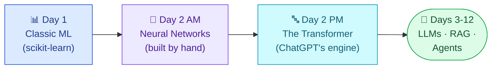
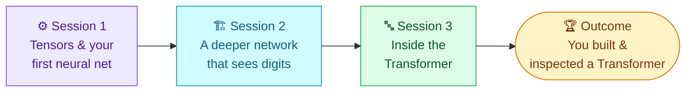
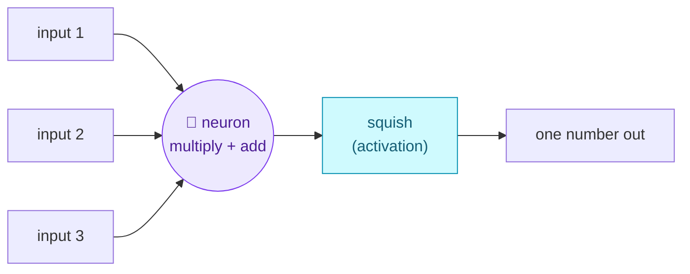
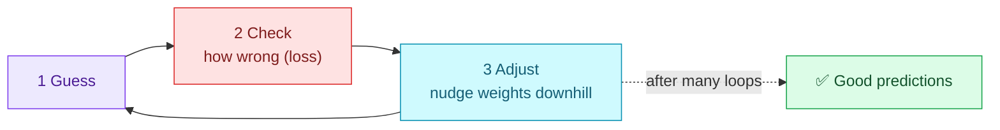
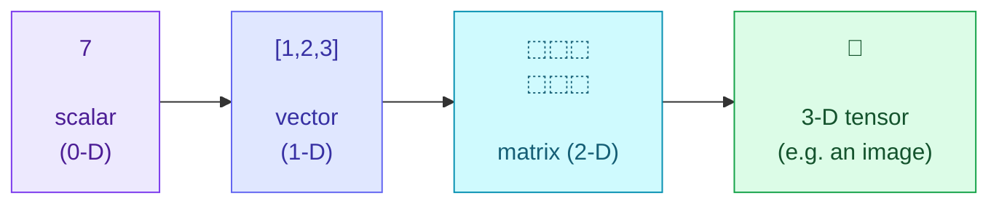
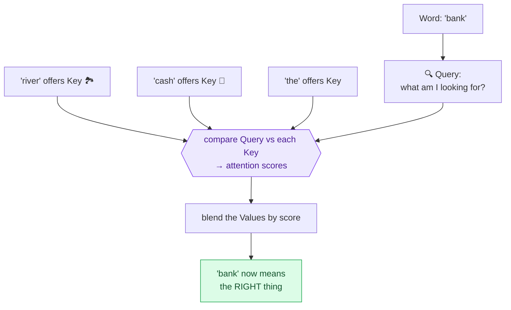
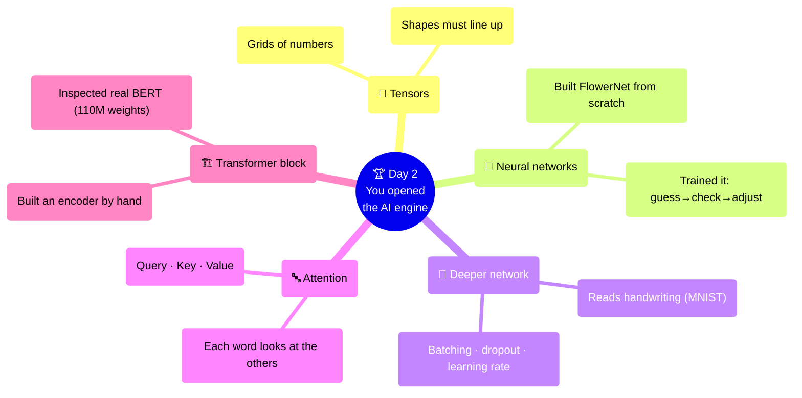

<div align="center">

# 🧠 Day 2 — Deep Learning & Transformer Architecture
### CodeLucky · 12-Day Programme on Modern AI, Generative AI & Agentic Systems
**Module M2 · 6 Hours · 100% Hands-On · Runs Entirely in Google Colab**


</div>

---

> [!NOTE]
> **How to use this document.** This is the *only* file you need for Day 2 — everything is here. We work entirely inside **Google Colab** (free, in your browser). Read top to bottom and type each code cell yourself. Every new idea is explained from scratch; you don't need any deep-learning background. Today we go from "what is a neuron?" all the way to the technology behind ChatGPT — built up step by step, with running code at every stage.

---

## 🌱 Where We Are, and Where We're Going Today

Yesterday (Day 1) you built a model the *classical* way — scikit-learn did the learning for you behind one `.fit()` call. Today we open the engine. We build the kind of model that powers **ChatGPT, image generators, and modern translation**: the **neural network**, and its most important modern form, the **Transformer**.

> [!IMPORTANT]
> **The one-line goal of Day 2:**
> Understand — and build with your own hands — how a neural network learns, and how the Transformer (the "T" in ChatGPT) reads language. By tonight, "a Transformer" will stop being a mystery word and become something you've inspected layer by layer.



---

## 🎯 Day 2 at a Glance

| | |
|---|---|
| 🧩 **What we build** | A neural network from scratch, then a Transformer encoder block — and we inspect a real pre-trained BERT model |
| 🗂️ **Data we use** | Iris flowers (tiny, 4-number inputs) for our first net; MNIST handwritten digits for the bigger one; real sentences for the Transformer |
| 💻 **Where we work** | Google Colab — and today we switch on a **free GPU** |
| ⏱️ **Structure** | 3 sessions × 2 hours |
| 🛠️ **Tools** | PyTorch · HuggingFace Transformers · Google Colab GPU |
| 🏁 **What you take home** | A working neural network you trained yourself, and a hand-built Transformer encoder block + an inspected BERT model |

### The Day 2 Journey



---

## 📖 The Vocabulary You'll Need (5 min)

Keep this handy — every term is explained again in context when it first appears.

| Term | Plain-English meaning |
|---|---|
| **Neural network** | A model loosely inspired by the brain: layers of tiny units that each do a simple calculation |
| **Neuron** | One tiny unit: it takes numbers in, multiplies and adds them, and passes one number out |
| **Weight** | A dial the network *learns* — how much to trust each input |
| **Tensor** | Just a fancy word for "a grid of numbers" (a list, a table, or a cube of numbers) |
| **PyTorch** | The toolkit we use to build and train neural networks |
| **GPU** | A graphics chip that does thousands of small maths operations at once — makes training fast |
| **Training (again)** | The network adjusting its weights, step by step, to make fewer mistakes |
| **Transformer** | The neural-network design behind ChatGPT — reads all words at once and decides what matters |

---

## 🧠 What Is a Neural Network, Really? (15 min)

Yesterday's models drew lines or asked yes/no questions. A **neural network** is different — and surprisingly simple at its core.

> [!IMPORTANT]
> **Start with one neuron.** A single neuron does just three things:
> 1. Takes some numbers in (the inputs).
> 2. Multiplies each input by a **weight** (how much it cares about that input) and adds them up.
> 3. Passes the result through a small "should I fire?" function and sends out one number.
>
> That's it. A neuron is just *"multiply, add, and squish."* A neural network is **many** of these neurons stacked in **layers**, where each layer's output feeds the next.



> [!NOTE]
> **Why "deep" learning?** When you stack *many* layers of neurons, the network is "deep." Early layers learn simple things (edges in an image, basic word patterns); later layers combine them into complex ideas (a face, the meaning of a sentence). "Deep learning" just means "a neural network with several layers."

> [!IMPORTANT]
> **How does it learn? The taste-test loop.** A network learns exactly like adjusting a recipe by taste:
> 1. **Guess** — make a prediction with the current weights.
> 2. **Check** — measure how wrong it was (the "loss").
> 3. **Adjust** — nudge every weight a little in the direction that reduces the error.
> 4. **Repeat** thousands of times until the guesses are good.
>
> This adjust-step is powered by something called **gradient descent** — but you don't need the calculus today. Picture a hiker walking downhill in fog: at each step they feel which way is "down" (less error) and take a small step that way. Eventually they reach the valley floor — the best weights.



---

## 🚀 Setting Up Colab — and Turning On the GPU (10 min)

Today's models do a *lot* of small calculations, so we switch on a free **GPU** (graphics chip) — it makes training dramatically faster.

> [!NOTE]
> **What is a GPU, and why does it help?** A normal processor (CPU) is like one very fast chef cooking dishes one at a time. A GPU is like a kitchen with *thousands* of line cooks each doing one tiny step at once. Neural networks are mostly thousands of tiny multiplications — perfect work for a GPU.

**Turn on the GPU in Colab:**

1. Open a new notebook at **[colab.research.google.com](https://colab.research.google.com)**.
2. Menu: **Runtime → Change runtime type**.
3. Under **Hardware accelerator**, choose **T4 GPU**, then **Save**.

Now check it's working:

```python
import torch   # PyTorch — our deep-learning toolkit (already installed in Colab)

# Is a GPU available?
print("GPU available:", torch.cuda.is_available())

# We'll send our work to the GPU if there is one, otherwise the CPU
device = "cuda" if torch.cuda.is_available() else "cpu"
print("Using device:", device)
```

> [!TIP]
> If `GPU available` prints `False`, you skipped step 2 above — go back to **Runtime → Change runtime type** and select the T4 GPU. Everything still works on CPU, just slower.

---

<div align="center">

## 🟣 SESSION 1 — Tensors & Your First Neural Network
### (2 hours)

</div>

> **Goal of this session:** Understand "tensors" (the grids of numbers everything is made of), then build and train a real neural network from scratch that recognises flowers — watching it get smarter with each step.

### 1.1 Tensors: Just Grids of Numbers (20 min)

Everything in PyTorch is a **tensor**. The word sounds intimidating; the idea is not.

> [!IMPORTANT]
> **A tensor is just a container of numbers, organised by how many directions it stretches:**
> - **0 directions** = a single number (e.g. `7`) — called a *scalar*.
> - **1 direction** = a list (e.g. `[1, 2, 3]`) — called a *vector*.
> - **2 directions** = a table/grid (rows × columns) — called a *matrix*.
> - **3+ directions** = a cube of numbers and beyond (e.g. a colour image = height × width × 3 colours).
>
> That's all "tensor" means: a grid of numbers with some shape.



Let's make some tensors and look at their **shape** (how big they are in each direction):

```python
import torch

a = torch.tensor(7)                       # a single number (scalar)
b = torch.tensor([1.0, 2.0, 3.0])         # a list (vector)
c = torch.tensor([[1.0, 2.0], [3.0, 4.0]]) # a 2x2 grid (matrix)

print("a:", a, "| shape:", a.shape)       # shape: torch.Size([])  -> just one number
print("b:", b, "| shape:", b.shape)       # shape: torch.Size([3]) -> 3 numbers in a row
print("c:\n", c, "| shape:", c.shape)     # shape: torch.Size([2, 2]) -> 2 rows, 2 columns
```

> [!NOTE]
> **Why "shape" matters so much.** Most beginner errors in deep learning are *shape mismatches* — trying to multiply a grid of the wrong size. Whenever something breaks, the first thing to print is `.shape`. Think of shapes like puzzle-piece edges: they have to line up to fit together.

Tensors do maths like a calculator, but on whole grids at once:

```python
x = torch.tensor([1.0, 2.0, 3.0])
y = torch.tensor([10.0, 20.0, 30.0])

print("Add:     ", x + y)        # [11, 22, 33] — element by element
print("Multiply:", x * y)        # [10, 40, 90]
print("Sum of x:", x.sum())      # 6.0
```

> [!TIP]
> **Sending a tensor to the GPU** is one command: `x = x.to(device)`. From then on, maths on `x` runs on the graphics chip. We'll do this with our model shortly.

### 1.2 Autograd: How PyTorch Learns the Adjust-Step (15 min)

Remember the "adjust the weights downhill" step? PyTorch works out *which way is downhill* automatically, using a feature called **autograd** (automatic gradients).

> [!NOTE]
> **What is a "gradient"?** In plain terms: for each weight, the gradient answers *"if I nudge this weight up a tiny bit, does the error go up or down, and how steeply?"* That's the direction-and-steepness signal the network needs to improve. PyTorch computes it for you — you never do the calculus by hand.

Here's the idea in miniature — watch PyTorch find the slope automatically:

```python
# Make a number we want to "learn", and tell PyTorch to track its gradient
w = torch.tensor(3.0, requires_grad=True)

# A pretend "error" that depends on w  (here: error = w squared)
error = w ** 2

# Ask PyTorch: which way should w move to reduce the error?
error.backward()

print("Current w:", w.item())
print("Gradient (slope) at w:", w.grad.item())   # 6.0 -> error rises steeply if w grows
# A positive slope means: to REDUCE error, make w smaller. That's the 'downhill' direction.
```

> [!IMPORTANT]
> **You don't need to memorise this.** The takeaway is simply: *PyTorch automatically figures out how to nudge every weight to reduce the error.* That automatic nudging is what "training" runs thousands of times. Everything else today is built on this one idea.

### 1.3 Meet the Data: Iris Flowers (10 min)

For our very first neural network we use the **Iris dataset** — a classic, tiny, friendly dataset. It's perfect because the whole problem fits in your head.

> [!NOTE]
> **What the Iris data is.** 150 flowers, each described by **4 numbers** (length and width of its petals and sepals), and labelled as one of **3 species** (setosa, versicolor, virginica). The task: given the 4 measurements, predict the species. So our network will take **4 numbers in** and choose **1 of 3 answers out** — small enough to picture completely.

```python
from sklearn.datasets import load_iris
from sklearn.model_selection import train_test_split
import torch

# Load the flowers
iris = load_iris()
X = iris.data         # 150 flowers x 4 measurements
y = iris.target       # the species: 0, 1, or 2

print("Inputs shape:", X.shape)    # (150, 4) -> 150 flowers, 4 numbers each
print("First flower:", X[0], "-> species", y[0])

# Split into train / test (same idea as Day 1: hide some data to grade honestly)
X_train, X_test, y_train, y_test = train_test_split(
    X, y, test_size=0.2, random_state=42, stratify=y)

# Turn the data into tensors and send to our device (GPU/CPU)
X_train = torch.tensor(X_train, dtype=torch.float32).to(device)
y_train = torch.tensor(y_train, dtype=torch.long).to(device)
X_test  = torch.tensor(X_test,  dtype=torch.float32).to(device)
y_test  = torch.tensor(y_test,  dtype=torch.long).to(device)

print("Ready: training on", X_train.shape[0], "flowers")
```

> [!TIP]
> Notice we reused Day 1's habit: `train_test_split` with `random_state=42` and `stratify=y`. Good habits carry across every model you'll ever build.

### 1.4 Build Your First Neural Network (30 min)

Now the moment: we define a network with **4 inputs → a hidden layer → 3 outputs** (one score per species).

> [!NOTE]
> **What is a "hidden layer"?** It's a layer of neurons between the input and the output. "Hidden" just means it's not the input or the final answer — it's the network's private workspace where it builds up useful patterns. More hidden neurons = more room to learn (up to a point).

```python
import torch.nn as nn

# Define the network as a class. Think of it as a recipe for the layers.
class FlowerNet(nn.Module):
    def __init__(self):
        super().__init__()
        # Layer 1: 4 inputs -> 16 hidden neurons
        self.layer1 = nn.Linear(4, 16)
        # The "squish" function that lets the network learn curves, not just lines
        self.relu = nn.ReLU()
        # Layer 2: 16 hidden neurons -> 3 outputs (one score per species)
        self.layer2 = nn.Linear(16, 3)

    # forward() describes how data flows through the layers
    def forward(self, x):
        x = self.layer1(x)   # multiply + add
        x = self.relu(x)     # squish
        x = self.layer2(x)   # multiply + add -> 3 scores
        return x

# Create the network and send it to the GPU/CPU
model = FlowerNet().to(device)
print(model)
```

> [!IMPORTANT]
> **Decoding the new pieces:**
> - **`nn.Linear(4, 16)`** — a layer of neurons taking 4 numbers in and putting 16 out. It holds the *weights* the network will learn. The numbers (4, 16) are just the in/out sizes — they must line up with the data (4 = our 4 measurements) and the next layer (16 = next layer's input).
> - **`nn.ReLU()`** — the "squish" (activation) function. **ReLU** is the simplest one: it turns any negative number into 0 and leaves positives unchanged. Why? Without a squish, stacking layers would just collapse into one straight line — ReLU lets the network bend and learn complex shapes. (We saw "without normalization the loss breaks" type failures live; ReLU is part of why networks can learn at all.)
> - **`nn.Module`** — the base "blueprint" every PyTorch network inherits from. `__init__` lists the layers; `forward` says how data flows through them.

### 1.5 Train It — Watch It Get Smarter (30 min)

Training is the taste-test loop from earlier, written in code. We need two more pieces:

> [!NOTE]
> **Two tools the training loop needs:**
> - **A loss function** — measures how wrong the predictions are. For "pick one of several classes" we use **`CrossEntropyLoss`** (don't worry about the name; it just gives a big number when the network is confidently wrong and a small number when it's right).
> - **An optimizer** — the thing that actually nudges the weights downhill. We use **`Adam`**, a popular, reliable optimizer. **`lr=0.01`** is the *learning rate* — how big each downhill step is (too big = overshoot, too small = crawls).

```python
import torch.optim as optim

loss_function = nn.CrossEntropyLoss()
optimizer = optim.Adam(model.parameters(), lr=0.01)   # lr = step size

# Train for 100 rounds (each round = one full taste-test loop over the data)
for epoch in range(100):
    # 1. GUESS — predict scores for every training flower
    predictions = model(X_train)

    # 2. CHECK — how wrong were we?
    loss = loss_function(predictions, y_train)

    # 3. ADJUST — clear old gradients, find new ones, take a downhill step
    optimizer.zero_grad()   # reset the slope tracker
    loss.backward()         # autograd works out which way is downhill
    optimizer.step()        # nudge every weight that way

    # Print progress every 20 rounds
    if (epoch + 1) % 20 == 0:
        print(f"Round {epoch+1:3d} | error (loss): {loss.item():.3f}")
```

> [!IMPORTANT]
> **Watch the error fall.** The loss should drop from around 1.0 toward ~0.1 over the 100 rounds. *That falling number is the network learning in real time.* Each round it guessed, checked, and nudged its weights downhill — exactly the taste-test loop. This is the heartbeat of all deep learning.

> [!NOTE]
> **What's an "epoch"?** One epoch = one full pass through all the training data. 100 epochs means the network reviewed every flower 100 times, improving a little each pass — like re-reading a chapter until it sticks.

### 1.6 Grade the Network (10 min)

Now test it on the held-out flowers it never trained on (Day 1's honesty rule):

```python
# Turn off learning for testing (we're just checking, not adjusting)
model.eval()
with torch.no_grad():                      # don't track gradients — faster
    test_scores = model(X_test)            # 3 scores per flower
    predicted = test_scores.argmax(dim=1)  # pick the species with the highest score
    accuracy = (predicted == y_test).float().mean()

print(f"Test accuracy: {accuracy.item()*100:.1f}%")   # usually ~95-100%
```

> [!TIP]
> **What is `argmax`?** The network outputs 3 scores (one per species). `argmax` just means "tell me the *position* of the biggest score" — i.e. the predicted species. Highest score wins.

### 1.7 🧪 Try It Yourself (15 min)

> 1. Build and train `FlowerNet` yourself, typing each layer.
> 2. Change the hidden layer from `16` neurons to `4`, then to `64`. Does accuracy or training speed change?
> 3. Change the learning rate `lr` from `0.01` to `0.1`, then `0.001`. Watch how the error falls faster, overshoots, or crawls.
> 4. **Think:** what's the smallest network that still hits high accuracy? (Iris is easy — a tiny net often suffices.)

✅ **Session 1 done:** You understand tensors, you've seen how PyTorch learns automatically, and you've built and trained a real neural network from scratch.

---

<div align="center">

## 🟣 SESSION 2 — A Deeper Network That Sees Handwriting
### (2 hours)

</div>

> **Goal of this session:** Build a bigger, multi-layer network that recognises handwritten digits — and learn the three tricks (batching, dropout, learning-rate) that make real networks train well, watching each one with our own eyes.

### 2.1 Meet the Data: MNIST Handwritten Digits (10 min)

> [!NOTE]
> **What MNIST is.** 70,000 tiny greyscale images of handwritten digits 0–9, each just 28×28 pixels. It's the "hello world" of deep learning. The task: look at the pixels, say which digit it is. Each image is a grid of numbers (a tensor!) where each number is how dark that pixel is.

```python
from torchvision import datasets, transforms
from torch.utils.data import DataLoader

# A recipe to turn each image into a tensor of pixel numbers
to_tensor = transforms.ToTensor()

# Download MNIST (Colab fetches it automatically)
train_data = datasets.MNIST(root="data", train=True,  download=True, transform=to_tensor)
test_data  = datasets.MNIST(root="data", train=False, download=True, transform=to_tensor)

print("Training images:", len(train_data))   # 60000
print("One image shape:", train_data[0][0].shape)  # [1, 28, 28] -> 1 colour, 28x28 pixels
print("Its label:", train_data[0][1])         # the digit it shows
```

### 2.2 Batching: Why We Don't Feed All 60,000 at Once (15 min)

> [!IMPORTANT]
> **What is a "batch", and why batch?** Instead of showing the network all 60,000 images at once (too much memory) or one at a time (too slow and jumpy), we show it **small groups** — say 64 images at a time. Each group is a **batch**. The network updates its weights once per batch. This is faster, smoother, and how all real training works.

```python
# DataLoader serves the data in shuffled batches of 64
train_loader = DataLoader(train_data, batch_size=64, shuffle=True)
test_loader  = DataLoader(test_data,  batch_size=64, shuffle=False)

# Peek at one batch
images, labels = next(iter(train_loader))
print("One batch of images:", images.shape)   # [64, 1, 28, 28] -> 64 images at once
print("One batch of labels:", labels.shape)   # [64]
```

> [!NOTE]
> **Why `shuffle=True` for training?** If the network always saw digits in the same order, it could "memorise the order" instead of learning the digits. Shuffling each epoch keeps it honest — like shuffling flashcards.

### 2.3 Build the Digit Network — with Dropout (25 min)

Our images are 28×28 = **784 pixels**. We flatten each image into a row of 784 numbers and feed it in.

```python
import torch.nn as nn

class DigitNet(nn.Module):
    def __init__(self):
        super().__init__()
        self.flatten = nn.Flatten()           # turn 28x28 image into a row of 784 numbers
        self.layer1 = nn.Linear(784, 128)     # 784 pixels -> 128 hidden neurons
        self.relu = nn.ReLU()
        self.dropout = nn.Dropout(0.2)        # randomly ignore 20% of neurons while training
        self.layer2 = nn.Linear(128, 10)      # 128 -> 10 outputs (one per digit 0-9)

    def forward(self, x):
        x = self.flatten(x)
        x = self.relu(self.layer1(x))
        x = self.dropout(x)
        x = self.layer2(x)
        return x

model = DigitNet().to(device)
print(model)
```

> [!IMPORTANT]
> **What is "dropout" and why deliberately ignore neurons?** During training, `nn.Dropout(0.2)` randomly switches off 20% of the hidden neurons each step. It sounds crazy, but it stops the network from *over-relying* on any single neuron — forcing it to learn robust, general patterns instead of memorising the training images. It's like a sports team practising with random players sitting out, so no one becomes a single point of failure. Dropout is one of the most important tricks for making networks that work on *new* data. (It's automatically switched off when we test.)

### 2.4 Train It — the Real Training Loop (30 min)

This is the full, real-world training loop: loop over epochs, and *within* each epoch loop over batches.

```python
import torch.optim as optim

loss_function = nn.CrossEntropyLoss()
optimizer = optim.Adam(model.parameters(), lr=0.001)

model.train()   # tell the network we're training (dropout ON)

for epoch in range(3):                       # 3 full passes is plenty for MNIST
    running_loss = 0.0
    for images, labels in train_loader:      # one batch at a time
        images, labels = images.to(device), labels.to(device)

        # The same taste-test loop, per batch:
        predictions = model(images)               # 1. guess
        loss = loss_function(predictions, labels) # 2. check
        optimizer.zero_grad()                     # 3a. reset slopes
        loss.backward()                           # 3b. find downhill direction
        optimizer.step()                          # 3c. nudge the weights

        running_loss += loss.item()

    avg = running_loss / len(train_loader)
    print(f"Epoch {epoch+1} | average error: {avg:.3f}")
```

> [!NOTE]
> **The learning rate, revisited.** Here `lr=0.001`. If you set it too high (say `0.1`), the loss may jump around wildly or explode — the hiker takes giant leaps and overshoots the valley. Too low (`0.00001`) and it crawls. `0.001` with Adam is a reliable starting point for most networks. **Try changing it in the lab and watch the error behave.**

### 2.5 Grade It and Look at Its Mistakes (20 min)

```python
model.eval()    # dropout OFF for testing
correct = 0
total = 0
with torch.no_grad():
    for images, labels in test_loader:
        images, labels = images.to(device), labels.to(device)
        predicted = model(images).argmax(dim=1)
        correct += (predicted == labels).sum().item()
        total += labels.size(0)

print(f"Test accuracy: {correct/total*100:.2f}%")   # usually ~97%
```

Let's actually *see* a prediction — deep learning shouldn't be invisible:

```python
import matplotlib.pyplot as plt

# Grab one test image
img, true_label = test_data[0]
model.eval()
with torch.no_grad():
    guess = model(img.unsqueeze(0).to(device)).argmax(dim=1).item()

plt.imshow(img.squeeze(), cmap="gray")
plt.title(f"Model says: {guess}   |   Truth: {true_label}")
plt.axis("off")
plt.show()
```

> [!IMPORTANT]
> **Failure-first habit (from Day 1).** Run the cell above a few times on different test images (change `test_data[0]` to `test_data[7]`, etc.). Find one the model gets *wrong* and look at it — often it's a genuinely messy, ambiguous digit even a human would hesitate on. Seeing *why* a model fails builds far more understanding than only celebrating when it succeeds.

### 2.6 🧪 Try It Yourself (15 min)

> 1. Build and train `DigitNet`; report your test accuracy.
> 2. Remove the dropout line and retrain. Does test accuracy change? (Often it drops slightly — dropout helps generalisation.)
> 3. Change `lr` to `0.1` and watch the error misbehave; then back to `0.001`.
> 4. Display 5 different test images with the model's guess vs the truth. Find one it gets wrong and describe why.

✅ **Session 2 done:** You built a deeper network that reads handwriting, and you understand the three real-world training tricks — batching, dropout, and the learning rate.

---

<div align="center">

## 🟣 SESSION 3 — Inside the Transformer (ChatGPT's Engine)
### (2 hours)

</div>

> **Goal of this session:** Understand the single most important idea in modern AI — **attention** — then build a Transformer encoder block by hand, and finally load and inspect a real pre-trained BERT model so "a Transformer" becomes something concrete you've touched.

### 3.1 The Problem Transformers Solve (15 min)

Our networks so far take a fixed list of numbers. But language is different — it's a *sequence of words*, and the meaning of a word depends on the **other words around it**.

> [!IMPORTANT]
> **Why context is everything.** Consider the word "bank":
> - "I sat on the river **bank**." 🏞️
> - "I deposited cash at the **bank**." 🏦
>
> Same word, totally different meaning — and the *only* way to tell is by looking at the other words. A model that reads words one-by-one in isolation can't do this well. The Transformer's breakthrough: **let every word look at every other word and decide which ones matter for its meaning.** That looking-around mechanism is called **attention**.

### 3.2 Attention, Explained Simply (25 min)

> [!IMPORTANT]
> **Attention = each word asking "who should I pay attention to?"** For every word in a sentence, the Transformer works out how much it should focus on each *other* word, then blends in their meaning. "bank" learns to pay attention to "river" or "cash" — and that's what disambiguates it.
>
> The mechanism uses three roles for each word, with deliberately friendly names:
> - **Query** — what this word is *looking for* ("I'm 'bank' — what context clarifies me?").
> - **Key** — what each word *offers* as a label ("I'm 'river', I signal nature/water").
> - **Value** — the actual meaning each word *contributes* once it's been attended to.
>
> Each word's Query is compared against every word's Key to get attention scores (how relevant), and those scores blend the Values together. The result: every word's meaning is updated by its most relevant neighbours.



> [!NOTE]
> **"Multi-head" attention.** Real Transformers do this looking-around several times in parallel, each "head" focusing on a different kind of relationship (one head might track grammar, another might track topic). The results are combined. "Multi-head" just means "several attention passes at once, then merged."

> [!NOTE]
> **Positional encoding — giving words a sense of order.** Attention looks at all words at once, which is powerful but loses *word order* ("dog bites man" vs "man bites dog"). So Transformers add a small **position signal** to each word telling the model where it sits in the sentence. That's all "positional encoding" is: a tag that says "I'm word #1, I'm word #2…".

### 3.3 Build a Self-Attention Block by Hand (25 min)

Let's build attention with PyTorch — small enough to read, real enough to work.

```python
import torch
import torch.nn as nn

# A tiny self-attention layer
class SelfAttention(nn.Module):
    def __init__(self, embed_size):
        super().__init__()
        # Three small layers that produce Query, Key, Value for each word
        self.query = nn.Linear(embed_size, embed_size)
        self.key   = nn.Linear(embed_size, embed_size)
        self.value = nn.Linear(embed_size, embed_size)
        self.softmax = nn.Softmax(dim=-1)   # turns scores into % that add to 100

    def forward(self, x):
        Q = self.query(x)          # what each word is looking for
        K = self.key(x)            # what each word offers
        V = self.value(x)          # what each word contributes

        # Compare every Query with every Key -> attention scores
        scores = Q @ K.transpose(-2, -1)        # @ means matrix multiply
        scores = scores / (x.shape[-1] ** 0.5)  # scale, keeps numbers stable
        weights = self.softmax(scores)          # turn into attention percentages

        # Blend the Values using those attention weights
        output = weights @ V
        return output, weights

# Try it on a pretend sentence: 5 words, each described by 8 numbers
fake_sentence = torch.rand(1, 5, 8)   # [1 sentence, 5 words, 8 numbers each]
attn = SelfAttention(embed_size=8)
out, weights = attn(fake_sentence)

print("Output shape:", out.shape)        # [1, 5, 8] -> same shape, but context-aware now
print("Attention weights shape:", weights.shape)  # [1, 5, 5] -> who looked at whom
```

> [!IMPORTANT]
> **What just happened.** Each of the 5 words produced a Query, Key, and Value. We compared Queries to Keys to get a 5×5 grid of "how much word i attends to word j," turned it into percentages with **softmax**, and used it to blend the Values. The output is the same 5 words — but each now carries information from its most relevant neighbours. **That is the heart of every Transformer, including ChatGPT.**

> [!NOTE]
> **What is `softmax`?** It turns a row of raw scores into percentages that add up to 100%. So "how much should 'bank' attend to each word?" becomes a clean set of weights like 70% river, 20% the, 10% sat. The biggest score gets the most attention, but everything gets a share.

### 3.4 The Full Encoder Block (15 min)

A Transformer **encoder block** wraps attention with two helpers, then stacks many of these blocks.

> [!NOTE]
> **The two helpers around attention:**
> - **A small feed-forward network** (just `Linear → ReLU → Linear`, exactly like Session 1) that processes each word further after attention.
> - **Residual connections + layer normalization** — fancy names for two stabilisers: "residual" means *add the input back to the output* (so the network can't forget the original word), and "layer norm" keeps the numbers in a healthy range so training doesn't break. (Remember Day 2's failure demo: *without normalization the loss curve breaks* — this is the fix.)

```python
class EncoderBlock(nn.Module):
    def __init__(self, embed_size):
        super().__init__()
        self.attention = SelfAttention(embed_size)
        self.norm1 = nn.LayerNorm(embed_size)
        self.norm2 = nn.LayerNorm(embed_size)
        # the small feed-forward network
        self.feed_forward = nn.Sequential(
            nn.Linear(embed_size, embed_size * 4),
            nn.ReLU(),
            nn.Linear(embed_size * 4, embed_size),
        )

    def forward(self, x):
        # 1. attention + add the input back (residual) + normalize
        attn_out, _ = self.attention(x)
        x = self.norm1(x + attn_out)
        # 2. feed-forward + add back + normalize
        ff_out = self.feed_forward(x)
        x = self.norm2(x + ff_out)
        return x

block = EncoderBlock(embed_size=8)
result = block(fake_sentence)
print("Encoder block output shape:", result.shape)   # [1, 5, 8] -> richer word meanings
```

> [!IMPORTANT]
> **You just built the core of a Transformer.** Stack 6, 12, or 24 of these `EncoderBlock`s, train on enormous text, and you have the architecture behind BERT and (with a small variation) ChatGPT. The thing that sounded like magic two hours ago is: *attention, a small network, and two stabilisers — repeated.*

### 3.5 Inspect a REAL Transformer: BERT (20 min)

Finally, let's load a famous pre-trained Transformer — **BERT** — and look inside, so it stops being abstract.

> [!NOTE]
> **What is BERT?** BERT is a Transformer trained by Google on a huge amount of text. It "understands" language well enough to power search engines and countless apps. We won't train it (that took Google enormous resources) — we'll *load* it ready-made and inspect it, the way you'd open the bonnet of a car to see the engine.

```python
# HuggingFace Transformers is pre-installed in Colab
from transformers import AutoTokenizer, AutoModel

# Load BERT and its tokenizer (the part that turns text into numbers)
tokenizer = AutoTokenizer.from_pretrained("bert-base-uncased")
bert = AutoModel.from_pretrained("bert-base-uncased")

sentence = "I sat on the river bank."
tokens = tokenizer(sentence, return_tensors="pt")

print("The sentence became these token IDs:")
print(tokens["input_ids"])
print("Which map back to these pieces:")
print(tokenizer.convert_ids_to_tokens(tokens["input_ids"][0]))
```

> [!NOTE]
> **What is a "tokenizer"?** A Transformer can't read letters — it reads numbers. The tokenizer chops text into pieces (**tokens**) and gives each a number. Notice BERT adds special tokens like `[CLS]` (start) and `[SEP]` (end) — they're markers it uses internally.

Now look at the model's structure — count the Transformer blocks:

```python
# How big is BERT?
total_params = sum(p.numel() for p in bert.parameters())
print(f"BERT has {total_params:,} learned weights")   # ~110 million!

# Print the layers — you'll see 12 encoder blocks, just like the one we built
print(bert)
```

> [!IMPORTANT]
> **The big reveal.** Scroll through the printout. You'll see **12 encoder layers**, each containing **self-attention** and a **feed-forward** network with **layer normalization** — *exactly the `EncoderBlock` you built by hand in 3.4*, just stacked 12 deep and trained on billions of words. BERT isn't magic; it's your block, repeated and trained at scale. **That realisation is the whole point of Day 2.**

Let's run the sentence through BERT and see it produce context-aware meanings:

```python
import torch
with torch.no_grad():
    output = bert(**tokens)

# BERT gives a rich vector of meaning for every token
print("Meaning vectors shape:", output.last_hidden_state.shape)
# [1, 7, 768] -> 1 sentence, 7 tokens, each now described by 768 context-aware numbers
```

> [!TIP]
> Those 768 numbers per word are BERT's *understanding* of each word **in this specific sentence** — so "bank" here is numerically closer to "river/water" meanings than to "money" meanings. That is attention doing its job, at scale.

### 3.6 🧪 Try It Yourself (15 min)

> 1. Build the `SelfAttention` and `EncoderBlock` classes yourself and run the fake sentence through.
> 2. Load BERT and tokenize a sentence of your own. How many tokens did it become? Did any word split into pieces?
> 3. Run both "river bank" and "money bank" sentences through BERT. (Advanced: compare the meaning vector for "bank" in each — they differ, because of attention.)
> 4. Count the encoder layers in the `print(bert)` output. Find the self-attention and feed-forward parts inside one layer.

✅ **Session 3 done:** You understand attention, you've built a Transformer encoder block by hand, and you've inspected a real 110-million-weight BERT model — bridging "I've heard of Transformers" to "I've built and opened one."

---

## 🏁 What You Built Today



> [!NOTE]
> **Why today matters for the rest of the programme.** Every model from here on — the LLMs you'll prompt on Day 3, the RAG systems on Days 5–6, the agents in Week 2 — is built on the Transformer you just opened up. When someone says "the model attends to the context" or "it's a 12-layer Transformer," you now know *exactly* what that means, because you built the pieces yourself.

---

## ✅ Day 2 Self-Check

Tick each box before you finish:

- [ ] I turned on the Colab GPU and confirmed `torch.cuda.is_available()`
- [ ] I can explain what a tensor is and why `.shape` matters
- [ ] I understand the guess → check → adjust training loop
- [ ] I built and trained a neural network (FlowerNet) from scratch
- [ ] I know what a hidden layer, ReLU, loss, and optimizer are
- [ ] I built a deeper network for MNIST and understand batching
- [ ] I can explain what dropout does and why we deliberately ignore neurons
- [ ] I understand attention: every word looks at every other word (Query/Key/Value)
- [ ] I built a self-attention layer and an encoder block by hand
- [ ] I loaded BERT and saw it's 12 of my encoder blocks, trained at scale

---

## 📚 One-Page Cheat-Sheet

```python
# THE DAY 2 PATTERNS — the shapes to remember

# --- 1. SET THE DEVICE (use the GPU) ---
import torch
device = "cuda" if torch.cuda.is_available() else "cpu"

# --- 2. DEFINE A NETWORK ---
import torch.nn as nn
class Net(nn.Module):
    def __init__(self):
        super().__init__()
        self.fc1 = nn.Linear(IN, HIDDEN)   # a layer of neurons
        self.relu = nn.ReLU()              # the "squish"
        self.fc2 = nn.Linear(HIDDEN, OUT)
    def forward(self, x):
        return self.fc2(self.relu(self.fc1(x)))

model = Net().to(device)

# --- 3. THE TRAINING LOOP (guess -> check -> adjust) ---
loss_fn = nn.CrossEntropyLoss()
optimizer = torch.optim.Adam(model.parameters(), lr=0.001)
for epoch in range(EPOCHS):
    pred = model(X)              # guess
    loss = loss_fn(pred, y)      # check
    optimizer.zero_grad()        # reset slopes
    loss.backward()              # find downhill (autograd)
    optimizer.step()             # nudge weights

# --- 4. EVALUATE ---
model.eval()
with torch.no_grad():
    acc = (model(X_test).argmax(1) == y_test).float().mean()

# --- 5. LOAD A REAL TRANSFORMER ---
from transformers import AutoTokenizer, AutoModel
tok = AutoTokenizer.from_pretrained("bert-base-uncased")
bert = AutoModel.from_pretrained("bert-base-uncased")
out = bert(**tok("Hello world", return_tensors="pt"))
```

| 🧠 Idea | 🔑 Remember this |
|---|---|
| Tensor | A grid of numbers; always check `.shape` |
| GPU | `.to(device)` sends work to the fast chip |
| Neuron | Multiply, add, squish |
| Training loop | Guess → check (loss) → adjust (optimizer) |
| ReLU | Negatives become 0; lets the net learn curves |
| Learning rate (lr) | Step size: too big overshoots, too small crawls |
| Batch | A small group of examples per update |
| Dropout | Randomly ignore neurons → robust, general model |
| Attention | Every word looks at every other word |
| Query / Key / Value | Looking-for / offering / contributing |
| Transformer = | Attention + small net + stabilisers, repeated |
| BERT | A real 12-block Transformer, 110M weights |

---

<div align="center">

### 🚀 Coming Up — Day 3: LLMs, Prompting & Real APIs
*We finish the Transformer story with a fine-tuning demo, then start talking to real LLMs through OpenAI and Groq — the bedrock skill for everything that follows.*

**CodeLucky · Faculty Development Programme**
📧 admin@codelucky.com · 📞 +91 85689-70199 · 🌐 codelucky.com

</div>
