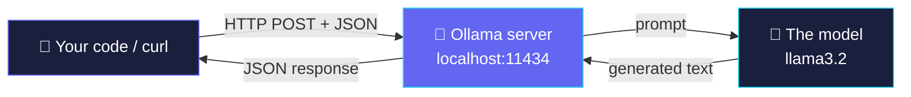

# 🧠 LLM APIs Explained — Hands-On Guide (with Ollama)

> **Who this is for:** Complete beginners. You don't need to know anything about APIs, servers, or AI.
> **Promise:** If you copy‑paste every command below **in order**, you'll be talking to your own local AI in about 15 minutes.
> **Cost:** ₹0 / $0. Everything runs on your own computer, offline.

---

## 📋 Table of Contents

1. [What you'll learn](#-1-what-youll-learn)
2. [The one idea: an API is a waiter](#-2-the-one-idea-an-api-is-a-waiter)
3. [What an *LLM* API actually is](#-3-what-an-llm-api-actually-is)
4. [The round trip (diagram)](#-4-the-round-trip-diagram)
5. [Which model should I use?](#-5-which-model-should-i-use)
6. [Step 1 — Install Ollama](#-step-1--install-ollama)
7. [Step 2 — Download a model](#-step-2--download-a-model)
8. [Step 3 — Chat without any code](#-step-3--chat-without-any-code-sanity-check)
9. [Step 4 — Your first API call with `curl`](#-step-4--your-first-api-call-with-curl)
10. [Step 5 — Your first API call with Python](#-step-5--your-first-api-call-with-python)
11. [Understanding the JSON](#-6-understanding-the-json-every-key-decoded)
12. [Streaming answers word‑by‑word](#-7-streaming-answers-word-by-word)
13. [Multi‑turn chat (memory)](#-8-multi-turn-chat-the-model-remembers)
14. [The temperature dial 🌡️](#-9-the-temperature-dial-)
15. [Mini project: a tiny chatbot](#-10-mini-project--a-tiny-terminal-chatbot)
16. [Troubleshooting](#-11-troubleshooting)
17. [Cheat sheet](#-12-cheat-sheet)

---

## 🎯 1. What you'll learn

By the end of this guide you will be able to:

- ✅ Explain what an API is in one sentence.
- ✅ Install Ollama and run a real AI model on your own PC.
- ✅ Send a request to the model using **both** the terminal (`curl`) and **Python**.
- ✅ Read and understand the JSON that goes back and forth.
- ✅ Control the model with `temperature`, `stream`, and chat history.
- ✅ Build a tiny working chatbot.

No prior programming experience is assumed. Python steps are optional but recommended.

---

## 🍽️ 2. The one idea: an API is a waiter

Imagine a restaurant:

| Restaurant | Software world |
|---|---|
| 🧑 **You**, the customer | Your app / your code |
| 🧑‍🍳 **The waiter** | The **API** |
| 🔥 **The kitchen** | The **LLM** (the AI model) |

You don't walk into the kitchen and cook. You tell the **waiter** what you want (an *order*), the waiter takes it to the **kitchen**, and brings back your food (the *result*).

> **📌 Definition:** An **API** (Application Programming Interface) is a messenger that lets two programs talk to each other using rules they both agree on. You send a **request**, you get a **response**.

That's it. Everything else is detail.

---

## 💬 3. What an *LLM* API actually is

An **LLM** (Large Language Model) is an AI trained to understand and generate text. An **LLM API** is just a waiter for that AI.

You send it text → it sends text back.

**You send (the request):**

| Field | Meaning |
|---|---|
| `model` | Which AI brain to use |
| `prompt` | Your question or instruction |
| `options` | Extra settings (e.g. how creative to be) |

**You get back (the response):**

| Field | Meaning |
|---|---|
| `response` | The generated text (the answer) |
| `model` | Which model answered |
| `done` | Whether it finished (`true` / `false`) |
| token counts | How much text was processed |

> **🔑 Key insight:** The data travels as **JSON** — a simple text format made of `"key": value` pairs that every programming language can read and write.

A JSON request looks like this:

```json
{
  "model": "llama3.2:3b",
  "prompt": "Why is the sky blue?",
  "stream": false
}
```

---

## 🔄 4. The round trip (diagram)

Here's what happens the moment you hit "send":



**In three sentences:**

1. ① You **POST** a small JSON packet to the Ollama server running on your machine.
2. ② The server hands your prompt to the model, which **generates** the answer.
3. ③ The reply comes back as **JSON** that your code reads.

> 💡 `localhost:11434` means "this same computer, door number 11434." Ollama opens that door and listens for requests. `11434` is Ollama's default port — remember it.

---

## 🧩 5. Which model should I use?

Ollama runs models **locally**, so the right choice depends on your RAM. Pick one:

| Model | Pull command | Size | Best for |
|---|---|---|---|
| ⭐ **`llama3.2:3b`** *(MAIN PICK)* | `ollama pull llama3.2:3b` | ~2 GB | **Start here.** Best balance of speed and quality. Runs well on 8 GB RAM. |
| 💾 **`llama3.2:1b`** *(LOW‑RAM)* | `ollama pull llama3.2:1b` | ~1.3 GB | PCs with **< 8 GB RAM** or slow/no‑GPU laptops. Near‑instant, lighter answers. |
| 🚀 **`qwen3:4b`** *(QUALITY)* | `ollama pull qwen3:4b` | ~2.5 GB | If you have **8 GB+ free** and want noticeably smarter replies. |

### 👉 How to choose in 5 seconds

- **Not sure? →** use `llama3.2:3b`.
- **Old laptop, spinning fan, < 8 GB RAM? →** use `llama3.2:1b`.
- **Comfortable machine, want the best answers? →** use `qwen3:4b`.

> **💡 Rule of thumb:** On 8 GB of system RAM, only ~4–5 GB is actually free for a model (the rest is your OS and browser). A 3B–4B model at default (Q4) quantization fits comfortably. Close your browser tabs before running if things feel slow.

**Everywhere below we use `llama3.2:3b`.** To use a different model, just swap that name in every command.

---

## 🟢 Step 1 — Install Ollama

Ollama is the free tool that downloads models and runs the local server (our "waiter").

### 🪟 Windows / 🍎 macOS

1. Go to **[https://ollama.com/download](https://ollama.com/download)**.
2. Download the installer for your OS and run it (click through the defaults).
3. Ollama now runs quietly in the background.

### 🐧 Linux

```bash
curl -fsSL https://ollama.com/install.sh | sh
```

### ✅ Verify it installed

Open a **terminal** (Windows: search "PowerShell"; macOS: "Terminal"; Linux: your shell) and run:

```bash
ollama --version
```

You should see a version number like `ollama version 0.x.x`. If you do — 🎉 you're ready.

> ❗ If you get *"command not found"*, close and reopen the terminal, or restart your PC so the new program is recognized.

---

## 📦 Step 2 — Download a model

This downloads the model **once** (~2 GB) and caches it on your PC forever after.

```bash
ollama pull llama3.2:3b
```

You'll see a progress bar. When it says `success`, the model is on your machine. ✅

> 💾 **Low‑RAM users:** run `ollama pull llama3.2:1b` instead, and use `llama3.2:1b` everywhere below.

Check what you've downloaded any time:

```bash
ollama list
```

---

## 💬 Step 3 — Chat without any code (sanity check)

Before touching any API, let's confirm the model works. This talks to it directly in the terminal:

```bash
ollama run llama3.2:3b "Say hello in exactly 5 words"
```

You should get a short reply back. To open an **interactive chat** (type messages, get replies), just run:

```bash
ollama run llama3.2:3b
```

Type a message and press Enter. Type `/bye` to exit.

> ✅ **If this works, everything is set up correctly.** The API steps below use the exact same model — just accessed through code instead of the terminal.

---

## 🌐 Step 4 — Your first API call with `curl`

`curl` is a tool (already on Mac/Linux, and modern Windows) that sends web requests from the terminal. This is the **raw API** — no programming language needed.

> ⚠️ **Keep Ollama running.** On Mac/Windows it's already running in the background after install. On Linux, if a call fails, open a separate terminal and run `ollama serve` first.

### The call

```bash
curl http://localhost:11434/api/generate -d '{
  "model": "llama3.2:3b",
  "prompt": "Why is the sky blue? Answer in 2 sentences.",
  "stream": false
}'
```

**🪟 Windows PowerShell note:** PowerShell handles quotes differently. Use this version instead:

```powershell
curl http://localhost:11434/api/generate -Method POST -Body '{"model":"llama3.2:3b","prompt":"Why is the sky blue? Answer in 2 sentences.","stream":false}'
```

### What comes back

A JSON blob like this (shortened):

```json
{
  "model": "llama3.2:3b",
  "response": "The sky appears blue because sunlight is scattered by air molecules...",
  "done": true,
  "total_duration": 3512000000,
  "eval_count": 42
}
```

The answer is inside the **`"response"`** field. 🎉 **You just made your first LLM API call.**

---

## 🐍 Step 5 — Your first API call with Python

Same request, but from Python — this is how real apps do it.

### 5a. Install Python (skip if you already have it)

Download from **[https://python.org/downloads](https://www.python.org/downloads/)** and install. Verify:

```bash
python --version
```

### 5b. Install the `requests` library

`requests` is the standard Python tool for sending web requests.

```bash
pip install requests
```

### 5c. Create the file

Make a file called **`first_call.py`** and paste this in:

```python
import requests  # the tool that sends web requests

# Send the request to our local Ollama "waiter"
response = requests.post(
    "http://localhost:11434/api/generate",
    json={
        "model": "llama3.2:3b",
        "prompt": "Why is the sky blue? Answer in 2 sentences.",
        "stream": False,   # False = get the whole answer at once
    },
)

# The reply is JSON. Pull out the "response" field and print it.
data = response.json()
print(data["response"])
```

### 5d. Run it

```bash
python first_call.py
```

You'll see the model's answer printed in your terminal. **That's the entire loop:** build a request → send it → read `response`. Everything else is a variation on this.

> 🧠 **Notice:** the `curl` version and the Python version send the *exact same JSON* to the *exact same address*. The language doesn't matter — the API is the same.

---

## 🔍 6. Understanding the JSON — every key decoded

Here's the request again, with every field explained:

```json
{
  "model":  "llama3.2:3b",
  "prompt": "Why is the sky blue?",
  "stream": false,
  "options": { "temperature": 0.7 }
}
```

| Key | Example | What it does |
|---|---|---|
| `"model"` | `llama3.2:3b` | Which model answers. **Must be one you've pulled.** |
| `"prompt"` | `Why is the sky blue?` | Your actual question or instruction. |
| `"stream"` | `false` | `false` = get the whole answer at once (easiest). `true` = get it piece by piece. |
| `"options"` | `{ "temperature": 0.7 }` | Optional tuning. Higher temperature = more creative; lower = more focused. |

And the response fields worth knowing:

| Key | What it means |
|---|---|
| `"response"` | ⭐ The generated text — this is the answer you want. |
| `"done"` | `true` when the model has finished. |
| `"eval_count"` | Roughly how many tokens (word‑pieces) were generated. |
| `"total_duration"` | How long it took, in nanoseconds. |

---

## 🌊 7. Streaming answers word‑by‑word

With `"stream": false` you wait for the full answer, then it appears all at once. With `"stream": true`, the model sends the answer **as it types**, like ChatGPT does. This feels faster to users.

Create **`stream_call.py`**:

```python
import requests
import json

response = requests.post(
    "http://localhost:11434/api/generate",
    json={
        "model": "llama3.2:3b",
        "prompt": "Write a haiku about the ocean.",
        "stream": True,          # <-- stream the answer piece by piece
    },
    stream=True,                 # <-- tell requests to read it as a stream too
)

# Each line is a small JSON chunk. Print the text pieces as they arrive.
for line in response.iter_lines():
    if line:
        chunk = json.loads(line)
        print(chunk.get("response", ""), end="", flush=True)
        if chunk.get("done"):
            break
print()  # final newline
```

Run it:

```bash
python stream_call.py
```

Watch the text appear gradually. 🌊

---

## 🧵 8. Multi‑turn chat (the model remembers)

`/api/generate` is one‑shot: it forgets everything after each call. For a real conversation where the model **remembers previous turns**, use `/api/chat` and send a list of **messages**.

Each message has a **role**:

- `system` → sets the AI's behavior/personality (optional, sent once).
- `user` → what the human says.
- `assistant` → what the AI said before (so it "remembers").

Create **`chat_call.py`**:

```python
import requests

messages = [
    {"role": "system", "content": "You are a friendly tutor. Keep answers short."},
    {"role": "user", "content": "What is an API in one line?"},
]

response = requests.post(
    "http://localhost:11434/api/chat",
    json={
        "model": "llama3.2:3b",
        "messages": messages,
        "stream": False,
    },
)

reply = response.json()["message"]["content"]
print("AI:", reply)
```

> 🧠 To continue the conversation, append the AI's reply to `messages` as an `assistant` message, then add the next `user` message, and call again. That's how "memory" works — **you** resend the history each time.

Run it:

```bash
python chat_call.py
```

---

## 🌡️ 9. The temperature dial

`temperature` controls how **creative vs. focused** the model is. It goes roughly from `0.0` to `1.0+`.

| Temperature | Behavior | Use it for |
|---|---|---|
| `0.0` | 🎯 Focused, factual, repeatable | Math, code, exact facts |
| `0.4` | ⚖️ Balanced | General Q&A |
| `0.7` | 🎨 Creative | Brainstorming, writing |
| `1.0+` | 🎲 Wild, random | Poetry, weird ideas |

Add it inside `options`:

```python
response = requests.post(
    "http://localhost:11434/api/generate",
    json={
        "model": "llama3.2:3b",
        "prompt": "Give me a startup name for a coffee app.",
        "stream": False,
        "options": { "temperature": 0.9 },   # <-- turn up the creativity
    },
)
print(response.json()["response"])
```

Try running it with `0.0` and then `1.0` and compare the difference.

---

## 🤖 10. Mini project — a tiny terminal chatbot

Let's combine everything into a real, working chatbot that remembers the conversation. Create **`chatbot.py`**:

```python
import requests

URL = "http://localhost:11434/api/chat"
MODEL = "llama3.2:3b"   # low-RAM users: change to "llama3.2:1b"

# Conversation history. The system message sets the personality.
messages = [
    {"role": "system", "content": "You are a helpful, concise assistant."}
]

print("🤖 Chatbot ready! Type 'quit' to exit.\n")

while True:
    user_input = input("You: ")
    if user_input.lower() in ("quit", "exit", "bye"):
        print("👋 Goodbye!")
        break

    # Add the user's message to the history
    messages.append({"role": "user", "content": user_input})

    # Send the full history so the model has context
    response = requests.post(
        URL,
        json={"model": MODEL, "messages": messages, "stream": False},
    )
    reply = response.json()["message"]["content"]

    # Show it, and save it back into history so it's "remembered"
    print("AI:", reply, "\n")
    messages.append({"role": "assistant", "content": reply})
```

Run it:

```bash
python chatbot.py
```

Now chat away. Ask a question, then ask a **follow‑up** — the bot remembers what you said earlier. 🎉

> 🏆 **You now understand LLM APIs end‑to‑end:** request/response, JSON, endpoints, streaming, chat history, and temperature. Everything cloud APIs (OpenAI, Anthropic, Google) do is a variation on exactly this — same JSON shape, different address and an API key.

---

## 🛠️ 11. Troubleshooting

| Problem | Fix |
|---|---|
| ❌ `command not found: ollama` | Reopen the terminal or restart your PC after installing. |
| ❌ `connection refused` on `localhost:11434` | Ollama isn't running. On Linux run `ollama serve` in a separate terminal. On Mac/Windows, launch the Ollama app. |
| ❌ `model 'x' not found` | You didn't pull it. Run `ollama pull llama3.2:3b`. |
| 🐌 Very slow / PC freezes | Model too big for your RAM. Switch to `llama3.2:1b`. Close your browser first. |
| ❌ `ModuleNotFoundError: requests` | Run `pip install requests`. |
| 🪟 `curl` errors on Windows | Use the PowerShell `-Method POST -Body '...'` version from Step 4. |
| ❓ Answer is empty | Make sure you're reading `response["response"]` for `/api/generate`, or `response["message"]["content"]` for `/api/chat`. |

Check the server is alive at any time:

```bash
curl http://localhost:11434
```

It should reply `Ollama is running`.

---

## 📝 12. Cheat sheet

**Setup (once):**
```bash
ollama pull llama3.2:3b        # download the model
ollama list                    # see your models
```

**Test without code:**
```bash
ollama run llama3.2:3b "Hi"
```

**One-shot API (generate):**
```
POST http://localhost:11434/api/generate
{ "model": "llama3.2:3b", "prompt": "...", "stream": false }
→ read  response["response"]
```

**Conversation API (chat):**
```
POST http://localhost:11434/api/chat
{ "model": "llama3.2:3b", "messages": [ {role, content}, ... ], "stream": false }
→ read  response["message"]["content"]
```

**The mental model:**

```
🐍 You  ──request(JSON)──▶  📮 Ollama server  ──▶  🧠 Model
🐍 You  ◀──response(JSON)──  📮 Ollama server  ◀──  🧠 Model
```

| Knob | Effect |
|---|---|
| `stream` | `false` = all at once · `true` = word‑by‑word |
| `temperature` | low = focused · high = creative |
| `messages` | send history → model "remembers" |

---

### 🎓 Where to go next

- Swap `llama3.2:3b` for `qwen3:4b` and compare answer quality.
- Point the same Python code at a **cloud** API (OpenAI/Anthropic) — you'll only change the URL and add an API key. The JSON shape is nearly identical.
- Build a small web UI, or feed the model your own documents (that's called **RAG**).

**You did it. 🚀 Follow this guide blindly, and it just works.**
