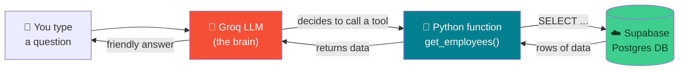
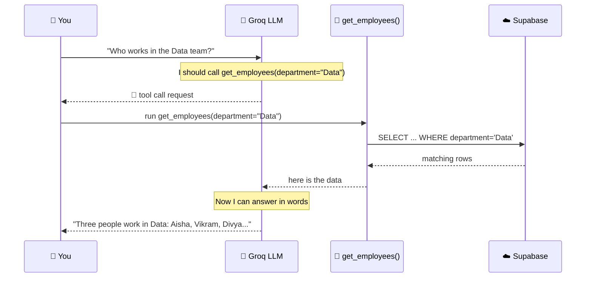
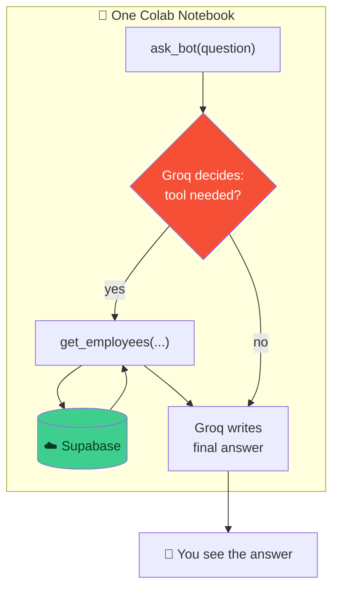

# 🔧 Tool Calling — End-to-End Practical

### *A minimal, real project: Groq + Supabase + a command-line AI bot (all in Google Colab)*

> **What we're building today:** a tiny AI bot you can chat with in the terminal. You ask it a question in plain English → it decides to call a **tool** → the tool reads **real data from a real cloud database (Supabase)** → the bot answers you in a friendly sentence.
>
> No servers, no frameworks, no local install. Everything runs inside one **Google Colab** notebook.

---

## 🗺️ The Big Picture (Read This First)

Here is the whole system on one page. Don't worry if some words are new — we build every piece step by step.



**Three pieces, three jobs:**

| Piece | Job | Analogy |
|-------|-----|---------|
| ☁️ **Supabase** | Stores our real data in the cloud | The filing cabinet 🗄️ |
| 🔧 **Tool function** | Python code that fetches from the cabinet | The clerk who opens the drawer 💁 |
| 🤖 **Groq LLM** | Reads your question, decides which tool to call | The manager who directs the clerk 🧠 |

> 🔑 **The key idea of tool calling:** the LLM does **not** know your data. It only knows *"I have a tool called `get_employees` — I should call it."* Your code fetches the real data. The LLM never touches the database directly.

---

## 📋 What You'll Need (all free)

1. A **Google account** (for Colab) — `https://colab.research.google.com`
2. A **Supabase account** — `https://supabase.com` (sign in with GitHub, free tier)
3. A **Groq account** — `https://console.groq.com` (free API key)

That's it. Let's go.

---

# PART A — ☁️ Set Up the Cloud Database (Supabase)

We'll create a database, add a table of **employees**, and put **real data** in it using a *migration* (a SQL script that sets everything up in one shot).

### A.1 — Create a Supabase project

1. Go to `https://supabase.com` → **Sign in** (use GitHub, it's fastest).
2. Click **New project**.
3. Fill in:
   - **Name:** `tool-calling-demo`
   - **Database Password:** pick anything and save it somewhere
   - **Region:** choose the one closest to you
4. Click **Create new project**. ⏳ Wait ~2 minutes while it spins up.

### A.2 — Run the migration (create table + insert data)

A **migration** is just a SQL script that builds your database structure and fills it with starter data. Running it once gives everyone the exact same database — no manual clicking.

1. In your Supabase project, open the **SQL Editor** (left sidebar, the `</>` icon).
2. Click **+ New query**.
3. Paste the script below and click **Run** ▶️.

```sql
-- ============================================================
-- MIGRATION: employees table + seed data
-- ============================================================

-- 1. Create the table (drop first so this script is re-runnable)
drop table if exists employees;

create table employees (
    id           bigint generated always as identity primary key,
    name         text    not null,
    department   text    not null,
    role         text    not null,
    city         text    not null,
    salary       integer not null,
    hired_on     date    not null
);

-- 2. Insert real starter data
insert into employees (name, department, role, city, salary, hired_on) values
    ('Priya Sharma',    'Engineering', 'Senior Developer',  'Bangalore', 1800000, '2021-03-15'),
    ('Rahul Verma',     'Engineering', 'Developer',         'Bangalore', 1200000, '2022-07-01'),
    ('Aisha Khan',      'Data',        'Data Scientist',    'Pune',      1600000, '2020-11-20'),
    ('Vikram Singh',    'Data',        'Data Analyst',      'Pune',       900000, '2023-01-10'),
    ('Neha Gupta',      'Design',      'UX Designer',       'Mumbai',    1100000, '2021-09-05'),
    ('Arjun Mehta',     'Sales',       'Sales Manager',     'Delhi',     1400000, '2019-06-25'),
    ('Sara Ali',        'Sales',       'Sales Executive',   'Delhi',      700000, '2023-04-18'),
    ('Karan Patel',     'Engineering', 'DevOps Engineer',   'Hyderabad', 1500000, '2022-02-28'),
    ('Divya Nair',      'Data',        'ML Engineer',       'Bangalore', 1900000, '2020-08-12'),
    ('Rohit Kumar',     'Design',      'Product Designer',  'Mumbai',    1300000, '2021-12-01');

-- 3. Let the API read this table (needed so our Python client can query it)
alter table employees enable row level security;

create policy "Allow public read access"
    on employees for select
    to anon
    using (true);
```

> ✅ You should see **"Success. No rows returned"**. That's expected — the last statements don't return rows.
>
> 💡 **What did we just do?** Created an `employees` table, inserted 10 real employees, and added a small security rule that lets our app *read* the data. (The read-only rule keeps it simple and safe for a demo.)

### A.3 — Verify the data is really there

In the left sidebar, click **Table Editor** → **employees**. You should see all 10 rows. 🎉 Real data, in a real cloud database.

### A.4 — Grab your two connection secrets

We need two things to connect from Python. In the Supabase dashboard:

1. Click the **Connect** button (top of the page) — or go to **Project Settings → API**.
2. Copy these two values and keep them handy:

| Secret | Looks like | Where |
|--------|-----------|-------|
| **Project URL** | `https://abcdxyz.supabase.co` | Settings → API → *Project URL* |
| **anon public key** | a long `eyJ...` string | Settings → API → *Project API keys → anon public* |

> ⚠️ The `anon` key is safe to use in a demo (it can only do what your security rules allow — here, read the employees table). Never paste your **service_role** key or database password into notebooks.

---

# PART B — 🤖 Get Your Groq API Key

1. Go to `https://console.groq.com` → sign in.
2. In the left menu click **API Keys** → **Create API Key**.
3. Name it `colab-demo`, click **Submit**, and **copy the key** (starts with `gsk_...`).
   You won't be able to see it again, so copy it now.

---

# PART C — 💻 Build the Bot in Google Colab

Open a fresh notebook at `https://colab.research.google.com` → **New notebook**. Now work through the cells below **one at a time** (Shift+Enter runs a cell).

### C.1 — Install the libraries

Paste into the **first cell** and run:

```python
!pip install -q groq supabase
```

> 💡 The `!` tells Colab to run a shell command. The `-q` just keeps the output quiet.

### C.2 — Store your secrets safely (Colab Secrets)

Never paste API keys directly into code you might share. Colab has a built-in secrets vault 🔐.

1. Click the **🔑 key icon** in the left sidebar of Colab.
2. Add **three** secrets (toggle "Notebook access" ON for each):

| Name | Value |
|------|-------|
| `GROQ_API_KEY` | your `gsk_...` key |
| `SUPABASE_URL` | your `https://....supabase.co` URL |
| `SUPABASE_KEY` | your `anon` public key (`eyJ...`) |

Now read them into your notebook:

```python
from google.colab import userdata

GROQ_API_KEY  = userdata.get("GROQ_API_KEY")
SUPABASE_URL  = userdata.get("SUPABASE_URL")
SUPABASE_KEY  = userdata.get("SUPABASE_KEY")

print("✅ Secrets loaded" if all([GROQ_API_KEY, SUPABASE_URL, SUPABASE_KEY]) else "❌ Something is missing")
```

### C.3 — Connect to Supabase and test it

```python
from supabase import create_client

supabase = create_client(SUPABASE_URL, SUPABASE_KEY)

# Quick sanity check — read 3 rows
test = supabase.table("employees").select("*").limit(3).execute()
for row in test.data:
    print(row["name"], "—", row["role"])
```

**Expected output:**

```
Priya Sharma — Senior Developer
Rahul Verma — Developer
Aisha Khan — Data Scientist
```

> 🎉 If you see names, your Python code is talking to the real cloud database. If you get an empty list, re-check that you ran the migration (Part A.2) and that the read policy was created.

### C.4 — Write the TOOL function (the clerk 💁)

This is a **normal Python function**. It knows how to fetch employees from Supabase, optionally filtered by department or city. This is the "tool" the LLM will call.

```python
def get_employees(department: str = None, city: str = None) -> list:
    """Fetch employees from the database, optionally filtered.

    Args:
        department: e.g. "Engineering", "Data", "Sales", "Design"
        city:       e.g. "Bangalore", "Pune", "Delhi", "Mumbai"
    Returns:
        A list of employee records (dicts).
    """
    query = supabase.table("employees").select(
        "name, department, role, city, salary"
    )
    if department:
        query = query.eq("department", department)
    if city:
        query = query.eq("city", city)

    result = query.execute()
    return result.data

# Test the tool directly (no AI yet — just checking it works)
print(get_employees(department="Data"))
```

**Expected output** (a list of the Data-team employees):

```
[{'name': 'Aisha Khan', 'department': 'Data', 'role': 'Data Scientist', 'city': 'Pune', 'salary': 1600000}, ...]
```

> 🔑 **This function is the bridge.** The LLM can't read the database — but it *can* ask us to run `get_employees("Data")`, and this code does the real work.

### C.5 — Describe the tool to Groq (the "menu")

The LLM can't read your Python. You describe the tool as a **JSON schema** so Groq knows its name, what it does, and what inputs it accepts.

```python
tools = [
    {
        "type": "function",
        "function": {
            "name": "get_employees",
            "description": (
                "Get the list of company employees. Can filter by department "
                "and/or city. Use this whenever the user asks about employees, "
                "staff, teams, who works where, salaries, or headcount."
            ),
            "parameters": {
                "type": "object",
                "properties": {
                    "department": {
                        "type": "string",
                        "description": "Department name, e.g. Engineering, Data, Sales, Design",
                    },
                    "city": {
                        "type": "string",
                        "description": "City name, e.g. Bangalore, Pune, Delhi, Mumbai",
                    },
                },
                "required": [],
            },
        },
    }
]
```

> 📝 **The `description` is instructions to the model.** Notice we listed *trigger phrases* ("who works where, salaries, headcount"). Clear descriptions = the model knows exactly when to reach for this tool.

### C.6 — The tool-calling loop (the manager 🧠)

Now the heart of it. When you ask a question, Groq may reply *"call `get_employees` with these arguments."* We run the function, hand back the result, and Groq writes the final answer.



Here's the code that runs that loop:

```python
import json
from groq import Groq

groq_client = Groq(api_key=GROQ_API_KEY)
MODEL = "llama-3.3-70b-versatile"   # a solid Groq model with reliable tool calling

# Maps the tool name (a string) to the real Python function
available_functions = {"get_employees": get_employees}

def ask_bot(question: str) -> str:
    messages = [
        {"role": "system", "content":
            "You are a helpful HR assistant. Use the provided tools to answer "
            "questions about employees. Answer in clear, friendly sentences."},
        {"role": "user", "content": question},
    ]

    # --- STEP 1: Ask Groq. Does it want to use a tool? ---
    response = groq_client.chat.completions.create(
        model=MODEL,
        messages=messages,
        tools=tools,
        tool_choice="auto",   # let the model decide
    )
    msg = response.choices[0].message

    # --- STEP 2: If it requested tool(s), run them ---
    if msg.tool_calls:
        messages.append(msg)   # record the model's request

        for call in msg.tool_calls:
            fn_name = call.function.name
            fn_args = json.loads(call.function.arguments)
            print(f"   🔧 calling {fn_name}({fn_args})")

            # Run OUR real function against the real database
            result = available_functions[fn_name](**fn_args)

            # Hand the result back to the model
            messages.append({
                "role": "tool",
                "tool_call_id": call.id,
                "name": fn_name,
                "content": json.dumps(result),
            })

        # --- STEP 3: Ask Groq again → it writes the final human answer ---
        final = groq_client.chat.completions.create(model=MODEL, messages=messages)
        return final.choices[0].message.content

    # No tool needed — the model answered directly
    return msg.content
```

### C.7 — Try a single question

```python
print(ask_bot("Who works in the Data team?"))
```

**Example output:**

```
   🔧 calling get_employees({'department': 'Data'})
Three people work in the Data team: Aisha Khan (Data Scientist) and
Divya Nair (ML Engineer), both based in Bangalore or Pune, along with
Vikram Singh (Data Analyst) in Pune.
```

> 🎯 **Pause and appreciate this.** You never told the code to filter by "Data" — **Groq read your sentence and chose the arguments itself.** That's tool calling.

---

# PART D — 🖥️ Turn It Into a Command-Line Bot

Now we wrap `ask_bot` in a simple **chat loop** so you can keep asking questions until you type `quit`. In Colab, `input()` shows a text box right under the cell.

```python
print("🤖 HR Bot ready! Ask me about employees. Type 'quit' to exit.\n")

while True:
    question = input("You: ")
    if question.strip().lower() in {"quit", "exit", "q"}:
        print("👋 Bye!")
        break
    if not question.strip():
        continue

    answer = ask_bot(question)
    print(f"Bot: {answer}\n")
```

### 💬 Things to ask it

Try these — each one makes Groq pick different tool arguments:

- `Who works in the Data team?`
- `List everyone in Bangalore.`
- `Who are the sales people in Delhi?`
- `How many employees do we have in total?`
- `Which department has the highest paid person?`

> 🧠 Notice the bot handles questions you never explicitly coded for (like counting or comparing salaries) — it fetches the rows with your tool, then reasons over them itself.

---

## 🧩 How It All Fits (Recap)



| Step | What happened | The code |
|------|---------------|----------|
| 1 | You asked a question | `input()` |
| 2 | Groq chose a tool + arguments | `tool_choice="auto"` |
| 3 | Your function hit the real DB | `supabase.table(...).execute()` |
| 4 | Result went back to Groq | `role: "tool"` message |
| 5 | Groq wrote a friendly answer | second `create()` call |

---

## 🛠️ Troubleshooting

| Symptom | Likely cause | Fix |
|---------|-------------|-----|
| `test.data` is empty `[]` | Migration not run, or read policy missing | Re-run Part A.2 in the SQL Editor |
| `Invalid API Key` (Supabase) | Wrong key pasted | Use the **anon public** key, not service_role |
| `401` / auth error (Groq) | Wrong or expired Groq key | Recreate the key at console.groq.com |
| Bot answers without real data | Tool description too vague | Add trigger phrases to the `description` |
| `KeyError` on `userdata.get` | Colab secret name mismatch | Names must match exactly + "Notebook access" ON |

---

## 🚀 Extend It (Optional Challenges)

1. **Add a second tool** — `get_departments()` that returns the list of unique departments. Give Groq both tools and watch it pick the right one.
2. **Add a write tool** — `add_employee(name, department, ...)` that inserts a row (you'll need to loosen the security policy to allow inserts). Now your bot can *change* data, not just read it.
3. **Filter by salary** — add a `min_salary` parameter to `get_employees` so you can ask "who earns more than 15 lakh?".

---

## ✅ What You Learned

- ☁️ Created a **real cloud Postgres database** on Supabase and seeded it with a **SQL migration**
- 🔧 Wrote a **tool function** in Python that fetches real data
- 🤖 Described that tool to **Groq** and let the LLM **decide when to call it**
- 🔁 Implemented the full **tool-calling loop** — ask → tool → data → answer
- 🖥️ Wrapped it all in a **command-line AI bot** running entirely in Colab

> 🎓 This is the exact pattern behind real AI assistants that book flights, query databases, and take actions. You just built a minimal, working version end-to-end.

---

## 🧰 Quick Reference Card

```python
# ── SETUP ──
!pip install -q groq supabase
from supabase import create_client
from groq import Groq
supabase = create_client(SUPABASE_URL, SUPABASE_KEY)
groq_client = Groq(api_key=GROQ_API_KEY)

# ── TOOL: plain function ──
def get_employees(department=None, city=None):
    q = supabase.table("employees").select("*")
    if department: q = q.eq("department", department)
    return q.execute().data

# ── DESCRIBE it (JSON schema in `tools=[...]`) ──
# ── LOOP: create() → if msg.tool_calls → run fn → append role:"tool" → create() again ──
```

| Concept | One-liner |
|---------|-----------|
| **Migration** | A SQL script that builds + seeds your DB in one run |
| **Supabase client** | `create_client(url, key)` → `.table("x").select().execute()` |
| **Tool** | A plain Python function the LLM can request |
| `tools=[...]` | The JSON menu you hand to Groq |
| `tool_choice="auto"` | Let Groq decide whether to call a tool |
| `role: "tool"` | How you feed the function's result back to Groq |
| **Golden rule** | Tool ignored? Add trigger phrases to its `description` |
