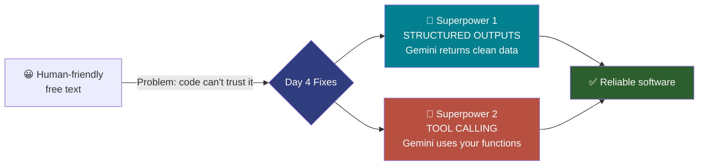
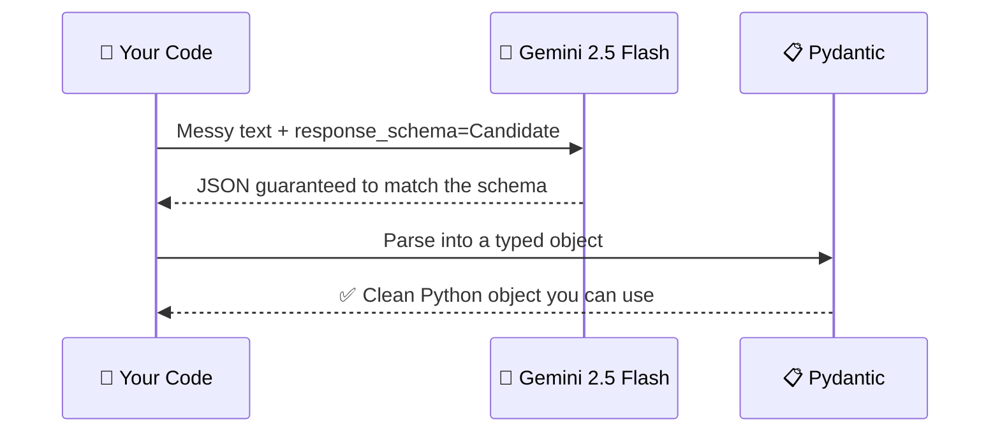
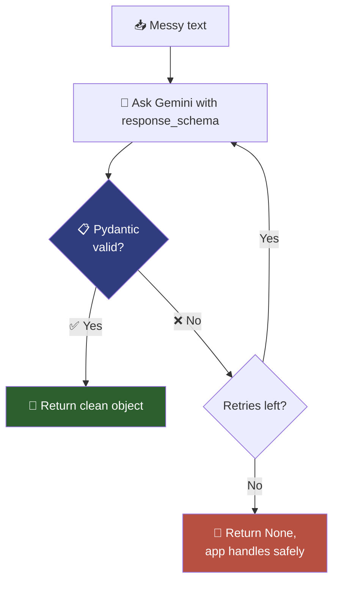
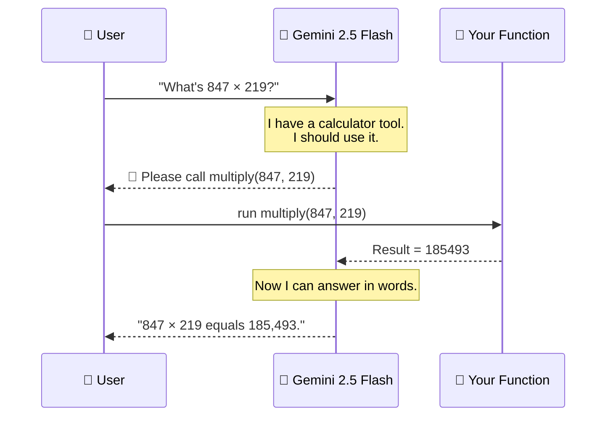
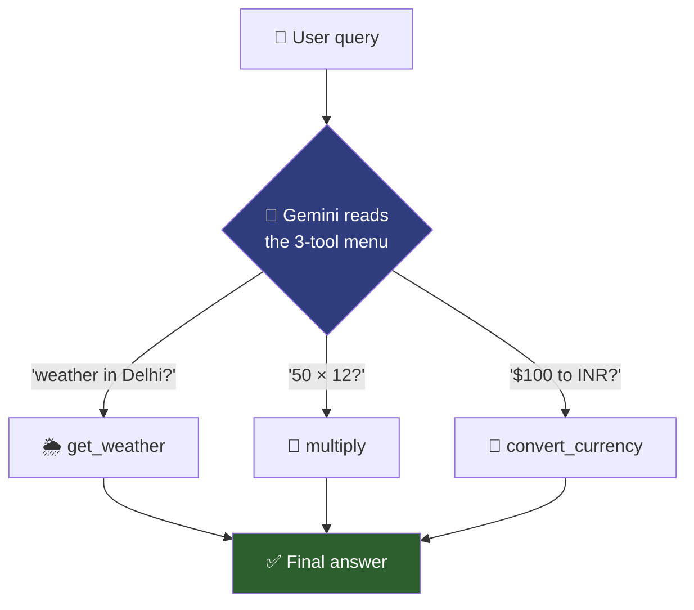
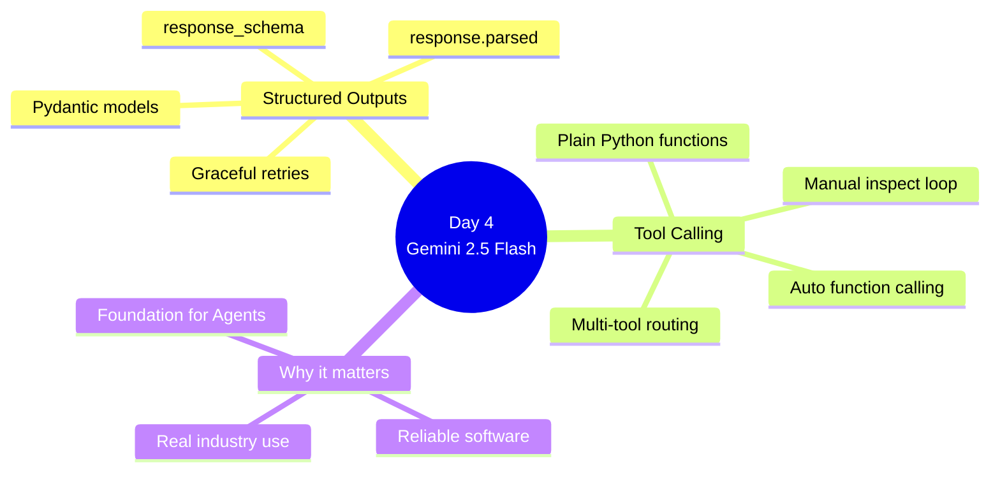

# 🗓️ Day 4 — Structured Outputs & Tool Calling

### *Module M3 · 6 hours · 100% Hands-On · Powered by Gemini 2.5 Flash*

> **The one-line pitch:** Today we stop treating an LLM like a chatbot that spits out paragraphs, and start treating it like a **software component** — one that returns clean, predictable data your code can trust, and one that can **pick up and use tools** (functions, calculators, APIs) on its own. Everything today runs on Google's **Gemini 2.5 Flash** model.

---

## 📌 Before We Start — What You Already Have

By Day 4 you have already:

- ✅ Made your first API calls to an LLM (Day 3)
- ✅ Played with temperature, top-p, and prompting styles (Day 3)
- ✅ Seen that an LLM replies in **free-form text**

Today we fix the biggest real-world headache with that free-form text: **you can't trust it.**

### 🔑 One Model for Everything: Gemini 2.5 Flash

Throughout Day 4 (and the rest of this programme) we use a **single model**: `gemini-2.5-flash`. Why this one?

| Reason | What it means for you |
|--------|-----------------------|
| ⚡ **Fast & cheap** | Great for live labs — quick responses, generous free tier |
| 🧱 **Native structured output** | Gemini can *guarantee* JSON that matches your schema |
| 🔧 **Native tool calling** | Built-in function calling — no extra libraries needed |
| 🎓 **One SDK to learn** | We only learn `google-genai`. Less to memorise, more to build |

> 💡 One model, one SDK, zero confusion. Every code snippet today uses the exact same client.

---

## 🔧 One-Time Setup (Do This First)

```bash
# Install the official Google GenAI SDK + Pydantic
pip install google-genai pydantic
```

> 💡 **Colab tip:** inside a notebook cell, put an exclamation mark first → `!pip install google-genai pydantic`

### 🔑 Getting your API key

1. Go to **Google AI Studio** → `https://aistudio.google.com/apikey`
2. Click **Create API key** (it's free to start)
3. Copy the key and set it as an environment variable:

```bash
export GEMINI_API_KEY="your-key-here"     # macOS / Linux
```

```python
# In Colab, set it safely like this:
import os
os.environ["GEMINI_API_KEY"] = "your-key-here"
```

### The client — you'll create this **once** and reuse it everywhere

```python
from google import genai

# The SDK automatically reads GEMINI_API_KEY from your environment.
client = genai.Client()

MODEL = "gemini-2.5-flash"   # 👈 our single model for the whole programme
```

> 📝 Keep `client` and `MODEL` at the top of every notebook. Every example below assumes they already exist.

---

## 🎯 Day 4 Learning Outcomes

By the end of today, **everyone** — regardless of background — will be able to:

| # | You will be able to… |
|---|----------------------|
| 1 | Explain *why* free-text LLM output breaks real software |
| 2 | Define a data "shape" using **Pydantic** and force Gemini to fill it |
| 3 | Validate a Gemini response and handle errors *gracefully* (not crash) |
| 4 | Give Gemini a **tool** (a Python function) and let it decide when to call it |
| 5 | Build a mini assistant that routes between **multiple tools** |
| 6 | Understand *why* every agent you'll build next week depends on today |

---

## 🧠 Part 0 — The Core Problem (Explained Simply)

Imagine you ask a friend: *"What's the weather and what should I wear?"*

Your friend replies:

> "Oh it's around 18 degrees, maybe grab a light jacket, could rain later though!"

That's **great for a human**. But now imagine you're a *vending machine* that must:

- Pull out the **exact number** `18`
- Decide **jacket: yes/no**
- Decide **umbrella: yes/no**

A vending machine can't read a friendly sentence. It needs **structured data**:

```json
{
  "temperature_c": 18,
  "jacket": true,
  "umbrella": true
}
```

> 🔑 **This is the entire point of Day 4.**
> LLMs naturally talk like your friend. Software needs the vending-machine format.
> We're going to force Gemini to hand us clean JSON — and then let it *use tools* too.

### 🖼️ The Two Superpowers of Today



---

## 🧱 PART 1 — Structured Outputs with Pydantic (Session 1 · 2 hours)

### 1.1 What is Pydantic? (Zero assumptions)

**Pydantic** is a small Python library that lets you describe *what your data should look like* — and then it **checks reality against that description**.

Think of it as a **strict form** 📋. You define the fields, their types, and whether they're required. If someone hands you the wrong thing, Pydantic complains loudly *before* the bad data reaches the rest of your program.

#### 🍎 Everyday analogy

A passport application form:

| Field | Rule |
|-------|------|
| Full name | text, required |
| Age | must be a **number**, required |
| Email | must *look like* an email |

If you write "banana" in the Age box, the clerk rejects it immediately. **Pydantic is that clerk.**

### 1.2 First Pydantic Model

```python
from pydantic import BaseModel

# We are describing the SHAPE of a person.
# Every class that inherits from BaseModel becomes a "strict form".
class Person(BaseModel):
    name: str          # must be text
    age: int           # must be a whole number
    is_student: bool   # must be True or False

# ✅ This works — types match
p1 = Person(name="Aisha", age=21, is_student=True)
print(p1)
# name='Aisha' age=21 is_student=True

# ❌ This FAILS loudly — "twenty" is not an int
p2 = Person(name="Ravi", age="twenty", is_student=True)
```

Running the last line throws a clear error:

```
pydantic_core._pydantic_core.ValidationError: 1 validation error for Person
age
  Input should be a valid integer, unable to parse string as an integer
```

> 🎉 **This is a feature, not a bug.** We *want* it to fail here, in a controlled way, instead of silently letting "twenty" break something later.

### 1.3 Why This Matters — Gemini's Native Structured Output

Here's the magic move. Gemini 2.5 Flash has a **built-in** structured-output mode. Instead of *hoping* the model returns JSON, we hand it the Pydantic model directly and Gemini **guarantees** the output matches it.

Two switches make this happen inside the `config`:

- `response_mime_type="application/json"` → "reply in JSON, not prose"
- `response_schema=MyModel` → "and it must match this exact shape"



### 1.4 Hands-On: Extract a Structured Profile from Messy Text

**Goal:** Turn a messy resume snippet into a clean, typed object.

```python
from google import genai
from google.genai import types
from pydantic import BaseModel, Field

client = genai.Client()
MODEL = "gemini-2.5-flash"

# ---------- STEP 1: Describe the shape we want ----------
class Candidate(BaseModel):
    full_name: str = Field(description="Person's full name")
    years_experience: int = Field(description="Total years of work experience")
    primary_skill: str = Field(description="Their single strongest skill")
    email: str = Field(description="Contact email address")

# ---------- STEP 2: The messy real-world input ----------
messy_text = """
Hey, I'm Priya Sharma. Been coding for about 6 years now, mostly Python
and some data science stuff. You can reach me at priya.codes@gmail.com
whenever. Cheers!
"""

# ---------- STEP 3: Ask Gemini, forcing the shape ----------
response = client.models.generate_content(
    model=MODEL,
    contents=messy_text,
    config=types.GenerateContentConfig(
        response_mime_type="application/json",   # 👈 JSON, not prose
        response_schema=Candidate,               # 👈 must match our model
    ),
)

# ---------- STEP 4: Use the result ----------
# .parsed gives you a ready-made Pydantic object — no manual JSON parsing!
candidate: Candidate = response.parsed

print("✅ Clean, typed object:")
print("Name       :", candidate.full_name)
print("Experience :", candidate.years_experience, "years")
print("Skill      :", candidate.primary_skill)
print("Email      :", candidate.email)
```

**Expected output:**

```
✅ Clean, typed object:
Name       : Priya Sharma
Experience : 6 years
Skill      : Python
Email      : priya.codes@gmail.com
```

> 🧩 **Notice two lovely things:**
> 1. We never wrote "please return JSON" in the prompt — `response_schema` handles it.
> 2. `response.parsed` hands us a **ready-to-use Pydantic object**. No `json.loads`, no cleanup.

### 1.5 🔑 The Key Ideas So Far

- 🧱 **Pydantic model** = a strict description of the data shape you want
- ⚙️ `response_mime_type="application/json"` = the switch that says *"reply in JSON only"*
- 🎯 `response_schema=Candidate` = *"and it must match this exact shape"*
- ✨ `response.parsed` = Gemini hands you the finished, typed object

---

## 🛡️ PART 2 — Handling Validation Errors Gracefully (Session 1 continued)

Gemini's schema mode is very reliable — but the network can hiccup, and your own **Pydantic validators** (extra rules you add) can still reject data. **A production system must survive this.**

### 2.1 The Naive (Fragile) Way ❌

```python
candidate = response.parsed        # 💥 if anything went wrong, this can be None or raise
print(candidate.full_name)         # 💥 crashes if candidate is None
```

If something fails, your entire program dies. Not acceptable.

### 2.2 Adding Your Own Rules with Validators

Pydantic lets you add extra checks beyond types. Say we require a *positive* number of years:

```python
from pydantic import BaseModel, Field, field_validator

class Candidate(BaseModel):
    full_name: str
    years_experience: int
    primary_skill: str
    email: str

    @field_validator("years_experience")
    @classmethod
    def years_must_be_sane(cls, v: int) -> int:
        if v < 0 or v > 60:
            raise ValueError("years_experience must be between 0 and 60")
        return v
```

### 2.3 The Robust Way ✅ — Catch, Report, Retry

```python
from pydantic import ValidationError

def extract_candidate(text: str, max_retries: int = 2) -> Candidate | None:
    for attempt in range(1, max_retries + 1):
        print(f"🔄 Attempt {attempt}...")
        try:
            response = client.models.generate_content(
                model=MODEL,
                contents=text,
                config=types.GenerateContentConfig(
                    response_mime_type="application/json",
                    response_schema=Candidate,
                ),
            )
            # .parsed runs Pydantic validation for us. If a rule fails,
            # it raises ValidationError, which we catch below.
            return response.parsed

        except ValidationError as e:
            print(f"⚠️  Validation failed: {e}")
            # Loop runs again → Gemini gets another chance
        except Exception as e:
            print(f"⚠️  API/parse error: {e}")

    print("❌ Gave up after retries.")
    return None

result = extract_candidate(messy_text)
if result:
    print("Got clean data:", result.full_name)
else:
    print("Could not extract — handle this case in your app.")
```

### 2.4 🖼️ The Safety Net Visualised



> 💬 **Teaching point for the room:** *"Never let a single bad response take down your service. Assume it will misbehave — and build the net before you need it."*

### 2.5 🧪 Mini-Exercise (10 min)

Add a new field `notice_period_days: int` to the `Candidate` model. Feed in text that **does not mention** a notice period. Watch what happens, then discuss:

- Does Gemini invent a number?
- Should you make the field **optional**? (`notice_period_days: int | None = None`)

---

## 🔧 PART 3 — Tool Calling Fundamentals (Session 2 · 2 hours)

### 3.1 What is "Tool Calling"? (Explained for everyone)

So far the LLM only *talks*. But an LLM **can't actually do things** — it can't check today's weather, it can't do precise arithmetic reliably, it can't query your database.

**Tool calling** solves this. You hand Gemini a menu of **functions** (tools). Gemini reads a user's request and, instead of guessing, it says:

> "🤖 I don't know the weather myself, but I see you gave me a `get_weather` tool. Please run `get_weather(city='Delhi')` for me."

Your code runs the function, gives the result back, and Gemini writes the final human answer.

### 🍎 Everyday analogy — The Receptionist

Think of Gemini as a smart **receptionist** 💁:

- They can *talk* to you brilliantly.
- But they can't fix your laptop themselves.
- They **know who to call**: "This needs IT — let me dial extension 42."

The receptionist doesn't do the repair. They **route** to the right tool. **That's tool calling.**

### 3.2 🖼️ The Tool-Calling Loop



> ⚠️ **Crucial mental model:** Gemini never runs the function itself. It only *asks* your code to run it. **You** are always in control of execution. This is a safety feature.

### 3.3 The Easiest Way — Automatic Function Calling

The `google-genai` SDK has a wonderful shortcut: **just pass your plain Python functions** as tools. Gemini reads the function's **name, its type hints, and its docstring** to understand what it does — then calls it *automatically* and gives you the final answer. No JSON schemas to hand-write.

#### Step 1 — Write normal Python functions (with clear docstrings!)

```python
def get_weather(city: str) -> str:
    """Get the current weather for a given city.

    Args:
        city: The name of the city, e.g. "Delhi".
    """
    fake_db = {
        "delhi": "34°C, sunny",
        "london": "12°C, rainy",
        "tokyo": "19°C, cloudy",
    }
    return fake_db.get(city.lower(), "No data for that city")

def multiply(a: float, b: float) -> float:
    """Multiply two numbers together accurately.

    Args:
        a: The first number.
        b: The second number.
    """
    return a * b
```

> 📝 **The docstring is not decoration — it is instructions to Gemini.** A vague docstring = Gemini won't know when to use the tool. Write it like you're explaining to a new intern. The type hints (`city: str`) tell Gemini what inputs to send.

#### Step 2 — Hand the functions to Gemini and let it work

```python
from google.genai import types

response = client.models.generate_content(
    model=MODEL,
    contents="What's the weather in Tokyo?",
    config=types.GenerateContentConfig(
        tools=[get_weather, multiply],   # 👈 just pass the functions!
    ),
)

print(response.text)
# The SDK automatically:
#   1. Sent your question + the tool menu to Gemini
#   2. Saw Gemini ask for get_weather(city="Tokyo")
#   3. Ran YOUR function, got "19°C, cloudy"
#   4. Sent the result back, got the final sentence
# Output → "The weather in Tokyo is currently 19°C and cloudy. 🌥️"

response2 = client.models.generate_content(
    model=MODEL,
    contents="What is 847 times 219?",
    config=types.GenerateContentConfig(tools=[get_weather, multiply]),
)
print(response2.text)
# Output → "847 times 219 equals 185,493."
```

> 🎯 **Pause and appreciate this.** Gemini *chose* the calculator for the math question and the weather tool for the weather question — **entirely on its own**. You wrote no `if/else` to decide, and no JSON schema. The SDK read your type hints and docstrings for you.

### 3.4 Peeking Under the Hood (Manual Mode)

Automatic mode is great, but sometimes you want to **see and control** each tool call — this is exactly what next week's agents need. Turn automatic mode off and inspect the request:

```python
from google.genai import types

config = types.GenerateContentConfig(
    tools=[get_weather, multiply],
    # Turn OFF auto-calling so WE handle the tool call manually
    automatic_function_calling=types.AutomaticFunctionCallingConfig(disable=True),
)

response = client.models.generate_content(
    model=MODEL,
    contents="What's the weather in Delhi?",
    config=config,
)

# Did Gemini ask for a tool?
part = response.candidates[0].content.parts[0]
if part.function_call:
    call = part.function_call
    print(f"🔧 Gemini wants to call: {call.name}({dict(call.args)})")
    # → 🔧 Gemini wants to call: get_weather({'city': 'Delhi'})

    # WE decide to run it (safety!) and could feed the result back
    available = {"get_weather": get_weather, "multiply": multiply}
    result = available[call.name](**call.args)
    print("   ↳ result:", result)
```

> 🧠 **This manual pattern is the seed of an agent.** An agent is just this loop — ask, inspect the tool request, run it, feed the result back — repeated until the task is done. We build exactly this on Day 7.

### 3.5 🧠 Why Not Just Let Gemini Do Math Itself?

Great question to raise with the room. LLMs predict text; they are **unreliable at exact arithmetic** with big numbers. A calculator tool is *always* right. **Rule of thumb:** anything that needs to be *exact* or *live* (math, dates, database lookups, current prices) → give it a tool.

---

## 🔀 PART 4 — Multi-Tool Routing & Ambiguity (Session 3 · 2 hours)

### 4.1 Three Tools, One Query

Now we add a **third** tool and let Gemini pick the right one from three options. We'll add a currency converter — and again, we just write a normal function.

```python
def convert_currency(amount: float, from_cur: str, to_cur: str) -> str:
    """Convert an amount of money from one currency to another.

    Args:
        amount: How much money to convert.
        from_cur: The 3-letter source currency code, e.g. "USD".
        to_cur: The 3-letter target currency code, e.g. "INR".
    """
    rates = {"USD_INR": 83.0, "INR_USD": 1 / 83.0, "EUR_INR": 90.0}
    key = f"{from_cur.upper()}_{to_cur.upper()}"
    if key not in rates:
        return "Rate not available"
    return f"{amount * rates[key]:.2f} {to_cur.upper()}"

# Hand ALL THREE tools to Gemini — it picks the right one every time
tools = [get_weather, multiply, convert_currency]

for question in [
    "What's the weather in Delhi?",
    "What is 50 times 12?",
    "Convert 100 US dollars to Indian rupees.",
]:
    resp = client.models.generate_content(
        model=MODEL,
        contents=question,
        config=types.GenerateContentConfig(tools=tools),
    )
    print(f"Q: {question}\nA: {resp.text}\n")
```



### 4.2 The Ambiguous Query 🤔

What if the user says something vague like:

> "Convert it for me."

Convert *what*? To *which* currency? A good model, given the right setup, will **ask a clarifying question** instead of hallucinating.

```python
config = types.GenerateContentConfig(
    tools=[convert_currency],
    system_instruction=(
        "You are a helpful assistant. If a request is missing information "
        "needed to call a tool, ASK the user a clarifying question instead "
        "of guessing."
    ),
)

resp = client.models.generate_content(
    model=MODEL,
    contents="Convert it to rupees for me.",
    config=config,
)
print(resp.text)
# Likely: "Sure! How much would you like to convert, and from which currency?"
```

> 💡 **Teaching moment:** A model that *asks* when unsure is far safer than one that *guesses*. The `system_instruction` is where you set this behaviour.

### 4.3 ⚠️ The Classic Failure — A Tool Gemini Refuses to Call

Sometimes Gemini *should* use a tool but doesn't. **99% of the time the cause is a bad docstring or unclear type hints.**

**Broken version (Gemini ignores it):**

```python
def lookup(x):          # ❌ no type hints, no docstring
    ...
```

**Fixed version (Gemini uses it correctly):**

```python
def lookup_order_status(order_id: str) -> str:
    """Look up the delivery status of a customer order using their order ID.

    Use this whenever a user asks 'where is my order' or mentions an
    order number.

    Args:
        order_id: The customer's order ID, e.g. "ORD-4821".
    """
    ...
```

> 🔑 **Golden rule:** If Gemini won't call your tool, **fix the docstring and type hints before you touch anything else.** For Gemini, the function's signature *is* the prompt.

---

## 🧩 PART 5 — Two Real Demos to Show the Room

### 5.1 Demo A — The Invoice Extractor 📄

Paste an unstructured email, get a validated `Invoice` object — back to structured output, now with a real business document.

```python
from pydantic import BaseModel, Field

class Invoice(BaseModel):
    invoice_number: str = Field(description="The invoice number/ID")
    vendor: str = Field(description="Company that issued the invoice")
    total_amount: float = Field(description="Total payable amount as a number")
    due_date: str = Field(description="Due date in YYYY-MM-DD format")

email = """
Hi team, please process payment for invoice INV-2026-0091 from
BrightWare Solutions. The total comes to 45,600 rupees and it's
due by the 15th of August 2026. Thanks!
"""

response = client.models.generate_content(
    model=MODEL,
    contents=email,
    config=types.GenerateContentConfig(
        response_mime_type="application/json",
        response_schema=Invoice,
    ),
)

invoice: Invoice = response.parsed
print(invoice)
# invoice_number='INV-2026-0091' vendor='BrightWare Solutions'
# total_amount=45600.0 due_date='2026-08-15'
```

> 🏢 **Real-world hook:** This single pattern powers accounts-payable automation, resume parsing, and support-ticket triage. It is genuinely the most-used LLM skill in industry.

### 5.2 Demo B — Structured Output *and* Tools Together

The two superpowers combine: a tool fetches live data, then we force the *final answer* into a clean structure. This is the exact foundation for **next week's agents** — a tool brings information in, and structured output makes the result something your next piece of code can consume.

---

## 📊 Part 6 — Structured Outputs vs Tool Calling: When to Use What

| Situation | Use this | Why |
|-----------|----------|-----|
| Turn messy text into clean data | 🧱 **Structured Output** (`response_schema`) | You need a predictable shape back |
| Model needs live/exact info (weather, math, DB) | 🔧 **Tool Calling** (`tools=[...]`) | Gemini can't know it alone |
| Extract fields from a document | 🧱 Structured Output | Classic parsing job |
| Book a meeting / send an email / query an API | 🔧 Tool Calling | Gemini must *act* |
| Build an autonomous agent | 🔧 **Both together** | Agents = tools + structured decisions |



---

## ✅ Day 4 Wrap-Up & Outcome

Today the room went from *"the LLM writes paragraphs"* to *"Gemini returns data my code trusts and uses tools I give it."*

**You can now:**

- 🧱 Force clean, typed objects out of Gemini using **`response_schema` + Pydantic**
- 🛡️ Survive bad responses with **validation + retries**
- 🔧 Give Gemini **plain Python functions** as tools and let it choose when to call them
- 🔀 Route between **multiple tools** and handle **ambiguous** requests
- 🧠 Understand *why* this is the engineering skill underneath **every agentic system** you'll build next week

> 🎓 **Day 4 Outcome:** Everyone can reliably extract structured data from Gemini 2.5 Flash and orchestrate multi-tool calls — the exact skill that makes Day 7's agents possible.

---

## 📝 Homework / Reflection (Optional, 20 min)

1. **Extend the assistant** with a fourth tool of your choice (e.g., `get_time(timezone)` — remember a clear docstring!).
2. **Break a tool on purpose** by removing its docstring and type hints, watch Gemini ignore it, then fix it.
3. **Make one field optional** in a Pydantic model and observe how Gemini handles missing info.

---

## 🧰 Quick Reference Card (Keep This Handy)

```python
from google import genai
from google.genai import types
from pydantic import BaseModel

client = genai.Client()
MODEL = "gemini-2.5-flash"

# ── STRUCTURED OUTPUT — the recipe ──
class MyModel(BaseModel):
    field_a: str
    field_b: int

resp = client.models.generate_content(
    model=MODEL,
    contents="...your text...",
    config=types.GenerateContentConfig(
        response_mime_type="application/json",
        response_schema=MyModel))
obj = resp.parsed          # 👈 ready-made typed object

# ── TOOL CALLING — the easy way ──
def my_tool(x: str) -> str:
    """Clear docstring telling Gemini exactly what this does."""
    return "..."

resp = client.models.generate_content(
    model=MODEL,
    contents="...user question...",
    config=types.GenerateContentConfig(tools=[my_tool]))
print(resp.text)           # 👈 Gemini called the tool for you
```

| Concept | One-liner |
|---------|-----------|
| **Model** | `gemini-2.5-flash` — one model for the whole programme |
| **Pydantic** | A strict form that validates data shape |
| `response_schema` | Forces Gemini's output to match your model |
| `response.parsed` | The finished, typed object — no manual JSON parsing |
| **Tool** | A plain Python function Gemini can request |
| `tools=[...]` | Hand functions to Gemini; it auto-calls them |
| **Golden rule** | Tool ignored? Fix the *docstring & type hints* first |

---

*🔗 Next up — Day 5: RAG Systems & Vector Databases. We'll give Gemini a memory of your own documents.*
