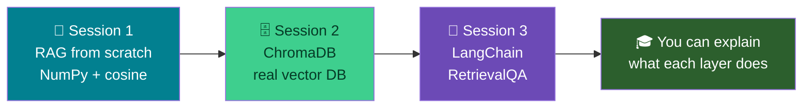
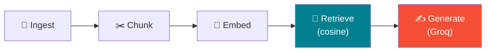
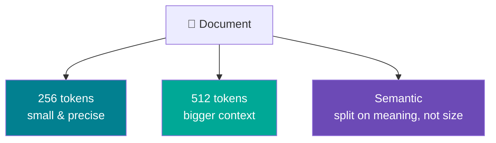
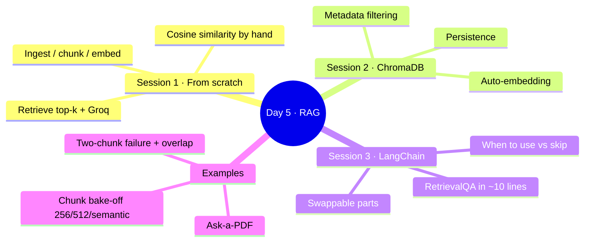

# 🗓️ Day 5 (Part 1) — RAG Systems & Vector Databases: All Topics

### *Module M4 · 6 hours · Build RAG three ways — from scratch, with ChromaDB, and with LangChain · Groq for generation*

> **Goal of this document:** cover *every* Day 5 topic in a minimal, runnable way. You'll build RAG **three times** — by hand with NumPy, then with a real vector database (ChromaDB), then with a framework (LangChain) — and understand exactly what each layer hides. We also cover the illustrative examples: **Ask-a-PDF**, the **256 vs 512 vs semantic chunking bake-off**, and the **two-chunk failure** (and its overlap fix).
>
> Every code block runs in **Google Colab**. Generation always uses **Groq**; embeddings run free & local.

---

## 🧭 What We're Building (Roadmap)



### 🔑 The one architecture note (read once)

Groq is fast at **generating** text but does **not** host embedding models. So across all three builds:

| Job | Tool | Cost |
|-----|------|------|
| 🔢 Embeddings (text → vectors) | `sentence-transformers` (local) | free |
| 🔎 Retrieval (find chunks) | NumPy → ChromaDB → LangChain | free |
| ✍️ Generation (write answer) | **Groq** LLM | free tier |

---

## 🔧 One-Time Colab Setup

Run these first. We install everything Day 5 needs across all three sessions.

```python
!pip install -q groq sentence-transformers numpy \
               chromadb langchain langchain-groq \
               langchain-chroma langchain-huggingface \
               langchain-community pypdf
```

Add your Groq key via **Colab Secrets** (🔑 icon in the left sidebar → add `GROQ_API_KEY`), then:

```python
from google.colab import userdata
import os

GROQ_API_KEY = userdata.get("GROQ_API_KEY")
os.environ["GROQ_API_KEY"] = GROQ_API_KEY   # some libraries read it from env
print("✅ Ready" if GROQ_API_KEY else "❌ Add your GROQ_API_KEY in Colab Secrets")

GROQ_MODEL = "llama-3.3-70b-versatile"   # our Groq model for the whole day
```

> 💡 No Groq key? Get one free at `https://console.groq.com` → **API Keys**.

---

# 🔨 SESSION 1 — RAG From Scratch (NumPy + Cosine, No Framework)

**Why do this the hard way?** Because once you build retrieval with your own hands, every framework afterwards becomes *obvious*. No magic, no hidden steps.

### 1.1 — The mental model (all 5 stages)



### 1.2 — Ingest a corpus (just some text)

```python
# Our "knowledge base" — normally this comes from files. Kept inline to stay minimal.
corpus = [
    "Acme Corp offers 24 days of paid annual leave to all full-time employees.",
    "Employees may work from home up to 3 days per week with manager approval.",
    "The head office is at 42 MG Road, Bangalore, and opens at 9:00 AM daily.",
    "Acme reimburses home internet up to 1000 rupees per month for remote staff.",
    "New joiners are on probation for the first 6 months of employment.",
    "The annual company retreat is held every December in Goa.",
]
```

### 1.3 — Embed everything (turn text into vectors)

```python
from sentence_transformers import SentenceTransformer
import numpy as np

embedder = SentenceTransformer("all-MiniLM-L6-v2")   # tiny, free, ~80MB

# Each chunk becomes a 384-number vector
corpus_vectors = embedder.encode(corpus)
print("Shape:", corpus_vectors.shape)   # (6, 384) → 6 chunks, 384 numbers each
```

### 1.4 — Cosine similarity, written by hand

This is the heart of retrieval. Cosine similarity measures the **angle** between two vectors: 1.0 = identical direction, 0 = unrelated.

```python
def cosine_similarity(a, b):
    """Angle-based similarity between two vectors. 1 = same, 0 = unrelated."""
    return np.dot(a, b) / (np.linalg.norm(a) * np.linalg.norm(b))

# Sanity check: similar sentences score high
v1 = embedder.encode("How much leave do I get?")
v2 = embedder.encode("How many holidays are there?")
v3 = embedder.encode("Where is the office?")
print("leave vs holidays:", round(float(cosine_similarity(v1, v2)), 2))  # ~0.6+
print("leave vs office  :", round(float(cosine_similarity(v1, v3)), 2))  # low
```

### 1.5 — Retrieve: find the top-k closest chunks

```python
def retrieve(question, k=2):
    q_vec = embedder.encode(question)
    # score the question against every chunk
    scores = [cosine_similarity(q_vec, c_vec) for c_vec in corpus_vectors]
    # get indices of the top-k highest scores
    top_idx = np.argsort(scores)[::-1][:k]
    return [(corpus[i], round(float(scores[i]), 3)) for i in top_idx]

for chunk, score in retrieve("How many holidays do I get?"):
    print(f"{score}  |  {chunk}")
```

**Expected:**

```
0.41  |  Acme Corp offers 24 days of paid annual leave to all full-time employees.
0.18  |  New joiners are on probation for the first 6 months of employment.
```

> 🎯 You asked about "holidays"; the top hit is about "annual leave" — matched by **meaning**, using math you wrote yourself.

### 1.6 — Generate: hand the context to Groq

```python
from groq import Groq
groq_client = Groq(api_key=GROQ_API_KEY)

def rag_from_scratch(question, k=2):
    hits = retrieve(question, k)                       # ① RETRIEVE
    context = "\n".join(chunk for chunk, _ in hits)
    prompt = f"""Answer using ONLY the context below.  # ② AUGMENT
If it's not in the context, say "I don't have that information."

Context:
{context}

Question: {question}"""
    resp = groq_client.chat.completions.create(        # ③ GENERATE
        model=GROQ_MODEL,
        messages=[{"role": "user", "content": prompt}],
        temperature=0,
    )
    return resp.choices[0].message.content

print(rag_from_scratch("How many holidays do I get?"))
# → "According to the context, Acme Corp offers 24 days of paid annual leave..."
```

> ✅ **Session 1 done.** You built the entire pipeline with `numpy` and one `for` loop. Everything below just makes this faster and tidier — nothing *conceptually* new.

---

# 🗄️ SESSION 2 — ChromaDB (A Real Vector Database)

Our hand-rolled `retrieve()` loops over **every** chunk for **every** question. Fine for 6 chunks; hopeless for 6 million. A vector database indexes vectors so search stays fast at scale — plus it gives us **persistence** and **metadata filtering** for free.

### 2.1 — Migrate the corpus into ChromaDB

```python
import chromadb

chroma_client = chromadb.Client()   # in-memory; use PersistentClient to save to disk
collection = chroma_client.get_or_create_collection("acme")

# ChromaDB embeds automatically with all-MiniLM-L6-v2 — same model as Session 1!
collection.add(
    documents=corpus,
    ids=[f"doc_{i}" for i in range(len(corpus))],
)
print("Stored:", collection.count(), "chunks")
```

### 2.2 — Query (retrieval in one call)

```python
results = collection.query(query_texts=["How many holidays do I get?"], n_results=2)
for doc in results["documents"][0]:
    print("-", doc)
```

> 🔁 Same result as your hand-rolled version — but ChromaDB did the embedding, scoring, and top-k selection in a single line. *That's* what the abstraction buys you.

### 2.3 — Metadata filtering (a superpower NumPy didn't give us)

Attach tags to each chunk, then filter retrieval by them. Great for multi-department or multi-document corpora.

```python
collection2 = chroma_client.get_or_create_collection("acme_tagged")
collection2.add(
    documents=corpus,
    ids=[f"d{i}" for i in range(len(corpus))],
    metadatas=[
        {"topic": "leave"},   {"topic": "remote"}, {"topic": "office"},
        {"topic": "remote"},  {"topic": "hr"},     {"topic": "events"},
    ],
)

# Only search within "remote"-tagged chunks
results = collection2.query(
    query_texts=["what can I claim?"],
    n_results=2,
    where={"topic": "remote"},   # 👈 metadata filter
)
print(results["documents"][0])
```

### 2.4 — Persistence (save the DB to disk)

```python
# PersistentClient writes to a folder so your index survives a restart
persistent = chromadb.PersistentClient(path="/content/chroma_store")
pcol = persistent.get_or_create_collection("acme_persist")
pcol.add(documents=corpus, ids=[f"p{i}" for i in range(len(corpus))])
print("Saved to /content/chroma_store — reload it later without re-embedding.")
```

### 2.5 — Wire ChromaDB retrieval to Groq

```python
def rag_chroma(question, k=2):
    hits = collection.query(query_texts=[question], n_results=k)
    context = "\n".join(hits["documents"][0])
    prompt = f'''Answer using ONLY the context. If absent, say "I don't know."
Context:
{context}
Question: {question}'''
    resp = groq_client.chat.completions.create(
        model=GROQ_MODEL, messages=[{"role": "user", "content": prompt}], temperature=0)
    return resp.choices[0].message.content

print(rag_chroma("Can I work from home?"))
```

> ✅ **Session 2 done.** Same RAG, now backed by a scalable index with filtering and persistence.

---

# 🔗 SESSION 3 — LangChain's RetrievalQA (The Framework)

LangChain bundles *ingest → chunk → embed → store → retrieve → prompt → generate* into a few composable objects. Great for speed; the cost is a layer of abstraction. Let's build the **same** RAG and then judge the trade-off.

### 3.1 — Build the whole chain

```python
from langchain_huggingface import HuggingFaceEmbeddings
from langchain_chroma import Chroma
from langchain_groq import ChatGroq
from langchain.chains import RetrievalQA

# ① Embeddings (same local model, wrapped for LangChain)
embeddings = HuggingFaceEmbeddings(model_name="all-MiniLM-L6-v2")

# ② Vector store built straight from our text list
vectorstore = Chroma.from_texts(texts=corpus, embedding=embeddings)

# ③ Groq as the LLM
llm = ChatGroq(model="llama-3.3-70b-versatile", temperature=0)

# ④ One object that does retrieve → stuff into prompt → generate
qa = RetrievalQA.from_chain_type(
    llm=llm,
    chain_type="stuff",                       # "stuff" = put all chunks in one prompt
    retriever=vectorstore.as_retriever(search_kwargs={"k": 2}),
    return_source_documents=True,             # so we can see WHICH chunks were used
)

result = qa.invoke({"query": "How many holidays do I get?"})
print("Answer:", result["result"])
print("\nSources used:")
for doc in result["source_documents"]:
    print(" -", doc.page_content)
```

### 3.2 — Hand-rolled vs LangChain: the honest comparison

| Aspect | From scratch (S1) | LangChain (S3) |
|--------|-------------------|----------------|
| Lines of code | ~30 | ~10 |
| You see every step | ✅ fully | ❌ hidden in the chain |
| Swap vector DB / LLM | manual rewrite | change one line |
| Debugging a weird answer | easy (it's your code) | harder (peek inside the chain) |
| Best for | learning, full control | shipping fast, standard pipelines |

> 🎓 **When to use which:** hand-roll (or use ChromaDB directly) when you need control or are learning; reach for LangChain when you want a standard pipeline fast and value swappable parts over transparency.

> ✅ **Session 3 done — and you've now built RAG three times.** You can explain exactly what each abstraction hides.

---

# 📄 EXAMPLE A — "Ask a PDF Anything"

Ingest a real multi-page PDF (e.g., a university policy) and answer questions about it. This adds the **ingestion + chunking** stages we skipped by using inline text.

### A.1 — Upload a PDF in Colab

```python
from google.colab import files
uploaded = files.upload()          # a file picker appears — choose your PDF
pdf_path = list(uploaded.keys())[0]
print("Uploaded:", pdf_path)
```

### A.2 — Load and split it

```python
from langchain_community.document_loaders import PyPDFLoader
from langchain.text_splitter import RecursiveCharacterTextSplitter

pages = PyPDFLoader(pdf_path).load()          # one Document per page
print(f"Loaded {len(pages)} pages")

splitter = RecursiveCharacterTextSplitter(chunk_size=500, chunk_overlap=50)
chunks = splitter.split_documents(pages)
print(f"Split into {len(chunks)} chunks")
```

### A.3 — Build the RAG chain over the PDF

```python
pdf_store = Chroma.from_documents(chunks, embedding=embeddings)
pdf_qa = RetrievalQA.from_chain_type(
    llm=llm, retriever=pdf_store.as_retriever(search_kwargs={"k": 4}),
    return_source_documents=True,
)

ans = pdf_qa.invoke({"query": "What is the attendance requirement?"})  # ask your PDF!
print(ans["result"])
print("\nFrom page(s):", [d.metadata.get("page") for d in ans["source_documents"]])
```

> 🏢 This is the exact skeleton behind "chat with your document" products. Swap in any PDF and ask away.

---

# ✂️ EXAMPLE B — Chunking Bake-Off: 256 vs 512 vs Semantic

Chunk size quietly decides whether RAG works. Too small → context gets cut off; too big → retrieval turns noisy. Let's measure it on the **same 5 questions**.

### B.1 — The three strategies



- **256-token chunks** — many small pieces. Precise matches, but a fact spanning two pieces can get cut.
- **512-token chunks** — fewer, larger pieces. More context per chunk, but retrieval is less pinpointed.
- **Semantic chunking** — split where the *topic* changes (using embeddings), not at a fixed size. Chunks stay meaning-complete.

### B.2 — A sample document + gold questions

```python
document = """
Acme Corp Leave Policy. Full-time employees receive 24 days of paid annual leave.
Leave must be requested two weeks in advance through the HR portal. Unused leave
of up to 5 days may be carried over to the next year. Sick leave is separate and
capped at 12 days per year, requiring a medical certificate beyond 3 consecutive days.
Maternity leave is 26 weeks; paternity leave is 2 weeks. Remote employees follow the
same leave rules. The retreat in December does not count against annual leave.
"""

questions = [
    "How many days of annual leave do employees get?",
    "How much unused leave can be carried over?",
    "What is the sick leave cap?",
    "How long is maternity leave?",
    "Does the December retreat use up annual leave?",
]
```

### B.3 — Helper: build a RAG over any chunk list & score answers

```python
def build_qa(chunks_list):
    store = Chroma.from_texts(chunks_list, embedding=embeddings)
    return RetrievalQA.from_chain_type(
        llm=llm, retriever=store.as_retriever(search_kwargs={"k": 3}))

def evaluate(qa_chain, name):
    print(f"\n===== {name} =====")
    for q in questions:
        ans = qa_chain.invoke({"query": q})["result"]
        print(f"Q: {q}\nA: {ans}\n")
```

### B.4 — Strategy 1 & 2: fixed-size (256 vs 512 "tokens")

We approximate tokens with characters (~4 chars ≈ 1 token, so 256 tokens ≈ 1000 chars).

```python
from langchain.text_splitter import RecursiveCharacterTextSplitter

# ~256 tokens
small = RecursiveCharacterTextSplitter(chunk_size=1000, chunk_overlap=100).split_text(document)
# ~512 tokens
large = RecursiveCharacterTextSplitter(chunk_size=2000, chunk_overlap=200).split_text(document)

print(f"256-style: {len(small)} chunks   |   512-style: {len(large)} chunks")

evaluate(build_qa(small), "256-token chunks")
evaluate(build_qa(large), "512-token chunks")
```

### B.5 — Strategy 3: semantic chunking (split on meaning)

Semantic chunking cuts where consecutive sentences stop being similar — so each chunk is one coherent idea.

```python
import numpy as np

def semantic_chunk(text, threshold=0.5):
    """Split into sentences, then start a new chunk when meaning shifts."""
    sentences = [s.strip() for s in text.replace("\n", " ").split(".") if s.strip()]
    vecs = embedder.encode(sentences)
    chunks, current = [], [sentences[0]]
    for i in range(1, len(sentences)):
        sim = float(cosine_similarity(vecs[i], vecs[i - 1]))   # reuse Session 1's function
        if sim >= threshold:
            current.append(sentences[i])          # same idea → keep together
        else:
            chunks.append(". ".join(current) + ".")  # topic shifted → close chunk
            current = [sentences[i]]
    chunks.append(". ".join(current) + ".")
    return chunks

semantic = semantic_chunk(document, threshold=0.5)
print(f"Semantic: {len(semantic)} chunks")
for c in semantic:
    print(" •", c)

evaluate(build_qa(semantic), "Semantic chunks")
```

### B.6 — What to look for

| Strategy | Typical result on these questions |
|----------|-----------------------------------|
| 256-token | Sharp on single-fact questions; may miss facts split across a boundary |
| 512-token | Robust context; can dilute a precise question with extra text |
| Semantic | Usually the most consistent — each chunk is one clean idea |

> 🔬 **The lesson:** there's no universally "right" chunk size. Bake it off against *your* real questions. Semantic chunking often wins because it respects meaning instead of arbitrary length.

---

# 🔪 EXAMPLE C — The Two-Chunk Failure (and the Overlap Fix)

The single most common RAG bug: an answer that lives **across a chunk boundary**, so no single chunk contains it and retrieval fails.

### C.1 — Force the failure (no overlap)

```python
# A fact deliberately split: the "who" and the "when" land in different chunks.
text = ("The project kickoff meeting will be led by Priya Sharma. "                     # chunk 1 end
        "It is scheduled for the 15th of March at 10 AM in Conference Room B.")          # chunk 2 start

# chunk_overlap=0 → a hard cut with nothing shared between chunks
no_overlap = RecursiveCharacterTextSplitter(
    chunk_size=60, chunk_overlap=0).split_text(text)
print("Chunks (no overlap):")
for c in no_overlap: print(" •", repr(c))

qa_bad = build_qa(no_overlap)
print("\nQ: Who leads the kickoff and when is it?")
print("A:", qa_bad.invoke({"query": "Who leads the kickoff and when is it?"})["result"])
# ❌ Likely incomplete — "who" and "when" are in different chunks, only one is retrieved
```

### C.2 — The fix: overlapping chunks

Overlap makes consecutive chunks **share** their boundary text, so a straddling fact appears whole in at least one chunk.


```python
with_overlap = RecursiveCharacterTextSplitter(
    chunk_size=60, chunk_overlap=30).split_text(text)   # 👈 30-char overlap
print("Chunks (with overlap):")
for c in with_overlap: print(" •", repr(c))

qa_good = build_qa(with_overlap)
print("\nQ: Who leads the kickoff and when is it?")
print("A:", qa_good.invoke({"query": "Who leads the kickoff and when is it?"})["result"])
# ✅ Now a chunk contains both the leader AND the time → complete answer
```

> 🔑 **Rule of thumb:** always set `chunk_overlap` to roughly 10–20% of `chunk_size`. It's the cheapest insurance against the most common RAG failure.

---

# 📊 Wrap-Up — The Whole Day on One Page



| Topic | One-liner takeaway |
|-------|--------------------|
| RAG from scratch | Retrieval is just cosine similarity + top-k; no magic |
| Cosine similarity | Compares direction of vectors; 1 = same meaning |
| ChromaDB | A fast, persistent index with metadata filtering |
| Metadata filtering | Restrict retrieval to a subset (department, doc, topic) |
| LangChain RetrievalQA | The whole pipeline in one object — fast, but less transparent |
| Ask-a-PDF | Load → split → embed → retrieve → answer; the real-world skeleton |
| Chunk size (256/512/semantic) | No universal best — bake off on your own questions |
| Overlap | Shared boundary text; fixes answers split across chunks |

> 🎓 **Day 5 Outcome:** You built RAG **three times** — by hand, with a vector DB, and with a framework — and can articulate exactly what each abstraction does and hides.

---

## 🧰 Quick Reference Card

```python
# ── SHARED SETUP ──
from sentence_transformers import SentenceTransformer
from groq import Groq
embedder = SentenceTransformer("all-MiniLM-L6-v2")
groq_client = Groq(api_key=GROQ_API_KEY)
MODEL = "llama-3.3-70b-versatile"

# ── FROM SCRATCH: cosine + top-k ──
import numpy as np
cos = lambda a,b: np.dot(a,b)/(np.linalg.norm(a)*np.linalg.norm(b))

# ── CHROMADB: one-line retrieval ──
import chromadb
col = chromadb.Client().get_or_create_collection("x")
col.add(documents=chunks, ids=[f"d{i}" for i in range(len(chunks))])
col.query(query_texts=[q], n_results=2, where={"topic": "leave"})  # + metadata filter

# ── LANGCHAIN: whole pipeline ──
from langchain_chroma import Chroma
from langchain_groq import ChatGroq
from langchain_huggingface import HuggingFaceEmbeddings
from langchain.chains import RetrievalQA
store = Chroma.from_texts(chunks, HuggingFaceEmbeddings(model_name="all-MiniLM-L6-v2"))
qa = RetrievalQA.from_chain_type(llm=ChatGroq(model=MODEL, temperature=0),
                                 retriever=store.as_retriever(search_kwargs={"k": 2}))
qa.invoke({"query": q})["result"]

# ── CHUNKING ──
from langchain.text_splitter import RecursiveCharacterTextSplitter
RecursiveCharacterTextSplitter(chunk_size=1000, chunk_overlap=150).split_text(text)
```

| Model / tool | String |
|--------------|--------|
| Groq LLM | `llama-3.3-70b-versatile` |
| Embeddings | `all-MiniLM-L6-v2` (free, local) |
| Vector DB | `chromadb` / `langchain_chroma` |
| PDF loader | `PyPDFLoader` |
| Splitter | `RecursiveCharacterTextSplitter` |

---

*🔗 Continues in Day 6: RAG at Scale (FAISS) + a Streamlit UI + quantitative evaluation (Recall@K, faithfulness).*
