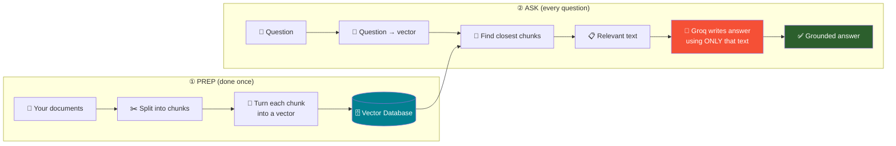
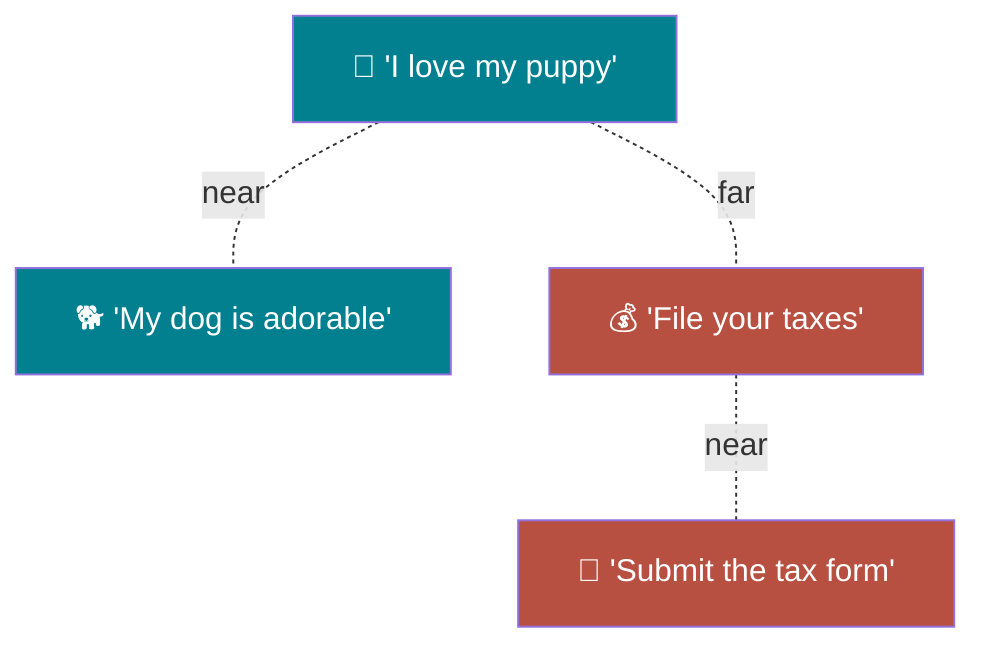
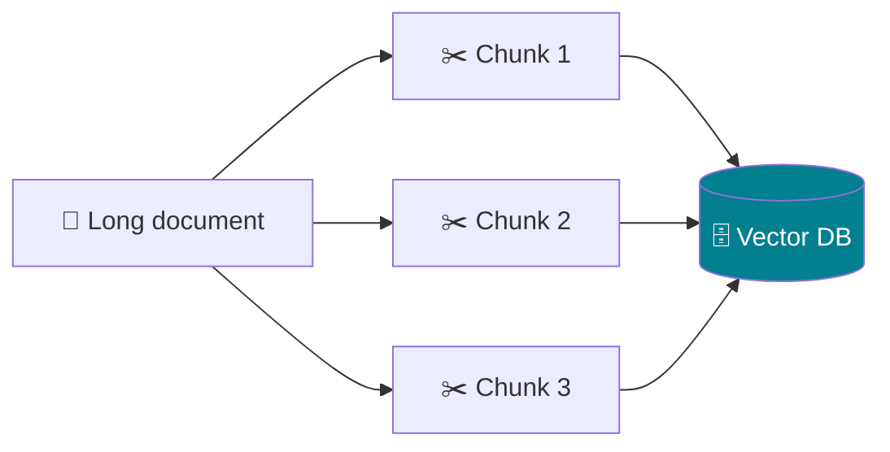
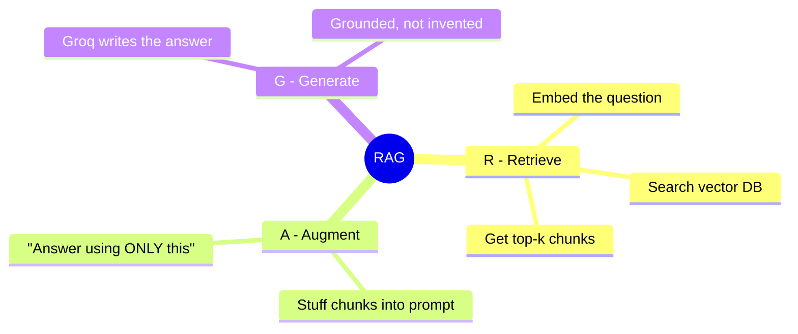

# 🗓️ Day 5 — RAG Systems & Vector Databases

### *Module M4 · 6 hours · 100% Hands-On · Retrieval with local embeddings + Generation with Groq*

> **The one-line pitch:** Yesterday we made the LLM return clean data and use tools. Today we give it a **memory of your own documents**. You'll build a system that reads *your* files, finds the right passage for any question, and answers using **only that passage** — so it stops making things up.

---

## 📌 Before We Start

By Day 5 you already know how to call an LLM and get answers. But there's a problem we haven't fixed yet…

### 🤔 The Problem: the LLM doesn't know *your* stuff

Ask a plain LLM *"What is our company's leave policy?"* and it will either:

- ❌ Say "I don't have access to that information", or
- ❌ **Make something up** that sounds confident but is wrong (a "hallucination")

Why? Because the LLM was trained on the public internet — **not on your PDF, your notes, or your company handbook.**

> 🔑 **RAG fixes this.** RAG = *Retrieval-Augmented Generation*. In plain words: **look up the relevant text first, then let the LLM answer using that text.**

### 🧠 A one-model note about today's stack

Groq is brilliant and fast at **generating** text, but Groq does **not** host embedding models (the piece that turns text into searchable numbers). So today we split the work the way real systems do:

| Job | Who does it | Runs where |
|-----|-------------|-----------|
| 🔢 **Embeddings** (turn text → numbers) | a tiny open-source model, built into ChromaDB | free, on Colab's CPU |
| 🔎 **Retrieval** (find the right chunk) | ChromaDB vector database | free, in memory |
| ✍️ **Generation** (write the answer) | **Groq** LLM | Groq API |

> 💡 One LLM provider — **Groq** — for all the "thinking". The embedding step is a free local helper. You never need a second paid API.

---

## 🎯 Day 5 Learning Outcomes

By the end of today, **everyone** — regardless of background — will be able to:

| # | You will be able to… |
|---|----------------------|
| 1 | Explain *why* a plain LLM hallucinates, and how RAG stops it |
| 2 | Understand embeddings & vectors with a simple mental model |
| 3 | Split documents into **chunks** and store them in a **vector database** |
| 4 | Retrieve the most relevant chunk for any question |
| 5 | Build a full **RAG pipeline**: ingest → embed → retrieve → answer with Groq |
| 6 | Build an "Ask-a-Document" bot and understand where RAG breaks |

---

## 🧠 Part 0 — RAG Explained Simply (No Jargon)

### 🍎 The open-book exam analogy

Imagine a student taking an exam:

- **Closed-book (a plain LLM):** answers from memory alone. If they didn't study your specific textbook, they *guess* — and guesses can be confidently wrong.
- **Open-book (RAG):** before answering, they **flip to the exact page** in your textbook, read it, and answer from what's written there.

RAG turns your confidently-guessing LLM into a careful **open-book** student. 📖

### 🖼️ The RAG pipeline in one picture



Two phases: **prep it once**, then **ask as many times as you like.**

---

## 🔢 Part 1 — Embeddings & Vectors (Session 1 · Concept)

### 1.1 What is an embedding? (Zero assumptions)

An **embedding** is a way to turn a piece of text into a **list of numbers** that captures its *meaning*. Similar meanings → similar numbers.

### 🍎 The map analogy

Think of a map of a country. Every city is a pair of numbers (latitude, longitude). Cities that are **close in meaning** (say, two beach towns) end up **close on the map**.

An embedding does the same for *sentences*: it places each sentence as a point in "meaning-space". Sentences about dogs cluster together; sentences about taxes cluster elsewhere.



> 🔑 "**Semantic search**" = searching by *meaning*, not by matching exact words. That's why RAG can find the right passage even when your question uses totally different words than the document.

### 1.2 See it yourself (a 5-line demo)

You don't need to understand the math. Just see that similar sentences get high similarity scores.

```python
# We'll set this up properly in Part 2. This is just to build intuition.
from sentence_transformers import SentenceTransformer, util

model = SentenceTransformer("all-MiniLM-L6-v2")   # tiny, free, ~80MB

a = model.encode("I love my puppy")
b = model.encode("My dog is adorable")
c = model.encode("Please file your taxes")

print("puppy vs dog :", round(float(util.cos_sim(a, b)), 2))   # ~0.6  (similar!)
print("puppy vs tax :", round(float(util.cos_sim(a, c)), 2))   # ~0.05 (different)
```

> 🎉 Notice: the model has never been told "puppy" and "dog" are related. It **learned** that from meaning. That's the magic that powers retrieval.

---

## 🏗️ Part 2 — Build RAG From Scratch (Session 2 · Hands-On in Colab)

Now the real thing. Open a fresh notebook at `https://colab.research.google.com`. Run each cell with **Shift+Enter**.

### 2.1 — Install the libraries

```python
!pip install -q groq chromadb sentence-transformers
```

> 💡 `chromadb` = our vector database. `sentence-transformers` = the free embedding model (ChromaDB uses it under the hood). `groq` = the LLM that writes answers.

### 2.2 — Add your Groq key (Colab Secrets)

1. Click the **🔑 key icon** in Colab's left sidebar.
2. Add a secret named `GROQ_API_KEY` with your `gsk_...` key (toggle "Notebook access" ON).

```python
from google.colab import userdata
GROQ_API_KEY = userdata.get("GROQ_API_KEY")
print("✅ Key loaded" if GROQ_API_KEY else "❌ Missing key")
```

> 🔑 Don't have a key? Get one free at `https://console.groq.com` → **API Keys**.

### 2.3 — Our tiny "knowledge base"

In real life these chunks come from PDFs or docs. To keep it minimal and clear, we'll hand-write a few facts about a fictional company, **Acme Corp**. Each string is one "chunk".

```python
documents = [
    "Acme Corp offers 24 days of paid annual leave to all full-time employees.",
    "Employees can work from home up to 3 days per week with manager approval.",
    "The office is located at 42 MG Road, Bangalore, and opens at 9:00 AM.",
    "Acme Corp reimburses internet bills up to 1000 rupees per month for remote staff.",
    "New employees are on probation for the first 6 months of employment.",
    "The annual company retreat happens every December in Goa.",
]
```

### 2.4 — Store the chunks in ChromaDB (embedding happens automatically)

This is the beautiful part: when you `add` documents to ChromaDB **without specifying an embedding function, it automatically embeds them for you** using the free `all-MiniLM-L6-v2` model. No embedding code needed.

```python
import chromadb

# In-memory database (resets when the notebook restarts — perfect for a lab)
chroma_client = chromadb.Client()
collection = chroma_client.get_or_create_collection(name="acme_docs")

# Add our chunks. ChromaDB embeds them automatically. ✨
collection.add(
    documents=documents,
    ids=[f"doc_{i}" for i in range(len(documents))],   # each chunk needs a unique id
)

print(f"✅ Stored {collection.count()} chunks in the vector database.")
```

**Expected output:**

```
✅ Stored 6 chunks in the vector database.
```

### 2.5 — Retrieve: find the right chunk for a question

Ask a question in words that **don't match** the document, and watch semantic search still find it.

```python
question = "How many holidays do I get?"   # note: doc says "annual leave", not "holidays"

results = collection.query(query_texts=[question], n_results=2)

print("🔎 Top matching chunks:")
for chunk in results["documents"][0]:
    print(" -", chunk)
```

**Expected output:**

```
🔎 Top matching chunks:
 - Acme Corp offers 24 days of paid annual leave to all full-time employees.
 - New employees are on probation for the first 6 months of employment.
```

> 🎯 **Pause here.** You asked about "holidays"; the document said "annual leave". Different words, same meaning — and it found the right chunk. **That's semantic retrieval.**

### 2.6 — Generate: let Groq answer using ONLY the retrieved text

Now we glue retrieval to generation. We stuff the retrieved chunks into the prompt as **context**, and instruct Groq to answer *only* from that context.

```python
from groq import Groq

groq_client = Groq(api_key=GROQ_API_KEY)
MODEL = "llama-3.3-70b-versatile"

def rag_answer(question: str, n_results: int = 2) -> str:
    # ① RETRIEVE the most relevant chunks
    results = collection.query(query_texts=[question], n_results=n_results)
    context = "\n".join(results["documents"][0])

    # ② AUGMENT: build a prompt that includes the context
    prompt = f"""Answer the question using ONLY the context below.
If the answer is not in the context, say "I don't have that information."

Context:
{context}

Question: {question}
Answer:"""

    # ③ GENERATE with Groq
    response = groq_client.chat.completions.create(
        model=MODEL,
        messages=[{"role": "user", "content": prompt}],
        temperature=0,   # keep it factual, not creative
    )
    return response.choices[0].message.content

# 🧪 Try it
print(rag_answer("How many holidays do I get?"))
```

**Expected output:**

```
Based on the context, Acme Corp offers 24 days of paid annual leave to all full-time employees.
```

> 🔑 **This is RAG.** Retrieve → Augment (stuff into prompt) → Generate. The answer is *grounded* in your document, not invented.

---

## 🧩 Part 3 — The "Ask-a-Document" Bot (Session 3 · Hands-On)

Let's make it interactive — a command-line loop, and let's also prove RAG's honesty when it *doesn't* know.

### 3.1 — The chat loop

```python
print("📖 Acme Doc Bot ready! Ask about leave, WFH, office, etc. Type 'quit' to exit.\n")

while True:
    q = input("You: ")
    if q.strip().lower() in {"quit", "exit", "q"}:
        print("👋 Bye!")
        break
    if not q.strip():
        continue
    print("Bot:", rag_answer(q), "\n")
```

### 3.2 — Questions to try

```text
How many days of leave do I get?
Can I work from home?
Where is the office and when does it open?
What's the capital of France?     ← NOT in our docs — watch it stay honest
```

> 🧠 That last one is the key demo. A plain LLM would happily answer "Paris". Our RAG bot should say **"I don't have that information"** — because it's not in the Acme documents. **This honesty is the whole point of RAG.**

---

## 🍽️ Part 4 — Chunking: Why & How (Concept + Mini-Lab)

Real documents are long. You can't embed a 50-page PDF as one blob — retrieval would return the whole book. So we **chunk**: split text into bite-sized pieces.

### 🍕 The pizza-slice analogy

You don't serve a whole pizza to answer "who wants a slice?" — you cut it. Chunks are slices of your document, each small enough to be a precise answer.



### 4.1 — A minimal chunker

```python
def chunk_text(text: str, chunk_size: int = 300, overlap: int = 50) -> list:
    """Split text into overlapping chunks of ~chunk_size characters.
    Overlap keeps sentences that straddle a boundary from being lost.
    """
    chunks = []
    start = 0
    while start < len(text):
        end = start + chunk_size
        chunks.append(text[start:end])
        start = end - overlap   # step back a little so chunks overlap
    return chunks

long_text = (
    "Acme Corp was founded in 2010 in Bangalore. "
    "It builds weather-prediction software for farmers. "
    "The company has 200 employees across three offices. "
    "Its flagship product, RainSense, launched in 2018. "
    "Acme was awarded Best AgriTech Startup in 2021."
)

pieces = chunk_text(long_text, chunk_size=80, overlap=20)
for i, c in enumerate(pieces):
    print(f"Chunk {i}: {c!r}")
```

> 💡 **Why overlap?** Imagine a fact split across a boundary: "...launched in | 2018." Overlap makes both chunks contain the full fact, so retrieval never misses it.

### 4.2 — Chunk size trade-off

| Chunk size | Pro | Con |
|------------|-----|-----|
| 🔬 small (100–200 chars) | Precise matches | May cut off context |
| 📦 large (800+ chars) | Full context | Retrieval gets "noisy", less precise |
| 🎯 medium (~300–500) | Best of both | The usual sweet spot |

---

## ⚠️ Part 5 — Where RAG Breaks (Failure-First Teaching)

Knowing the failure modes makes you a real engineer, not a demo-builder.

| Failure | What you see | The fix |
|---------|-------------|---------|
| 🔪 Answer split across two chunks | RAG misses half the answer | Add **overlap** between chunks |
| 🗑️ Question not in the docs | LLM tries to guess | Instruct it to say "I don't know" (we did this!) |
| 📚 Retrieved wrong chunk | Confident but off-topic answer | Retrieve **more** chunks (raise `n_results`) |
| 🧱 Chunks too big | Vague, unfocused answers | Smaller chunks |
| 🔁 Same question, different words | Should still work | This is where embeddings shine — test it! |

### 🧪 See a failure live

```python
# Ask something the docs don't cover:
print(rag_answer("What is Acme's revenue?"))
# → "I don't have that information."  ✅ (honest, because we told it to be)
```

---

## 📊 Part 6 — The Three Steps, Always

Every RAG system, no matter how fancy, is these three letters:



| Letter | Meaning | In our code |
|--------|---------|-------------|
| **R** | Retrieve relevant text | `collection.query(...)` |
| **A** | Augment the prompt with it | the `f"""...context..."""` prompt |
| **G** | Generate the answer | `groq_client.chat.completions.create(...)` |

---

## ✅ Day 5 Wrap-Up & Outcome

Today we gave the LLM a **memory of your documents** and made it answer honestly.

**You can now:**

- 📖 Explain RAG as an "open-book exam" and why it stops hallucinations
- 🔢 Understand embeddings as "meaning coordinates" for text
- 🗄️ Store & retrieve chunks with a **vector database** (ChromaDB)
- 🔁 Build the full **Retrieve → Augment → Generate** pipeline with **Groq**
- 🍕 Chunk long documents and know the size/overlap trade-offs
- ⚠️ Recognise and fix the classic RAG failure modes

> 🎓 **Day 5 Outcome:** Everyone has built a working "Ask-a-Document" bot that answers from real text and stays honest when it doesn't know — the foundation of every enterprise AI assistant.

---

## 📝 Homework / Reflection (Optional, 20 min)

1. **Swap the knowledge base** — replace the Acme facts with 6 facts about your own field. Re-run and query it.
2. **Break it on purpose** — ask a question whose answer spans two chunks with *no* overlap, watch it fail, then add overlap and watch it work.
3. **Tune `n_results`** — try 1 vs 4 retrieved chunks and see how the answers change.

---

## 🧰 Quick Reference Card (Keep This Handy)

```python
# ── SETUP ──
!pip install -q groq chromadb sentence-transformers
import chromadb
from groq import Groq

chroma_client = chromadb.Client()
collection = chroma_client.get_or_create_collection("docs")
groq_client = Groq(api_key=GROQ_API_KEY)
MODEL = "llama-3.3-70b-versatile"

# ── PREP (once): store chunks; ChromaDB embeds automatically ──
collection.add(documents=my_chunks, ids=[f"d{i}" for i in range(len(my_chunks))])

# ── ASK (every time): Retrieve → Augment → Generate ──
hits = collection.query(query_texts=[question], n_results=2)   # R
context = "\n".join(hits["documents"][0])                       # A
prompt = f"Answer using ONLY this:\n{context}\n\nQ: {question}"
ans = groq_client.chat.completions.create(                      # G
    model=MODEL, messages=[{"role":"user","content":prompt}], temperature=0)
print(ans.choices[0].message.content)
```

| Concept | One-liner |
|---------|-----------|
| **RAG** | Retrieve relevant text, then let the LLM answer from it |
| **Embedding** | Text turned into "meaning coordinates" (numbers) |
| **Vector DB** | Stores embeddings; finds the closest ones fast (ChromaDB) |
| **Chunk** | A small slice of a document |
| **Overlap** | Shared text between chunks so facts aren't cut in half |
| **Grounding** | Forcing the answer to come from retrieved text only |
| **Golden rule** | Always tell the LLM: "if it's not in the context, say you don't know" |

---

*🔗 Next up — Day 6: RAG at Scale + a Streamlit UI. We'll turn today's notebook bot into a real app with a search interface.*
