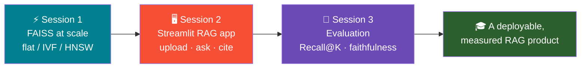
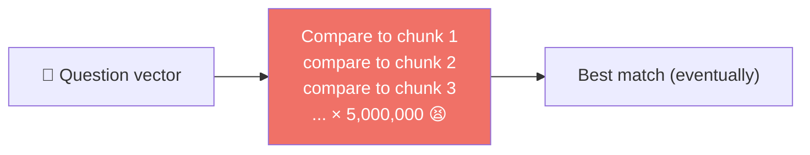
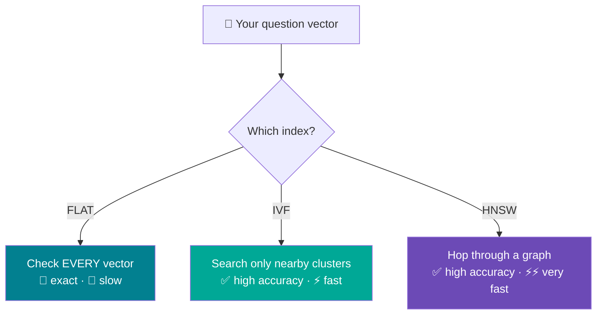
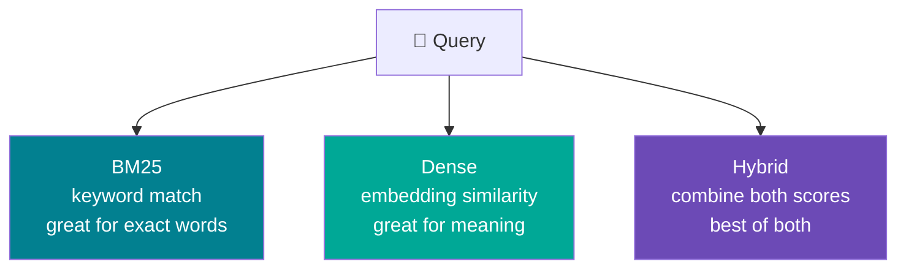
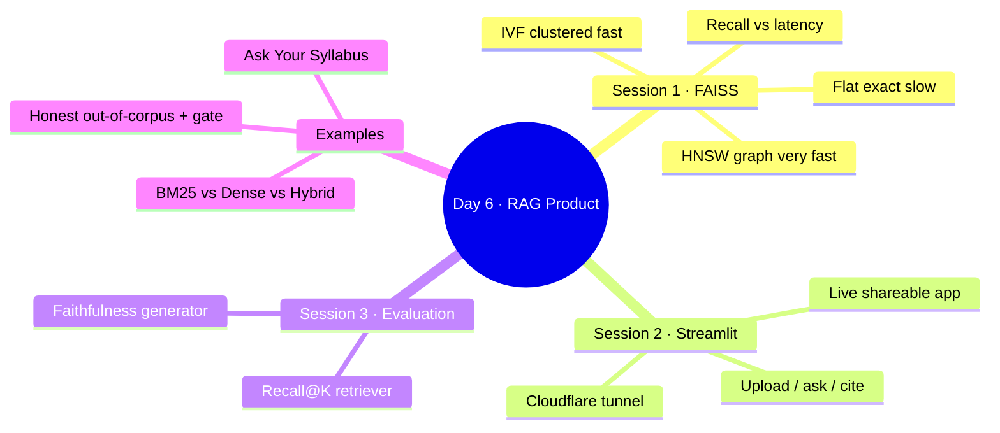

# 🗓️ Day 6 — RAG at Scale + Streamlit UI + Evaluation

### *Module M4 · 6 hours · From a notebook RAG to a real, measured product · Groq for generation*

> **Goal of this document:** take yesterday's notebook RAG and turn it into a **real product** — fast enough to scale (FAISS), usable by humans (a Streamlit app), and **measured** (the first quantitative numbers: Recall@K and faithfulness). Every code block runs in **Google Colab**; generation always uses **Groq**; embeddings run free & local.

---

## 🧭 What We're Building (Roadmap)



### 🔑 The one architecture note (read once)

Same split as Day 5 — Groq **generates**, everything else is free & local:

| Job | Tool | Cost |
|-----|------|------|
| 🔢 Embeddings (text → vectors) | `sentence-transformers` (local) | free |
| 🔎 Fast retrieval at scale | **FAISS** index | free |
| ✍️ Generation (write answer) | **Groq** LLM | free tier |

---

## 🔧 One-Time Colab Setup

```python
!pip install -q groq sentence-transformers numpy faiss-cpu \
               rank-bm25 streamlit
```

Add your Groq key via **Colab Secrets** (🔑 icon → add `GROQ_API_KEY`), then:

```python
from google.colab import userdata
import os

GROQ_API_KEY = userdata.get("GROQ_API_KEY")
os.environ["GROQ_API_KEY"] = GROQ_API_KEY
print("✅ Ready" if GROQ_API_KEY else "❌ Add GROQ_API_KEY in Colab Secrets")

GROQ_MODEL = "llama-3.3-70b-versatile"   # our Groq model all day
```

> 💡 No key? Get one free at `https://console.groq.com` → **API Keys**.

---

# ⚡ SESSION 1 — FAISS at Scale (Flat vs IVF vs HNSW)

### 1.0 — Wait, what is FAISS? (Start here)

Let's build up from zero. No prior knowledge assumed.

**Quick recap — what's a vector again?** An embedding model turns a piece of text into a **list of numbers** (a "vector") that captures its meaning. Similar meanings get similar numbers. `all-MiniLM-L6-v2` turns each chunk into **384 numbers**. So a corpus of 1,000 chunks becomes 1,000 lists of 384 numbers each.

**What is "retrieval"?** When you ask a question, we turn *the question* into its own vector, then find the stored chunk-vectors that are **closest** to it. Closest = most similar in meaning. Those chunks become the context we feed to the LLM.

**So what's the problem?** To find the closest chunk, the naive way is to compare your question against **every single stored vector**, one at a time, and keep the best. That's called *brute-force* search.

- 10 chunks? Instant. 👍
- 6 chunks (like yesterday)? Instant. 👍
- 5 **million** chunks? Your app freezes while it does 5 million comparisons for *every* question. 👎



**FAISS is the fix.** FAISS (say "face") stands for **F**acebook **A**I **S**imilarity **S**earch. It's a free library that stores your vectors in a clever structure called an **index** so that finding the closest ones is *fast* — even with millions of vectors.

> 🍎 **Analogy:** finding a word in a dictionary. Brute-force = reading the dictionary from page 1 until you hit the word. An **index** = using the A–Z tabs to jump near the word instantly. FAISS builds those "tabs" for vectors.

**What is an "index"?** Just a smart container for your vectors that's organised for fast searching. You **add** all your vectors to it once, then **search** it as many times as you like. FAISS offers *different kinds* of index, each organised differently — and that's the whole choice you have to make today.

### 1.0.1 — The three index types, explained like you're five

There are three you'll meet. They all answer "which stored vectors are closest to my question?" — they just do it with different strategies.

**1️⃣ FLAT — "check everything"**
The Flat index doesn't do anything clever. It compares your question against **every** vector, exactly like brute-force. The upside: it's **100% accurate** — it can never miss the true closest match. The downside: it's **slow** on big data.
> 🍎 *Analogy:* to find the tallest person in a stadium, you measure **everyone**. Perfectly accurate, but exhausting.
> ✅ Use when: your corpus is small (say under ~50,000 chunks), or when being perfectly accurate matters more than speed.

**2️⃣ IVF — "divide into neighbourhoods, only search the right one"**
IVF ("Inverted File") first splits all your vectors into **clusters** (groups of similar vectors) — like sorting a city into neighbourhoods. When a question comes in, it figures out which neighbourhood(s) the answer probably lives in and **only searches those**, ignoring the rest. Way fewer comparisons = much faster. The trade-off: occasionally the true match is just over the neighbourhood border and gets missed, so accuracy is *very high* but not always perfect.
> 🍎 *Analogy:* looking for a good Italian restaurant — you don't search the whole city, you go to the neighbourhood known for Italian food and look there.
> 🎛️ *The knob:* `nprobe` = how many neighbourhoods to check. More neighbourhoods = more accurate but slower.
> ⚠️ IVF must be **trained** first (it needs to look at your data once to decide where the neighbourhood boundaries go). Flat and HNSW don't need training.
> ✅ Use when: you have a large corpus and can accept a tiny accuracy dip for a big speed win.

**3️⃣ HNSW — "follow a web of friend-of-a-friend links"**
HNSW ("Hierarchical Navigable Small World") builds a **graph**: every vector is connected to its nearest neighbours by links, like a social network of "who's similar to whom." To search, it starts at some vector and **hops** along links, always moving toward vectors more similar to your question — converging on the answer in just a few hops. Extremely fast, very accurate. The cost: the graph takes **extra memory** to store all those links.
> 🍎 *Analogy:* finding a job through your network. You don't cold-call every company — you ask a friend, who introduces you to *their* well-connected friend, and a few hops later you've reached the right person.
> 🎛️ *The knobs:* `M` = how many links each vector keeps; `efSearch` = how thoroughly to explore while hopping. Higher = more accurate, slower, more memory.
> ✅ Use when: you need the **lowest latency** on a large corpus and have memory to spare. (It's the most popular choice in production.)

### 1.1 — The three at a glance



| Index | How it searches | Accuracy | Speed | Memory | Needs training? | When to use |
|-------|-----------------|----------|-------|--------|-----------------|-------------|
| **Flat** | Brute-force: compares against every vector | 💯 exact | 🐌 slow | low | no | Small corpora (< ~50k), or when perfect recall matters |
| **IVF** | Splits vectors into clusters, searches only the closest few | ✅ high | ⚡ fast | low | **yes** | Large corpora where a tiny accuracy drop is fine |
| **HNSW** | Builds a graph, "hops" toward nearest neighbours | ✅ high | ⚡⚡ very fast | higher | no | Large corpora needing low latency; memory to spare |

> 🔑 **The one idea to remember:** all three find "closest vectors." Flat is *perfect but slow*. IVF and HNSW are *nearly perfect but much faster* — they're called **ANN** (Approximate Nearest Neighbour) methods because they trade a sliver of accuracy for a huge speed gain. That trade-off is the entire art of scaling RAG.

### 1.2 — Make a 50,000-vector corpus

To *feel* the speed difference we need scale. We'll create 50,000 vectors, then index them three ways and race them.

```python
import numpy as np
from sentence_transformers import SentenceTransformer

embedder = SentenceTransformer("all-MiniLM-L6-v2")
DIM = 384   # all-MiniLM-L6-v2 outputs 384 numbers per vector

# Making 50k REAL embeddings is slow, so we simulate a 50k corpus with random
# vectors of the SAME shape. FAISS treats them identically, so the SPEED
# comparison is honest. (Real text vectors would give even better accuracy.)
np.random.seed(0)
N = 50_000
corpus_vectors = np.random.random((N, DIM)).astype("float32")   # FAISS needs float32

# One real query embedding to search with
query = embedder.encode(["How much annual leave do employees get?"]).astype("float32")
print("Corpus:", corpus_vectors.shape, "| Query:", query.shape)
```

### 1.3 — Build all three indexes

Before the code, a tiny glossary so nothing looks cryptic:

- `IndexFlatL2(DIM)` — make a **Flat** index for vectors of size `DIM` (384). "L2" just means it measures straight-line distance; closest = smallest distance.
- `.add(vectors)` — put your vectors into the index.
- `.search(query, k)` — find the `k` closest vectors to `query`. Returns their distances and their positions (IDs).
- **IVF terms:** `nlist` = how many clusters/neighbourhoods to create (a common rule of thumb is about √N). `quantizer` = a little helper index IVF uses to decide which cluster a vector belongs to. `nprobe` = how many clusters to actually search at query time.
- **HNSW terms:** `M` = how many neighbour-links each vector keeps in the graph. `efConstruction` = how carefully the graph is built (higher = better graph, slower to build). `efSearch` = how carefully it hops around when answering (higher = more accurate, slower).

```python
import faiss

# --- FLAT: exact brute-force ---
flat = faiss.IndexFlatL2(DIM)
flat.add(corpus_vectors)

# --- IVF: cluster-based (needs training to learn the clusters) ---
nlist = 200                                   # number of clusters (~sqrt(N))
quantizer = faiss.IndexFlatL2(DIM)
ivf = faiss.IndexIVFFlat(quantizer, DIM, nlist)
ivf.train(corpus_vectors)                     # 👈 IVF must be trained first
ivf.add(corpus_vectors)
ivf.nprobe = 10                               # how many clusters to search (speed vs accuracy)

# --- HNSW: graph-based ---
M = 32                                         # neighbours per node
hnsw = faiss.IndexHNSWFlat(DIM, M)
hnsw.hnsw.efConstruction = 40                  # build-time thoroughness
hnsw.hnsw.efSearch = 16                        # search-time thoroughness
hnsw.add(corpus_vectors)

print("All three indexes built. Vectors indexed:",
      flat.ntotal, ivf.ntotal, hnsw.ntotal)
```

### 1.4 — Benchmark: recall vs latency

Two new words, both simple:

- **Latency** = how long one search takes (we measure it in milliseconds). Lower is better.
- **Recall** = did the fast index find the *right* answers? Since **Flat** is exact, we treat its top-5 as the "correct" answer, then check how many of those same 5 the IVF/HNSW indexes also returned. Recall of 1.0 = found all 5 (perfect); 0.8 = found 4 of 5. Higher is better.

We race all three on the same query.

```python
import time

def search(index, q, k=5):
    t0 = time.time()
    _, ids = index.search(q, k)
    ms = (time.time() - t0) * 1000
    return ids[0], ms

# Ground truth from the exact index
truth_ids, flat_ms = search(flat, query)
ivf_ids,  ivf_ms  = search(ivf, query)
hnsw_ids, hnsw_ms = search(hnsw, query)

def recall(approx, truth):
    return len(set(approx) & set(truth)) / len(truth)   # overlap with exact top-k

print(f"FLAT  | recall 1.00 (ground truth) | {flat_ms:6.2f} ms")
print(f"IVF   | recall {recall(ivf_ids, truth_ids):.2f}         | {ivf_ms:6.2f} ms")
print(f"HNSW  | recall {recall(hnsw_ids, truth_ids):.2f}         | {hnsw_ms:6.2f} ms")
```

**What you'll typically see:** Flat is the slowest but perfect; HNSW is dramatically faster with recall close to 1.0; IVF sits in between and you can trade accuracy for speed by changing `nprobe`.

> 🎛️ **Tune the knobs:** raise `ivf.nprobe` → higher recall, slower. Raise `hnsw.efSearch` → higher recall, slower. Try `ivf.nprobe = 30` and re-run to watch recall climb.

### 1.5 — Save & reload an index (persistence)

```python
faiss.write_index(hnsw, "corpus.faiss")        # save to disk
reloaded = faiss.read_index("corpus.faiss")    # reload later without rebuilding
print("Reloaded vectors:", reloaded.ntotal)
```

> ✅ **Session 1 done.** You can now pick the right index for a corpus and justify it with recall/latency numbers instead of vibes.

---

# 🖥️ SESSION 2 — A Streamlit RAG App (Upload · Ask · Cite)

Time to give real users a UI. **Streamlit** turns a Python script into a web app with zero HTML. Colab can't show a web server directly, so we expose it with a **Cloudflare tunnel** (free, no signup).

### 2.1 — Write the app to a file

`%%writefile` saves the cell's contents as `app.py`. This is the whole RAG app: upload text, build an index, ask questions, and **see the source chunks** behind each answer.

```python
%%writefile app.py
import os
import streamlit as st
import numpy as np
import faiss
from sentence_transformers import SentenceTransformer
from groq import Groq

st.set_page_config(page_title="Ask Your Docs", page_icon="📖")

# --- cache heavy objects so they load once ---
@st.cache_resource
def get_embedder():
    return SentenceTransformer("all-MiniLM-L6-v2")

@st.cache_resource
def get_groq():
    return Groq(api_key=os.environ["GROQ_API_KEY"])

embedder, groq_client = get_embedder(), get_groq()
MODEL = "llama-3.3-70b-versatile"

st.title("📖 Ask Your Documents")
st.caption("Upload a .txt file, then ask questions. Answers cite their source chunks.")

uploaded = st.file_uploader("Upload a text file", type=["txt"])

if uploaded:
    # 1) read + chunk (split on blank lines to keep it minimal)
    text = uploaded.read().decode("utf-8")
    chunks = [c.strip() for c in text.split("\n\n") if c.strip()]

    # 2) embed + index with FAISS (built once per upload)
    @st.cache_resource
    def build_index(chunks_tuple):
        vecs = embedder.encode(list(chunks_tuple)).astype("float32")
        idx = faiss.IndexFlatL2(vecs.shape[1])
        idx.add(vecs)
        return idx
    index = build_index(tuple(chunks))
    st.success(f"Indexed {len(chunks)} chunks. Ask away!")

    # 3) question box
    q = st.text_input("Your question")
    if q:
        qv = embedder.encode([q]).astype("float32")
        _, ids = index.search(qv, k=3)
        retrieved = [chunks[i] for i in ids[0]]
        context = "\n".join(retrieved)

        prompt = (f'Answer using ONLY the context. If absent, say "I don\'t know."\n'
                  f'Context:\n{context}\n\nQuestion: {q}')
        answer = groq_client.chat.completions.create(
            model=MODEL, messages=[{"role": "user", "content": prompt}],
            temperature=0).choices[0].message.content

        st.subheader("Answer")
        st.write(answer)

        with st.expander("📎 Source chunks used"):
            for i, chunk in enumerate(retrieved, 1):
                st.markdown(f"**Chunk {i}:** {chunk}")
```

### 2.2 — Pass the Groq key to the app's environment

The app reads the key from an environment variable. Set it in the notebook so the subprocess inherits it:

```python
import os
os.environ["GROQ_API_KEY"] = GROQ_API_KEY   # already loaded from Colab Secrets earlier
```

### 2.3 — Launch it with a Cloudflare tunnel

```python
# Download cloudflared (one-time)
!wget -q https://github.com/cloudflare/cloudflared/releases/latest/download/cloudflared-linux-amd64 -O cloudflared
!chmod +x cloudflared

# Start Streamlit in the background, then open a public tunnel to port 8501
!streamlit run app.py &>/content/logs.txt &
!sleep 5
!./cloudflared tunnel --url http://localhost:8501
```

> 🌐 A `https://something.trycloudflare.com` URL appears in the output — click it to use your live app. Upload a `.txt` file, ask a question, and expand **"Source chunks used"** to see exactly which text produced the answer.
>
> 🧪 **No file handy?** Make one in a cell: `open("policy.txt","w").write("Employees get 24 days of annual leave.\n\nThe office opens at 9 AM.")` then upload it.

> ✅ **Session 2 done.** You shipped a real, shareable RAG app with cited sources — the thing users actually touch.

---

# 📏 SESSION 3 — Evaluating RAG (Recall@K + Faithfulness)

So far we've *trusted* our RAG. Real engineering means **measuring** it. We build a tiny ground-truth set and compute the first two numbers every RAG team reports: **Recall@K** (did we retrieve the right chunk?) and **faithfulness** (did the answer stick to the retrieved text?).

### 3.1 — Build a small ground-truth set

For each question we record which chunk *should* be retrieved to answer it.

```python
from sentence_transformers import SentenceTransformer
import numpy as np
embedder = SentenceTransformer("all-MiniLM-L6-v2")

corpus = [
    "Acme Corp offers 24 days of paid annual leave to all full-time employees.",  # 0
    "Employees may work from home up to 3 days per week with manager approval.",   # 1
    "The head office is at 42 MG Road, Bangalore, and opens at 9:00 AM.",          # 2
    "Acme reimburses home internet up to 1000 rupees per month for remote staff.", # 3
    "New joiners are on probation for the first 6 months of employment.",          # 4
]

# ground truth: question -> index of the chunk that answers it
gold = [
    ("How many leave days do I get?",        0),
    ("Can I work remotely?",                 1),
    ("When does the office open?",           2),
    ("What internet reimbursement is there?",3),
    ("How long is probation?",               4),
]

corpus_vecs = embedder.encode(corpus).astype("float32")
```

### 3.2 — Metric 1: Recall@K (did retrieval find the right chunk?)

**Recall@K** = the fraction of questions where the correct chunk appears in the top-K retrieved. It measures the **retriever**, independent of the LLM.

```python
def retrieve_ids(question, k):
    qv = embedder.encode([question]).astype("float32")[0]
    sims = corpus_vecs @ qv / (np.linalg.norm(corpus_vecs, axis=1) * np.linalg.norm(qv))
    return list(np.argsort(sims)[::-1][:k])

def recall_at_k(k):
    hits = sum(1 for q, correct in gold if correct in retrieve_ids(q, k))
    return hits / len(gold)

for k in (1, 2, 3):
    print(f"Recall@{k}: {recall_at_k(k):.2f}")
```

**Reading it:** `Recall@1 = 1.00` means the very top chunk was always correct. If Recall@1 is low but Recall@3 is high, your retriever finds the answer but not first — a sign to retrieve more chunks or improve chunking.

### 3.3 — Metric 2: Faithfulness (did the answer stay grounded?)

**Faithfulness** asks: is the generated answer actually *supported* by the retrieved context, or did the LLM wander off? The cheap, effective way to measure it is to let an LLM judge — Groq grades its own pipeline.

```python
from groq import Groq
groq_client = Groq(api_key=GROQ_API_KEY)
MODEL = "llama-3.3-70b-versatile"

def generate(question, k=2):
    ids = retrieve_ids(question, k)
    context = "\n".join(corpus[i] for i in ids)
    prompt = f'Answer using ONLY this context.\nContext:\n{context}\n\nQ: {question}'
    ans = groq_client.chat.completions.create(
        model=MODEL, messages=[{"role": "user", "content": prompt}],
        temperature=0).choices[0].message.content
    return ans, context

def faithfulness(answer, context):
    judge = (f"Context:\n{context}\n\nAnswer:\n{answer}\n\n"
             "Is EVERY claim in the Answer supported by the Context? "
             "Reply with only YES or NO.")
    verdict = groq_client.chat.completions.create(
        model=MODEL, messages=[{"role": "user", "content": judge}],
        temperature=0).choices[0].message.content.strip().upper()
    return verdict.startswith("YES")

# Score the whole set
faithful = 0
for q, _ in gold:
    ans, ctx = generate(q)
    ok = faithfulness(ans, ctx)
    faithful += ok
    print(f"{'✅' if ok else '❌'}  {q}")
print(f"\nFaithfulness: {faithful}/{len(gold)} = {faithful/len(gold):.2f}")
```

> 🎯 **Two numbers, two responsibilities.** Recall@K grades the **retriever** (did we fetch the right text?). Faithfulness grades the **generator** (did it stick to that text?). A good RAG needs both high.

> ✅ **Session 3 done.** You produced the first quantitative numbers for your RAG — the thing you can actually put in a report.

---

# 📚 EXAMPLE A — "Ask Your Syllabus" App

The Streamlit app from Session 2 *is* Ask-Your-Syllabus — just feed it course material. To make it concrete, create a syllabus file and run the same app:

```python
syllabus = """Course: Introduction to Machine Learning (CS-201)

Grading: 40% assignments, 20% midterm, 40% final exam.

Attendance: A minimum of 75% attendance is required to sit the final exam.

Textbook: "Pattern Recognition and Machine Learning" by Bishop is the primary reference.

Office hours: Tuesdays and Thursdays, 2 to 4 PM, in Room 314.
"""
open("syllabus.txt", "w").write(syllabus)
print("Saved syllabus.txt — upload it to the app and ask 'What is the attendance requirement?'")
```

> 🎓 Upload `syllabus.txt` in the running app and ask *"What percent is the final exam?"* or *"When are office hours?"* — each answer shows its source chunk.

---

# ⚖️ EXAMPLE B — Retriever Bake-Off: BM25 vs Dense vs Hybrid

Not all retrieval is embedding-based. Three approaches, same query — which wins?



- **BM25** — classic keyword search. Wins when the query shares exact words with the text (names, codes, IDs).
- **Dense** — embedding similarity (what we've used). Wins on meaning/paraphrase.
- **Hybrid** — blend both scores. Usually the most robust.

```python
from rank_bm25 import BM25Okapi
import numpy as np

# --- BM25 (keyword) ---
tokenized = [doc.lower().split() for doc in corpus]
bm25 = BM25Okapi(tokenized)

def bm25_scores(query):
    s = np.array(bm25.get_scores(query.lower().split()))
    return s / (s.max() + 1e-9)          # normalise to 0–1 for fair blending

# --- Dense (embeddings) ---
def dense_scores(query):
    qv = embedder.encode([query]).astype("float32")[0]
    s = corpus_vecs @ qv / (np.linalg.norm(corpus_vecs, axis=1) * np.linalg.norm(qv))
    return (s - s.min()) / (s.max() - s.min() + 1e-9)

# --- Hybrid (weighted blend) ---
def hybrid_scores(query, alpha=0.5):
    return alpha * dense_scores(query) + (1 - alpha) * bm25_scores(query)

query = "MG Road office"      # a keyword-heavy query
for name, fn in [("BM25", bm25_scores), ("Dense", dense_scores), ("Hybrid", hybrid_scores)]:
    top = int(np.argmax(fn(query)))
    print(f"{name:6} → chunk {top}: {corpus[top]}")
```

> 🔬 **Try both kinds of query.** A keyword query like `"MG Road office"` favours BM25; a paraphrase like `"where is the building located"` favours Dense. Hybrid handles both — which is why production systems often use it.

---

# 🕳️ EXAMPLE C — Honest Evaluation: When the Answer Isn't in the Corpus

A trustworthy RAG must **know what it doesn't know**. Let's measure how it behaves on out-of-corpus questions and detect the failure.

```python
out_of_corpus = [
    "What is Acme's annual revenue?",     # not in our chunks
    "Who is the CEO of Acme?",            # not in our chunks
    "What is the capital of France?",     # not even about Acme
]

for q in out_of_corpus:
    ans, ctx = generate(q)                # reuse Session 3's generate()
    refused = any(p in ans.lower() for p in ["don't know", "do not know",
                                             "not in the context", "no information"])
    print(f"{'✅ honest' if refused else '⚠️ hallucinated'}  |  Q: {q}\n   A: {ans}\n")
```

> 🎯 **What good looks like:** every out-of-corpus question should trigger an "I don't know." If any produce a confident made-up answer, that's a **hallucination** — the fix is a firmer prompt ("if it's not in the context, say you don't know") and/or a retrieval-score threshold that refuses to answer when the best chunk is too far away.

### C.1 — A retrieval-score safety gate (bonus)

Refuse to answer when even the *best* chunk isn't similar enough:

```python
def answer_with_gate(question, k=2, min_sim=0.25):
    qv = embedder.encode([question]).astype("float32")[0]
    sims = corpus_vecs @ qv / (np.linalg.norm(corpus_vecs, axis=1) * np.linalg.norm(qv))
    if sims.max() < min_sim:                       # nothing relevant enough
        return "I don't have information about that."
    return generate(question, k)[0]

print(answer_with_gate("What is the capital of France?"))  # → refuses, no LLM call needed
print(answer_with_gate("How many leave days do I get?"))   # → answers normally
```

> 💡 The gate catches out-of-corpus questions **before** spending an LLM call — cheaper *and* safer.

---

## 📊 Wrap-Up — The Whole Day on One Page



| Topic | One-liner takeaway |
|-------|--------------------|
| Flat index | Exact but slow; perfect for small corpora |
| IVF index | Clusters vectors; fast with a small accuracy trade-off (`nprobe`) |
| HNSW index | Graph hops; very fast, low latency, more memory (`efSearch`) |
| Recall vs latency | Always benchmark; tune knobs to your accuracy/speed budget |
| Streamlit + tunnel | A Python script becomes a shareable web app in minutes |
| Recall@K | Measures the retriever: did the right chunk appear in top-K? |
| Faithfulness | Measures the generator: did the answer stay grounded? |
| BM25 vs Dense vs Hybrid | Keyword vs meaning vs both; hybrid is most robust |
| Honest evaluation | RAG must refuse out-of-corpus questions; a score gate enforces it |

> 🎓 **Day 6 Outcome:** You ended Week 1 with a **deployable Streamlit RAG app backed by a real FAISS index**, plus the numbers (Recall@K, faithfulness) to say how well it actually performs.

---

## 🧰 Quick Reference Card

```python
# ── FAISS: three indexes ──
import faiss
flat = faiss.IndexFlatL2(DIM); flat.add(vecs)                 # exact
q = faiss.IndexFlatL2(DIM); ivf = faiss.IndexIVFFlat(q, DIM, 200)
ivf.train(vecs); ivf.add(vecs); ivf.nprobe = 10               # clustered
hnsw = faiss.IndexHNSWFlat(DIM, 32); hnsw.add(vecs)           # graph
D, I = flat.search(query_vec, k=5)                            # search any of them
faiss.write_index(hnsw, "x.faiss"); faiss.read_index("x.faiss")  # save / load

# ── STREAMLIT in Colab ──
# %%writefile app.py   → write your app
# !streamlit run app.py &>/content/logs.txt &
# !./cloudflared tunnel --url http://localhost:8501   → public URL

# ── EVALUATION ──
# Recall@K: fraction of questions whose correct chunk is in top-K retrieved
# Faithfulness: ask the LLM "is every claim supported by the context? YES/NO"

# ── RETRIEVERS ──
from rank_bm25 import BM25Okapi                # keyword
# dense = embeddings + cosine; hybrid = alpha*dense + (1-alpha)*bm25
```

| Model / tool | String |
|--------------|--------|
| Groq LLM | `llama-3.3-70b-versatile` |
| Embeddings | `all-MiniLM-L6-v2` (free, local) |
| Vector index | `faiss-cpu` (Flat / IVF / HNSW) |
| Keyword retriever | `rank-bm25` |
| Web UI | `streamlit` + `cloudflared` tunnel |

---

*🔗 That completes Week 1. You've built RAG from scratch, scaled it, given it a UI, and measured it — a complete, honest RAG product.*
