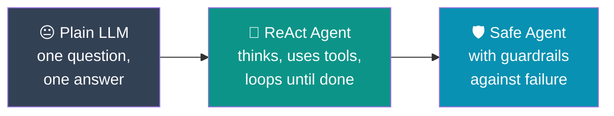
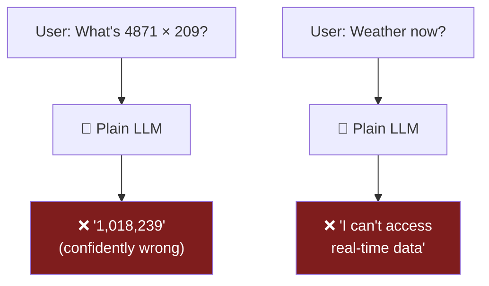
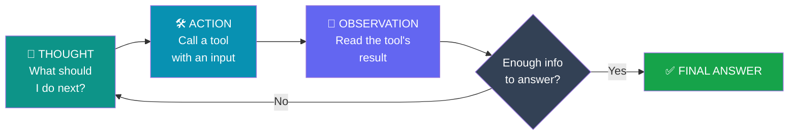
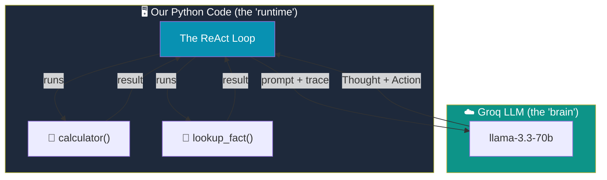
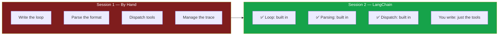
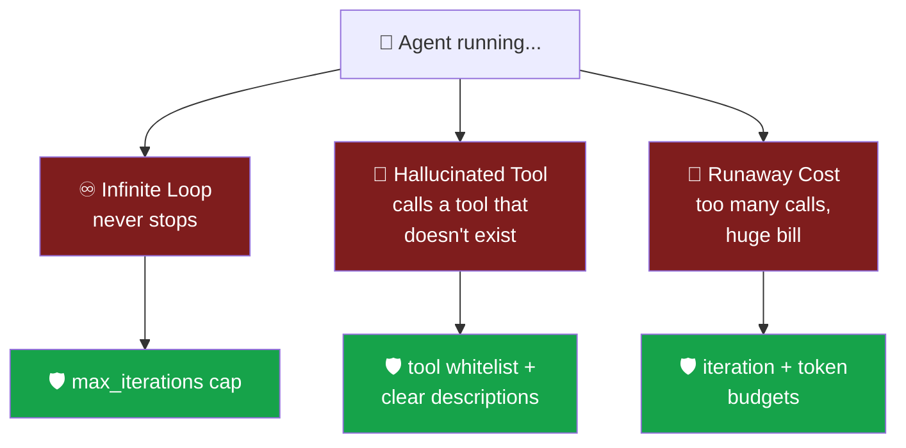
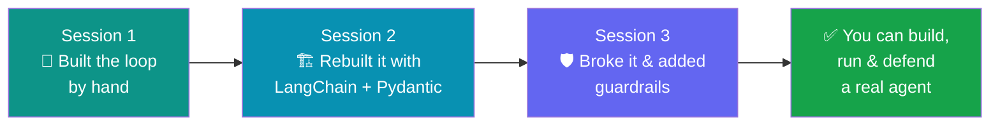

# 🤖 Day 7 — Agentic AI & ReAct Agents

> **Module M5 · 6 hours · 3 hands-on sessions**
>
> *From a single LLM call to a system that **thinks, acts, observes, and repeats** — until the job is done.*

---

## 🧭 What This Day Is About (Read This First)

Until now, whenever we used a Large Language Model (LLM), the conversation looked like this:

```
You ask a question  ──►  The model answers  ──►  Done.
```

One question in, one answer out. This works for "Summarize this paragraph" or "Translate this sentence." But it **breaks** the moment a task needs more than one step:

- *"What is the population density of the three largest cities in Punjab?"*
- *"Read this PDF, find the refund policy, and calculate my refund."*
- *"Search for today's weather and tell me if I need an umbrella."*

An LLM on its own **cannot look things up, cannot do reliable math, and cannot browse.** It only predicts text. So how do modern AI assistants do all of that?

The answer is the topic of today: **agents.** An agent is an LLM wrapped in a **loop** that lets it *use tools* (a calculator, a search function, a database) and *react* to what those tools return — over and over — until it has a final answer.

By the end of Day 7 you will have **built such a loop yourself, by hand**, then rebuilt it with a professional framework, then broken it on purpose so you understand exactly how agents fail and how to defend against them.



---

## 📚 Table of Contents

1. [Core Vocabulary — Plain English](#1--core-vocabulary--plain-english)
2. [Why a Plain LLM Is Not Enough](#2--why-a-plain-llm-is-not-enough)
3. [The Big Idea: The ReAct Loop](#3--the-big-idea-the-react-loop)
4. [Setup — Getting Your Environment Ready](#4-️-setup--getting-your-environment-ready)
5. [🧪 Session 1 — Build the ReAct Loop From Scratch](#-session-1--build-the-react-loop-from-scratch-2h)
6. [🧪 Session 2 — A Real Agent with LangChain + Pydantic Tools](#-session-2--a-real-agent-with-langchain--pydantic-tools-2h)
7. [🧪 Session 3 — How Agents Fail, and How to Defend](#-session-3--how-agents-fail-and-how-to-defend-2h)
8. [Illustrative Walkthroughs](#8--illustrative-walkthroughs)
9. [Common Errors & Fixes](#9--common-errors--fixes)
10. [Day 7 Recap & Takeaways](#10--day-7-recap--takeaways)
11. [Cheat Sheet](#11--cheat-sheet)

---

## 1. 📖 Core Vocabulary — Plain English

Before any code, let's agree on words. Don't skip this — every later section leans on these.

| Term | Plain-English meaning | Everyday analogy |
|------|----------------------|------------------|
| **LLM** | A program that predicts text. You give it words, it continues them. | A very well-read autocomplete. |
| **Prompt** | The text you send to the LLM. | The question you ask. |
| **Tool** | A normal function (Python code) the LLM is *allowed to ask us to run* — a calculator, a web search, a database lookup. | A pocket calculator you hand to someone who's bad at math. |
| **Agent** | An LLM placed inside a loop so it can call tools and react to results. | A detective: gathers clues, thinks, gathers more, concludes. |
| **ReAct** | A specific recipe for that loop: **Rea**son + **Act**. The model alternates *thinking* and *doing*. | Think → do → look → think again. |
| **Iteration** | One trip around the loop (one thought + one action + one observation). | One round of "let me check that." |
| **Trace** | The full written record of every thought, action, and observation. | The detective's notebook. |

> 💡 **Key mental model:** An agent is **not** a smarter LLM. It's the *same* LLM, but we gave it hands (tools) and a habit of checking its work (the loop).

---

## 2. 🚫 Why a Plain LLM Is Not Enough

Let's make the problem concrete. Ask any LLM directly:

> *"What is 4,871 × 209?"*

It will often answer confidently — and be **wrong.** LLMs predict plausible-looking text; they don't actually *compute*. Similarly:

> *"What's the weather in Ludhiana right now?"*

The model has **no way to know** — its knowledge is frozen at training time, and it can't reach the internet on its own.



The **three fundamental limits** of a bare LLM:

1. 🧮 **It can't compute reliably** — arithmetic, dates, and precise logic are guesswork.
2. 🌐 **It can't access live or private data** — no internet, no databases, no your-company's-files.
3. 🔒 **It can't take actions** — it can't send an email, book a ticket, or run code.

**Tools fix all three.** If we let the LLM *ask us* to run a calculator, a search, or a database query — and feed the result back — suddenly it can do real work. The mechanism that makes this happen, safely and repeatedly, is the **agent loop.**

---

## 3. 💡 The Big Idea: The ReAct Loop

**ReAct** = **Rea**soning + **Act**ing. It's the foundational pattern behind almost every AI agent today.

Instead of forcing the model to answer in one shot, we ask it to work in a visible cycle:



Read that loop as a sentence:

> *"**I think** I need the population of Ludhiana → **I act** by calling `search('Ludhiana population')` → **I observe** the result is 1.6 million → I think again → … → **Final Answer.**"*

Each pass around the loop is one **iteration**. The model keeps going until it decides it has everything it needs, then it stops and writes the final answer.

### Why this works so well

- **Transparency** — every step is written down (the *trace*), so you can see *why* the agent did what it did. No black box.
- **Grounding** — the model's answers are anchored to real tool outputs, not just its imagination.
- **Recovery** — if a tool returns an error, the model *sees* the error and can try something else.

### The ReAct "script" the model follows

We instruct the model, via the prompt, to always reply in this exact shape:

```
Thought: <the model's reasoning about what to do>
Action: <the name of a tool to use>
Action Input: <what to pass to that tool>
```

…and then **we** (our code) run the tool, and send back:

```
Observation: <the tool's result>
```

…and the loop repeats. When the model is ready, it instead writes:

```
Thought: I now know the final answer.
Final Answer: <the answer for the user>
```

That's the *entire* trick. Sessions 1–3 turn this idea into working code.

---

## 4. ⚙️ Setup — Getting Your Environment Ready

We use the **Groq API** as our LLM backend. Groq is fast and has a generous free tier — perfect for a classroom.

### Step 4.1 — Get a free Groq API key 🔑

1. Go to **https://console.groq.com** and sign up (free).
2. Open **API Keys** → **Create API Key**. Copy it (it looks like `gsk_...`).
3. **Never paste your key into code you'll share.** We'll load it from an environment variable.

### Step 4.2 — Install the libraries 📦

Open a terminal and run:

```bash
pip install groq langchain langchain-groq langchain-community pydantic
```

| Package | What it's for |
|---------|---------------|
| `groq` | Talk to the Groq LLM directly (Session 1). |
| `langchain`, `langchain-groq`, `langchain-community` | The agent framework (Sessions 2–3). |
| `pydantic` | Define and validate tool inputs safely. |

### Step 4.3 — Store your key safely 🗝️

Create a file named `.env` in your project folder (a `.env` file holds secrets, and is never uploaded to GitHub):

```bash
# .env  — put your real key here, do NOT share this file
GROQ_API_KEY=gsk_your_real_key_here
```

Then load it in Python. This pattern goes at the top of **every** script today:

```python
import os
from dotenv import load_dotenv

load_dotenv()                              # reads the .env file
API_KEY = os.environ["GROQ_API_KEY"]       # pulls the key into our program

# Quick sanity check — make sure the key loaded
assert API_KEY.startswith("gsk_"), "❌ Groq key not found — check your .env file!"
print("✅ Groq API key loaded successfully")
```

> 🧯 **If you see `KeyError: 'GROQ_API_KEY'`** — your `.env` file is missing, misspelled, or in the wrong folder. Run `pip install python-dotenv` if `load_dotenv` is undefined.

### Step 4.4 — Say hello to Groq 👋

Let's confirm everything works with the simplest possible call:

```python
from groq import Groq

client = Groq(api_key=API_KEY)

response = client.chat.completions.create(
    model="llama-3.3-70b-versatile",       # a strong, free Groq model
    messages=[
        {"role": "user", "content": "Say hello in one short sentence."}
    ],
)

print(response.choices[0].message.content)
# Expected: something like "Hello! How can I help you today?"
```

**Understanding this call, line by line:**

- `client` — our connection to Groq.
- `model` — which brain to use. `llama-3.3-70b-versatile` is smart enough for agents.
- `messages` — a list of turns. Each has a `role` (`user`, `assistant`, or `system`) and `content`.
- `response.choices[0].message.content` — the actual text the model replied with.

✅ **If you see a friendly hello, your environment is ready.** If not, fix it now — everything below depends on this working.

---

## 🧪 Session 1 — Build the ReAct Loop From Scratch (2h)

**Goal:** No framework, no magic. We'll build a working agent using *only* Python and raw Groq calls, so you understand exactly what a framework does for you later.

### 5.1 — The plan

We'll give our agent **two tools**:

- 🧮 a **calculator** (because LLMs can't do math), and
- 📇 a tiny **fact lookup** (a stand-in for "search the web").

Then we'll write the loop that lets the model use them.



### 5.2 — Step 1: Define the tools 🛠️

A "tool" is just a normal Python function. Nothing fancy.

```python
import math

def calculator(expression: str) -> str:
    """Safely evaluate a math expression like '4871 * 209'."""
    try:
        # We only allow math — no arbitrary code. (More on safety in Session 3.)
        allowed = {k: v for k, v in math.__dict__.items() if not k.startswith("_")}
        result = eval(expression, {"__builtins__": {}}, allowed)
        return str(result)
    except Exception as e:
        return f"Error: {e}"

def lookup_fact(query: str) -> str:
    """A pretend 'search engine' — a tiny fixed fact table for the demo."""
    facts = {
        "largest cities in punjab": "Ludhiana, Amritsar, and Jalandhar.",
        "ludhiana population": "1,618,879",
        "ludhiana area": "310 square kilometres",
    }
    key = query.lower().strip()
    return facts.get(key, "No fact found. Try a different query.")

# Quick test — always test tools before wiring them into an agent!
print(calculator("4871 * 209"))     # Expected: 1018039
print(lookup_fact("Ludhiana population"))   # Expected: 1,618,879
```

> 💡 **Why test tools first?** If a tool is broken, the agent will *look* broken — but the fault is in the tool, not the loop. Testing tools separately saves hours of confusion.

### 5.3 — Step 2: Write the system prompt (the "rules of the game") 📜

This prompt teaches the model the ReAct format. This is the heart of Session 1 — read it carefully.

```python
SYSTEM_PROMPT = """You are a helpful assistant that solves problems step by step.

You have access to these tools:
- calculator(expression): evaluates a math expression, e.g. "12 * 7"
- lookup_fact(query): looks up a fact, e.g. "Ludhiana population"

To solve a task, ALWAYS reply in this exact format:

Thought: <your reasoning about what to do next>
Action: <one of: calculator, lookup_fact>
Action Input: <the input to the tool>

After you receive an Observation, continue reasoning.
When you have the final answer, reply in EXACTLY this format instead:

Thought: I now know the final answer.
Final Answer: <your answer to the user>

Only output ONE Thought/Action/Action Input block at a time. Then stop and wait.
"""
```

### 5.4 — Step 3: A helper to talk to Groq 💬

```python
from groq import Groq

client = Groq(api_key=API_KEY)

def ask_llm(messages):
    """Send the conversation so far and get the model's next step."""
    response = client.chat.completions.create(
        model="llama-3.3-70b-versatile",
        messages=messages,
        temperature=0,           # 0 = deterministic; we want reliable, not creative
        stop=["Observation:"],   # stop the model BEFORE it hallucinates its own observation
    )
    return response.choices[0].message.content
```

> ⚠️ **The `stop` parameter is critical.** Without it, the model will happily *make up* the tool's result ("Observation: 1018039") instead of letting our real tool run. `stop=["Observation:"]` forces it to pause so *we* provide the real observation.

### 5.5 — Step 4: The loop itself 🔁

This is the whole agent. Read the comments — they narrate each pass.

```python
import re

def run_agent(user_question, max_iterations=6):
    # The running transcript. Starts with the rules + the user's question.
    messages = [
        {"role": "system", "content": SYSTEM_PROMPT},
        {"role": "user", "content": user_question},
    ]

    tools = {"calculator": calculator, "lookup_fact": lookup_fact}

    for step in range(max_iterations):        # max_iterations = a safety cap (Session 3!)
        # 1) Ask the model for its next Thought + Action
        reply = ask_llm(messages)
        print(f"\n--- Iteration {step + 1} ---")
        print(reply)

        # 2) Did the model give a Final Answer? If so, we're done.
        if "Final Answer:" in reply:
            answer = reply.split("Final Answer:")[-1].strip()
            return answer

        # 3) Otherwise, extract which tool it wants and the input
        action_match = re.search(r"Action:\s*(.+)", reply)
        input_match = re.search(r"Action Input:\s*(.+)", reply)
        if not action_match or not input_match:
            return "⚠️ Model did not follow the format. Stopping."

        tool_name = action_match.group(1).strip()
        tool_input = input_match.group(1).strip()

        # 4) Run the real tool
        if tool_name in tools:
            observation = tools[tool_name](tool_input)
        else:
            observation = f"Error: unknown tool '{tool_name}'"

        print(f"Observation: {observation}")

        # 5) Feed the model's own reply + the real observation back in, then loop
        messages.append({"role": "assistant", "content": reply})
        messages.append({"role": "user", "content": f"Observation: {observation}"})

    return "⚠️ Ran out of iterations without a final answer."
```

### 5.6 — Step 5: Run it! 🚀

```python
question = "What is the population of Ludhiana, and what is that number multiplied by 2?"
final = run_agent(question)
print("\n========================")
print("FINAL:", final)
```

**Expected trace (roughly):**

```
--- Iteration 1 ---
Thought: I need Ludhiana's population first.
Action: lookup_fact
Action Input: Ludhiana population
Observation: 1,618,879

--- Iteration 2 ---
Thought: Now I multiply that by 2.
Action: calculator
Action Input: 1618879 * 2
Observation: 3237758

--- Iteration 3 ---
Thought: I now know the final answer.
Final Answer: Ludhiana's population is 1,618,879, and doubled it is 3,237,758.
========================
FINAL: Ludhiana's population is 1,618,879, and doubled it is 3,237,758.
```

🎉 **You just built an agent from nothing.** Notice what happened: the model *reasoned*, *chose a tool*, *saw the real result*, and *reasoned again*. That back-and-forth is the entire soul of agentic AI.

> 🧠 **Pause and reflect:** The LLM never did the math itself. It *delegated* to the calculator. It never "knew" the population — it *looked it up*. The intelligence is in **knowing which tool to reach for and when.**

---

## 🧪 Session 2 — A Real Agent with LangChain + Pydantic Tools (2h)

**Goal:** Rebuild Session 1's agent using **LangChain** (a professional agent framework) and **Pydantic** (for safe, validated tool inputs). You'll see how much boilerplate a framework removes — and why the raw version was worth building first.

### 6.1 — What LangChain does for us

In Session 1 we hand-wrote the loop, the format parsing, and the tool dispatch. LangChain provides all of that, battle-tested, so we can focus on **the tools and the task.**



### 6.2 — Why Pydantic for tools? 🛡️

When the LLM calls a tool, it sends text. What if it sends `"twelve"` where we need a number? Or forgets a required field? **Pydantic** defines a strict "shape" for each tool's input and *rejects bad data automatically* — before it can crash your tool.

Think of Pydantic as a **bouncer at the door**: it checks every input against the rules and turns away anything malformed.

```python
from pydantic import BaseModel, Field

class CalculatorInput(BaseModel):
    """The validated shape of the calculator's input."""
    expression: str = Field(description="A math expression, e.g. '4871 * 209'")
```

If the model sends something that doesn't fit, Pydantic raises a clear, catchable error instead of letting garbage through.

### 6.3 — Step 1: Define tools the LangChain way 🧰

LangChain's `@tool` decorator turns a plain function into an agent-ready tool. The **docstring matters enormously** — the LLM reads it to decide *when* to use the tool.

```python
from langchain.tools import tool
from pydantic import BaseModel, Field
import math

class CalculatorInput(BaseModel):
    expression: str = Field(description="A math expression, e.g. '4871 * 209'")

@tool(args_schema=CalculatorInput)
def calculator(expression: str) -> str:
    """Evaluate a mathematical expression. Use this for ANY arithmetic,
    because you cannot reliably do math on your own."""
    try:
        allowed = {k: v for k, v in math.__dict__.items() if not k.startswith("_")}
        return str(eval(expression, {"__builtins__": {}}, allowed))
    except Exception as e:
        return f"Error: {e}"

class SearchInput(BaseModel):
    query: str = Field(description="What to look up, e.g. 'Ludhiana population'")

@tool(args_schema=SearchInput)
def lookup_fact(query: str) -> str:
    """Look up a real-world fact. Use this whenever you need information
    you don't already know, such as populations or locations."""
    facts = {
        "largest cities in punjab": "Ludhiana, Amritsar, and Jalandhar.",
        "ludhiana population": "1,618,879",
        "amritsar population": "1,183,705",
        "jalandhar population": "873,725",
    }
    return facts.get(query.lower().strip(), "No fact found.")
```

> 📝 **Docstring = tool description = the model's instruction manual.** A vague docstring ("does stuff") means the model won't know when to call it. A clear one ("Use this for ANY arithmetic") guides the model to the right choice. This is the single biggest lever on agent reliability — remember it for Session 3.

### 6.4 — Step 2: Connect Groq to LangChain 🔌

```python
from langchain_groq import ChatGroq

llm = ChatGroq(
    model="llama-3.3-70b-versatile",
    temperature=0,        # deterministic — reliable tool use
    api_key=API_KEY,
)
```

### 6.5 — Step 3: Build the agent 🏗️

Modern LangChain uses a "tool-calling" agent that's cleaner than the text-parsing we did by hand.

```python
from langchain.agents import create_agent
from langchain.agents.middleware import ModelCallLimitMiddleware

tools = [calculator, lookup_fact]

agent = create_agent(
    model=llm,
    tools=tools,
    system_prompt="You are a helpful assistant. Use the tools available to you...",
    middleware=[ModelCallLimitMiddleware(thread_limit=6)],
)

result = agent.invoke({"messages": [{"role": "user", "content": "What is the population density of the three largest cities in Punjab? "}]})
print(result["messages"][-1].content)
```

**What each piece is:**

- `create_tool_calling_agent` — builds the "brain" that decides which tool to call.
- `AgentExecutor` — the "runtime" that actually runs the loop (this is Session 1's loop, done for you).
- `agent_scratchpad` — LangChain's name for the running trace of thoughts and observations.
- `verbose=True` — shows you every step. **Keep this on while learning.**

### 6.6 — Step 4: Run it 🚀

```python
result = executor.invoke({
    "input": "What is the population density of the three largest cities in Punjab? "
             "(You'll need to find each city's population.)"
})
print("\nFINAL ANSWER:\n", result["output"])
```

Watch the `verbose` output: the agent will look up each city, then reason about the answer — the **same ReAct loop from Session 1**, now handled by the framework.

### 6.7 — Side-by-side: what changed?

| | Session 1 (by hand) | Session 2 (LangChain) |
|--|--------------------|----------------------|
| The loop | You wrote it | Built into `AgentExecutor` |
| Format parsing | Manual regex | Handled automatically |
| Tool input validation | None | Pydantic schemas |
| Trace display | `print()` statements | `verbose=True` |
| Lines of code | ~40 | ~15 |
| **Understanding gained** | **Everything** | Builds on Session 1 |

> 🎯 **The lesson:** Frameworks aren't magic — they're *your Session-1 loop, packaged*. Because you built it by hand first, you now know exactly what LangChain is doing under the hood. That's why we did it the hard way.

---

## 🧪 Session 3 — How Agents Fail, and How to Defend (2h)

**Goal:** Agents fail in *specific, predictable* ways. This session shows each failure mode **live**, then the fix. This is the difference between a demo and something you'd trust.

### 7.1 — The three big failure modes



### 7.2 — Failure #1: The infinite loop ♾️

**What happens:** The agent gets confused, keeps calling tools, and never decides it's done. Left unchecked, it runs forever (and costs money every step).

**Live demo — cause it on purpose.** Give the agent a task with no answer in its tools:

```python
# ⚠️ This will loop until the cap stops it — that's the point of the demo
result = executor.invoke({
    "input": "What is the population of the imaginary city of Zorblax?"
})
```

The agent keeps searching, finds nothing, searches again… The **one-line fix** is already in our code:

```python
executor = AgentExecutor(
    agent=agent,
    tools=tools,
    max_iterations=6,          # 👈 THE FIX: hard stop after 6 loops
    early_stopping_method="force",   # return a graceful message instead of crashing
)
```

> 💡 **Rule of thumb:** *Every* agent you ever deploy must have a `max_iterations` cap. No exceptions. It's the seatbelt of agent engineering.

### 7.3 — Failure #2: The hallucinated tool 👻

**What happens:** The model invents a tool that doesn't exist — e.g. it decides to call `send_email()` when you never gave it one.

**Two defenses:**

**(a) Whitelist** — our code already only runs tools in the `tools` list. Anything else is rejected. Let's make the rejection explicit and safe:

```python
ALLOWED_TOOLS = {"calculator", "lookup_fact"}

def safe_dispatch(tool_name, tool_input, tools):
    if tool_name not in ALLOWED_TOOLS:
        return f"❌ Refused: '{tool_name}' is not an approved tool."
    return tools[tool_name](tool_input)
```

**(b) Clear descriptions** — remember Session 2's lesson? A model calls the *wrong* tool when descriptions are vague. Compare:

```python
# ❌ BAD — the model won't know when to use this
@tool
def process(x: str) -> str:
    """Processes things."""
    ...

# ✅ GOOD — unambiguous, so the model routes correctly
@tool
def calculator(expression: str) -> str:
    """Evaluate a math expression. Use ONLY for arithmetic like '5 * 12'.
    Do NOT use for looking up facts."""
    ...
```

> 🎯 **The fix for "the model won't call my tool" (or calls the wrong one) is almost always: rewrite the docstring.** Make it say exactly *when* to use the tool and *when not to*.

### 7.4 — Failure #3: Runaway cost 💸

**What happens:** Every LLM call and every iteration costs tokens (and money). A looping or over-eager agent can rack up a huge bill silently.

**Defenses:**

1. **Iteration cap** (`max_iterations`) — already covered; limits total loops.
2. **Token awareness** — log how many tokens each run uses, so cost is visible:

```python
from langchain_community.callbacks.manager import get_openai_callback

# Works with Groq too — tracks tokens across the whole agent run
with get_openai_callback() as cb:
    result = executor.invoke({"input": "How many people live in Amritsar?"})
    print(f"Tokens used: {cb.total_tokens}")   # 👀 now cost is visible, not hidden
```

3. **Timeouts** — set a wall-clock limit so a stuck agent can't run for minutes.

### 7.5 — The defended agent (put it all together) 🏰

```python
from langchain.agents import create_tool_calling_agent, AgentExecutor

safe_executor = AgentExecutor(
    agent=agent,
    tools=tools,                      # ✅ whitelist: only these tools exist
    verbose=True,
    max_iterations=6,                 # ✅ no infinite loops
    max_execution_time=30,            # ✅ 30-second wall-clock timeout
    early_stopping_method="force",    # ✅ graceful stop, not a crash
    handle_parsing_errors=True,       # ✅ recover if the model's format slips
)
```

Each argument maps to one failure mode you just saw. **This is what "production-credible" means** — not that failures never happen, but that every known failure has a guardrail.

> 🧠 **Takeaway:** A demo shows the happy path. An *engineer* assumes the model will misbehave and builds the fences before it does. You now have the fences.

---

## 8. 🔬 Illustrative Walkthroughs

### 8.1 — The research assistant 🔍

A single question broken into sub-queries, each answered by a tool, then composed into a cited answer:

> **Q:** *"Which of Punjab's three largest cities has the highest population, and by how much more than the second?"*

The agent's trace:

```
Thought: I need the three largest cities. → lookup_fact("largest cities in punjab")
Observation: Ludhiana, Amritsar, Jalandhar.
Thought: Now each population. → lookup_fact("Ludhiana population") → 1,618,879
Thought: → lookup_fact("Amritsar population") → 1,183,705
Thought: Ludhiana is highest. Difference = 1618879 - 1183705.
       → calculator("1618879 - 1183705") → 435174
Final Answer: Ludhiana is largest at 1,618,879 — 435,174 more than Amritsar.
```

Notice: **five tool calls, one clean answer.** No single LLM call could do this reliably.

### 8.2 — Agent stuck in a loop, and the one-line fix 🔧

Without `max_iterations`, the "Zorblax" query loops forever. Adding `max_iterations=6` turns an infinite hang into a graceful *"I couldn't find that."* **One line separates a hang from a handled failure.**

### 8.3 — When agency actually pays off ⚖️

| Task | Single LLM call | ReAct agent | Winner |
|------|:---------------:|:-----------:|--------|
| "Summarize this paragraph" | ✅ instant | 🐢 overkill | **Single call** |
| "What's 4871 × 209?" | ❌ wrong | ✅ correct | **Agent** |
| "Population density of 3 cities" | ❌ can't | ✅ step by step | **Agent** |
| "Translate 'hello' to French" | ✅ instant | 🐢 overkill | **Single call** |

> 🎯 **When to use an agent:** the task needs **multiple steps**, **live/precise data**, or **actions**. If a single call answers it, *don't* reach for an agent — agents are slower and costlier. Match the tool to the job.

---

## 9. 🧯 Common Errors & Fixes

| Symptom | Likely cause | Fix |
|---------|-------------|-----|
| `KeyError: 'GROQ_API_KEY'` | `.env` not loaded / wrong folder | `pip install python-dotenv`; check file location & spelling |
| Model invents "Observation:" text | Missing `stop=["Observation:"]` | Add the `stop` parameter (Session 1) |
| Agent never stops | No iteration cap | Add `max_iterations=6` |
| Model won't call your tool | Vague docstring | Rewrite the docstring to say *when* to use it |
| Model calls the wrong tool | Overlapping descriptions | Make each docstring specify what it's *not* for |
| `RateLimitError` | Too many calls too fast | Add small delays; lower `max_iterations`; check Groq dashboard |
| Tool crashes on weird input | No input validation | Wrap tools in `try/except`; add Pydantic schemas |
| Garbled math answers | Model doing math itself | Ensure the calculator tool exists *and* its docstring says "use for ALL arithmetic" |

---

## 10. 🏁 Day 7 Recap & Takeaways



**The four ideas to carry forward:**

1. 🔁 **An agent is an LLM in a loop with tools.** Not a smarter model — the same model, given hands and a habit of checking its work.
2. 🛠️ **Tools fix what LLMs can't do:** math, live data, actions. The skill is *choosing the right tool at the right time* — and that's driven by clear tool descriptions.
3. 🛡️ **Every agent needs guardrails:** an iteration cap, a tool whitelist, cost/time limits. Assume the model will misbehave, and fence it in *before* it does.
4. ⚖️ **Use agents only when the task needs them** — multiple steps, live data, or actions. For one-shot tasks, a plain LLM call is faster and cheaper.

**What you can now do:** build a ReAct loop from scratch, rebuild it with a real framework, and harden it against the failure modes that sink naive agents. Tomorrow builds directly on this — **planner agents and LangGraph** turn today's single agent into coordinated *teams* of agents.

---

## 11. 📋 Cheat Sheet

**The ReAct loop, in one breath:**
> Thought → Action → Observation → (repeat) → Final Answer.

**Minimal agent skeleton (LangChain + Groq):**

```python
from langchain_groq import ChatGroq
from langchain.agents import create_tool_calling_agent, AgentExecutor
from langchain_core.prompts import ChatPromptTemplate
from langchain.tools import tool

@tool
def my_tool(x: str) -> str:
    """Clear description of WHEN to use this tool."""
    return "result"

llm = ChatGroq(model="llama-3.3-70b-versatile", temperature=0, api_key=API_KEY)
prompt = ChatPromptTemplate.from_messages([
    ("system", "Use your tools to answer accurately."),
    ("human", "{input}"),
    ("placeholder", "{agent_scratchpad}"),
])
agent = create_tool_calling_agent(llm, [my_tool], prompt)
executor = AgentExecutor(
    agent=agent, tools=[my_tool],
    max_iterations=6, max_execution_time=30,   # 🛡️ always
    handle_parsing_errors=True, verbose=True,
)
print(executor.invoke({"input": "your question"})["output"])
```

**The non-negotiable guardrails:**

| Guardrail | Argument | Stops |
|-----------|----------|-------|
| Iteration cap | `max_iterations=6` | Infinite loops |
| Time limit | `max_execution_time=30` | Runaway runtime |
| Graceful stop | `early_stopping_method="force"` | Ugly crashes |
| Error recovery | `handle_parsing_errors=True` | Format slips |

**Golden rules:**
- 🔑 Keys go in `.env`, never in code.
- 🧪 Test every tool *before* wiring it into an agent.
- 📝 The tool's docstring is its instruction manual — make it precise.
- 🛡️ No agent ships without an iteration cap.
- ⚖️ One-shot task? Use a plain LLM call, not an agent.

---

*🤖 End of Day 7 — Agentic AI & ReAct Agents. Next: Day 8 — Planner Agents & LangGraph Foundations.*
