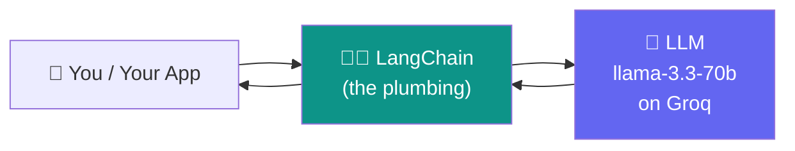
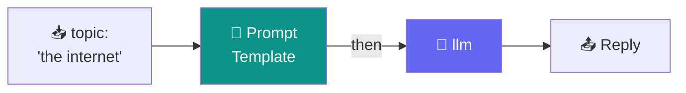
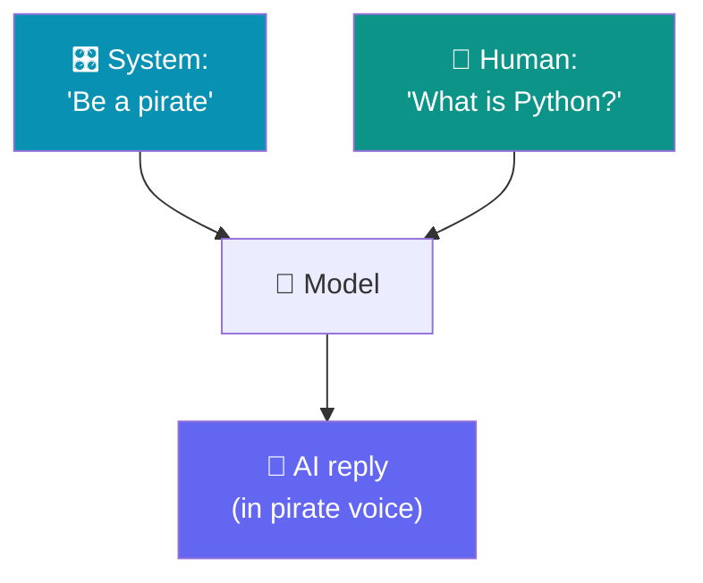
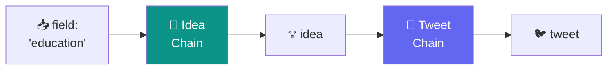
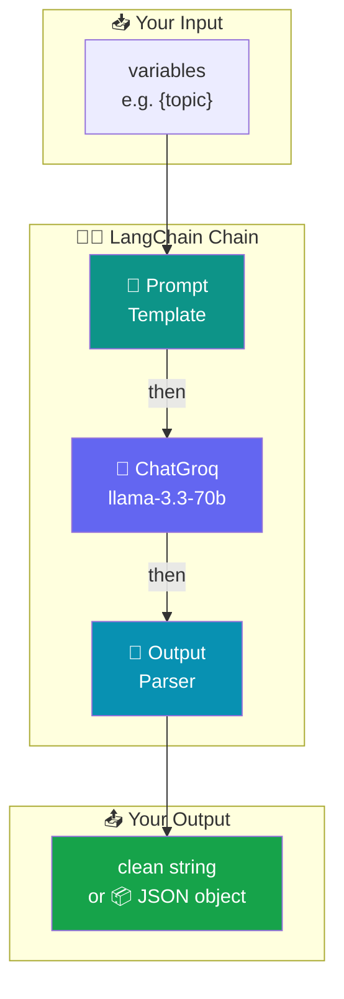

# 🦜🔗 LangChain for Absolute Beginners
### Build your first LLM apps in Google Colab — with copy-paste runnable code

> **Who this is for:** You have *never* used LangChain (maybe never called an LLM from code at all). By the end you'll understand what LangChain is, why it exists, and you'll have run **7 tiny programs** yourself — each one runnable in a fresh Google Colab cell.
>
> **LLM backend:** [Groq](https://console.groq.com) (free, extremely fast) running the **`llama-3.3-70b-versatile`** model.

> [!WARNING]
> ⏳ **Model note (read this once):** On **17 June 2026**, Groq marked `llama-3.3-70b-versatile` as **deprecated** — it still runs today but has a scheduled shutdown. Every example below works right now. If you ever get a *"model decommissioned"* error, just change **one line** — swap the model name to Groq's recommended replacement `openai/gpt-oss-120b`. Nothing else in the code changes. We'll point out exactly where.

---

## 📋 Table of Contents

1. [🤔 What is LangChain (in plain English)?](#-1--what-is-langchain-in-plain-english)
2. [🧩 The 5 building blocks you'll actually use](#-2--the-5-building-blocks-youll-actually-use)
3. [🔑 Step 0 — Get your free Groq API key](#-3--step-0--get-your-free-groq-api-key)
4. [⚙️ Step 1 — Set up Google Colab](#️-4--step-1--set-up-google-colab)
5. [👋 Example 1 — Your first LLM call](#-5--example-1--your-first-llm-call-hello-world)
6. [📝 Example 2 — Prompt templates (reusable prompts)](#-6--example-2--prompt-templates)
7. [⛓️ Example 3 — Chains with LCEL (the pipe `|`)](#️-7--example-3--your-first-chain-lcel)
8. [🧹 Example 4 — Output parsers (clean strings out)](#-8--example-4--output-parsers)
9. [💬 Example 5 — Adding a system role + memory of the turn](#-9--example-5--system-role--message-types)
10. [📦 Example 6 — Structured output (get JSON, not prose)](#-10--example-6--structured-output-json)
11. [🔁 Example 7 — Multi-step chains](#-11--example-7--multi-step-chains)
12. [🗺️ How it all fits together](#️-12--how-it-all-fits-together)
13. [🧯 Common errors & fixes](#-13--common-errors--fixes)
14. [🎓 Recap & cheat sheet](#-14--recap--cheat-sheet)

---

## 🤔 1 · What is LangChain (in plain English)?

An **LLM** (Large Language Model) like Llama is just a very smart *text-in, text-out* function. You send it words, it sends words back. That's powerful — but raw.

To build a real app on top of it, you keep needing the same plumbing over and over:

- 🧱 **Reusable prompts** — "translate this to {language}" where `{language}` changes each time.
- 🔗 **Connecting steps** — take the model's answer, feed it into the next model call.
- 🧹 **Cleaning the output** — pull out just the text, or force it into JSON.
- 🔌 **Swapping providers** — use Groq today, OpenAI tomorrow, without rewriting your app.
- 🧠 **Memory, tools, documents** — the harder stuff you'll grow into later.

> 💡 **LangChain is a toolbox that gives you all this plumbing so you don't write it yourself.** It's a framework that sits *between your code and the LLM* and makes common patterns short and standard.

Here's the mental model:



**Analogy 🔌:** The LLM is a powerful appliance. LangChain is the *universal wall socket + adapters* — it lets you plug that appliance into your project cleanly, and swap appliances without rewiring the house.

> ⚠️ **Important honesty note:** For a *single* simple call, you don't strictly *need* LangChain. Its value shows up when you start **chaining steps, reusing prompts, and swapping models**. We start tiny and build up so you feel exactly where it earns its place.

---

## 🧩 2 · The 5 building blocks you'll actually use

| # | Building block | Emoji | What it does | Plain-English analogy |
|---|----------------|:-----:|--------------|-----------------------|
| 1 | **Model** (`ChatGroq`) | 🤖 | The brain. Sends your text to Llama on Groq and gets a reply. | The engine |
| 2 | **Prompt Template** | 📝 | A reusable prompt with `{blanks}` you fill in later. | A fill-in-the-blank form |
| 3 | **Output Parser** | 🧹 | Turns the raw model reply into a clean string or structured data. | A strainer |
| 4 | **Chain** (LCEL, the `\|` pipe) | ⛓️ | Snaps blocks together so output of one flows into the next. | LEGO connectors |
| 5 | **Messages** (System/Human/AI) | 💬 | Labels *who* is speaking so you can set rules + ask questions. | Name tags on a conversation |

You'll meet all five below, one at a time. 🎯

---

## 🔑 3 · Step 0 — Get your free Groq API key

You need a key so Groq knows it's you. It's free and takes ~1 minute.

1. 🌐 Go to **[console.groq.com](https://console.groq.com)** and sign in (Google login works).
2. 🔍 In the left menu, click **API Keys**.
3. ➕ Click **Create API Key**, give it any name (e.g. `colab`), and **Create**.
4. 📋 **Copy the key immediately** — it starts with `gsk_...` and is shown only once.
5. 💾 Paste it somewhere safe for the next step. Treat it like a password — **never** put it in a public notebook or GitHub.


---

## ⚙️ 4 · Step 1 — Set up Google Colab

Google Colab is a free notebook that runs Python in your browser — nothing to install on your computer. 🎉

### 4.1 · Open a notebook
Go to **[colab.research.google.com](https://colab.research.google.com)** → **New notebook**.

### 4.2 · Install LangChain + Groq
In the **first cell**, paste this and press ▶️ (Shift+Enter). The `-q` just keeps the output quiet.

```python
!pip install -q langchain langchain-groq langchain-core
```

### 4.3 · Add your API key safely 🔐
We store the key in a variable called **`API_KEY`**. In a real project you'd use Colab's 🔑 *Secrets* panel, but for learning we'll paste it directly. Run this in a **new cell**:

```python
# 🔐 Paste your Groq key between the quotes
API_KEY = "gsk_your_key_here"

import os
os.environ["GROQ_API_KEY"] = API_KEY   # LangChain reads the key from here

print("✅ Key is set! Ready to build.")
```

> 💡 **Why set the environment variable?** `ChatGroq` automatically looks for a variable named `GROQ_API_KEY`. Setting it once means every example below "just works" without repeating the key.

You're set up! Everything from here is copy-paste runnable. 🚀

---

## 👋 5 · Example 1 — Your first LLM call (Hello World)

Let's do the smallest possible thing: send one message, get one reply.

```python
from langchain_groq import ChatGroq

# 🤖 Create the model (the "brain")
llm = ChatGroq(
    model="llama-3.3-70b-versatile",   # 👈 the only line to change if deprecated
    api_key=API_KEY,
    temperature=0.7,                   # 0 = focused, 1 = creative
)

# 💬 Ask it something
response = llm.invoke("Explain what an API is in one simple sentence.")

# 🧹 The reply is an object; the text lives in .content
print(response.content)
```

**✅ What you'll see:** a one-sentence explanation of an API.

**🔎 Line by line:**
- `ChatGroq(...)` builds the model object. `temperature` controls randomness.
- `.invoke("...")` sends your text and **waits** for the full reply.
- `response.content` is where the actual answer text lives.

> 🎯 **You just called a 70-billion-parameter model in 3 lines.** That's the "Model" building block.

---

## 📝 6 · Example 2 — Prompt Templates

Typing the full prompt every time is repetitive. A **Prompt Template** is a reusable prompt with blanks (`{like_this}`) you fill in later.

```python
from langchain_core.prompts import ChatPromptTemplate

# 📝 A reusable template with one blank: {topic}
prompt = ChatPromptTemplate.from_template(
    "Explain {topic} to a 10-year-old in 2 sentences."
)

# 🖊️ Fill the blank to produce a real message
message = prompt.invoke({"topic": "gravity"})
print(message)          # 👀 see the filled-in prompt

# 🤖 Now send it to the model
response = llm.invoke(message)
print("\n" + response.content)
```

**✅ What you'll see:** first the filled prompt, then a kid-friendly explanation of gravity.

**💡 Why this matters:** change `"gravity"` to `"taxes"` or `"black holes"` and reuse the *same* template. No copy-pasting long prompt strings. This is the **Prompt Template** building block. 📝

---

## ⛓️ 7 · Example 3 — Your first Chain (LCEL)

Look at Example 2 — we did two steps by hand: **fill the prompt**, then **send to model**. LangChain lets you **snap these together** with the pipe symbol `|`. This is called **LCEL** (LangChain Expression Language).

> 🧠 Read `|` as the word **"then"**. `prompt | llm` means *"fill the prompt, **then** send to the model."*

```python
# ⛓️ Snap the blocks together into one "chain"
chain = prompt | llm

# ▶️ Run the whole chain in ONE call
response = chain.invoke({"topic": "the internet"})
print(response.content)
```

**✅ What you'll see:** a kid-friendly explanation of the internet — same result, but now it's **one clean step**.



> 🎯 **This is the heart of LangChain.** Chains let you build pipelines. Next we'll add a third block to the pipe.

---

## 🧹 8 · Example 4 — Output Parsers

Notice we keep writing `response.content` to dig the text out. An **Output Parser** does that for you — the `StrOutputParser` hands back a **plain string** directly.

```python
from langchain_core.output_parsers import StrOutputParser

# 🧹 This parser extracts the .content string automatically
parser = StrOutputParser()

# ⛓️ Three blocks in the pipe: prompt → model → parser
chain = prompt | llm | parser

# ▶️ Now the result is already a clean string!
text = chain.invoke({"topic": "electricity"})
print(text)          # 👈 no .content needed
print(type(text))    # <class 'str'>
```

**✅ What you'll see:** a clean string explanation, and `<class 'str'>` — proving the output is now a ready-to-use string.

**💡 Why this matters:** now your chain outputs exactly the type you want. The pattern **`prompt | llm | parser`** is the single most common thing you'll write in LangChain. Memorize it. 🏆

---

## 💬 9 · Example 5 — System role & message types

So far we sent plain text. Real chat apps label *who* is speaking with **messages**:

- 🎛️ **System** — sets rules & personality ("You are a pirate.")
- 🧑 **Human** — what the user asks.
- 🤖 **AI** — what the model replied (added automatically).

```python
from langchain_core.prompts import ChatPromptTemplate

# 💬 A template with a system role + a human question
prompt = ChatPromptTemplate.from_messages([
    ("system", "You are a friendly pirate. Always answer in pirate slang. 🏴‍☠️"),
    ("human",  "{question}")
])

chain = prompt | llm | parser

answer = chain.invoke({"question": "What is Python?"})
print(answer)
```

**✅ What you'll see:** an explanation of Python — in pirate voice. 🏴‍☠️

**💡 Why this matters:** the **system** message is how you set behavior, tone, and rules for the whole conversation. Change it to *"You are a strict math tutor"* and the personality flips instantly.



---

## 📦 10 · Example 6 — Structured output (JSON)

Often you don't want prose — you want **data** your program can use (a name, a rating, a list). LangChain can force the model to return a **Python object** that matches a shape you define with **Pydantic**.

```python
from pydantic import BaseModel, Field

# 📦 Define the exact shape you want back
class MovieReview(BaseModel):
    title:  str = Field(description="the movie's title")
    rating: int = Field(description="a score from 1 to 10")
    summary: str = Field(description="a one-line summary")

# 🔗 Tell the model to fill this shape
structured_llm = llm.with_structured_output(MovieReview)

result = structured_llm.invoke(
    "Review the movie Inception."
)

# ✅ result is now a real Python object!
print("Title :", result.title)
print("Rating:", result.rating, "/10")
print("Summary:", result.summary)
```

**✅ What you'll see:** three clean fields — title, a numeric rating, and a summary — that you can use directly in code (e.g. `if result.rating > 7:`).

**💡 Why this matters:** no messy text parsing. You asked for structured data, you got a typed object. This is how you connect an LLM to the rest of a real program. 📦

---

## 🔁 11 · Example 7 — Multi-step chains

The real payoff: chain **two model calls** where the first answer feeds the second. Here we (1) pick a topic idea, then (2) write a tweet about it — automatically.

```python
from langchain_core.output_parsers import StrOutputParser

parser = StrOutputParser()

# 1️⃣ First chain: come up with a startup idea in a field
idea_prompt = ChatPromptTemplate.from_template(
    "Give ONE creative startup idea in the field of {field}. Reply with just the idea in one line."
)
idea_chain = idea_prompt | llm | parser

# 2️⃣ Second chain: write a tweet promoting that idea
tweet_prompt = ChatPromptTemplate.from_template(
    "Write a fun, emoji-filled tweet promoting this startup idea: {idea}"
)
tweet_chain = tweet_prompt | llm | parser

# 🔁 Run step 1, then feed its output into step 2
idea  = idea_chain.invoke({"field": "education"})
tweet = tweet_chain.invoke({"idea": idea})

print("💡 Idea:\n", idea)
print("\n🐦 Tweet:\n", tweet)
```

**✅ What you'll see:** a generated startup idea, then a ready-to-post tweet promoting *that specific idea*.



> 🎉 **You just built a 2-step AI pipeline.** This is exactly how bigger LangChain apps are made — small chains, snapped together.

---

## 🗺️ 12 · How it all fits together

Everything you learned, in one picture:



**The one pattern to remember:** 🌟

```python
chain = prompt | llm | parser
result = chain.invoke({"your_variable": "value"})
```

---

## 🧯 13 · Common errors & fixes

| 😱 Error message | 🔎 Cause | ✅ Fix |
|-----------------|----------|--------|
| `AuthenticationError` / `401` | Bad or missing API key | Re-check `API_KEY` starts with `gsk_` and was copied fully |
| `ModuleNotFoundError: langchain_groq` | Package not installed | Re-run the `!pip install` cell |
| `model ... has been decommissioned` | Model was shut down | Change model to `"openai/gpt-oss-120b"` |
| `RateLimitError` / `429` | Too many requests on free tier | Wait a few seconds and re-run |
| Reply is empty / cut off | Answer hit token limit | Add `max_tokens=1024` to `ChatGroq(...)` |
| `KeyError: 'topic'` | Template blank not filled | Pass every `{blank}` in `.invoke({...})` |

> 💡 **Golden rule:** if something breaks, read the **last line** of the red error — it usually names the exact problem.

---

## 🎓 14 · Recap & cheat sheet

You went from zero to building AI pipelines. Here's what you now know: 🏆

- 🤖 **Model** — `ChatGroq(model="llama-3.3-70b-versatile", api_key=API_KEY)`
- 📝 **Prompt Template** — reusable prompts with `{blanks}`
- 🧹 **Output Parser** — `StrOutputParser()` gives clean strings
- ⛓️ **Chains** — `prompt | llm | parser` (read `|` as "then")
- 💬 **Messages** — System sets rules, Human asks
- 📦 **Structured output** — `.with_structured_output(MySchema)` returns typed data
- 🔁 **Multi-step** — feed one chain's output into the next

### 📋 Copy-paste starter (everything in one cell)

```python
!pip install -q langchain langchain-groq langchain-core

from langchain_groq import ChatGroq
from langchain_core.prompts import ChatPromptTemplate
from langchain_core.output_parsers import StrOutputParser

API_KEY = "gsk_your_key_here"

llm = ChatGroq(model="llama-3.3-70b-versatile", api_key=API_KEY, temperature=0.7)
prompt = ChatPromptTemplate.from_template("Explain {topic} simply.")
parser = StrOutputParser()

chain = prompt | llm | parser
print(chain.invoke({"topic": "LangChain"}))
```

### 🚀 Where to go next
- 🧠 **Memory** — make chat remember previous turns
- 🔧 **Tools & Agents** — let the model use a calculator, search, or your functions
- 📚 **RAG** — answer questions from *your own* documents
- 🌊 **Streaming** — show the reply word-by-word as it generates

> 🎉 **Congratulations!** You can now read almost any LangChain tutorial and understand what `prompt | llm | parser` means. That's the foundation everything else builds on. Keep the pipe `|` in mind — it's LangChain's superpower. 🦜🔗
