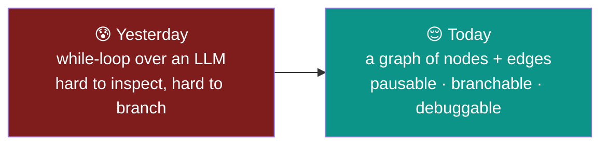
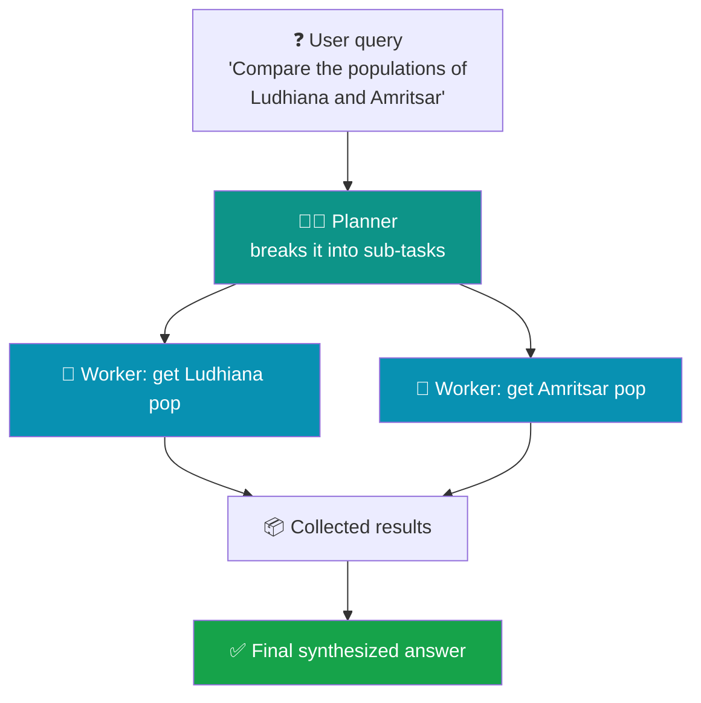
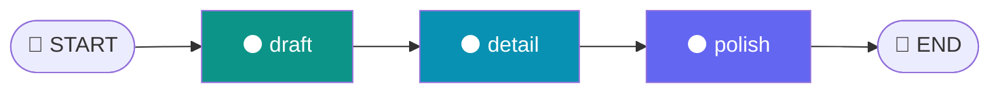
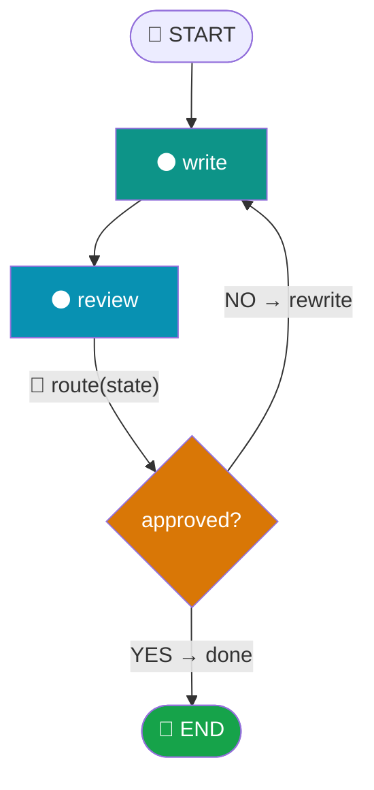
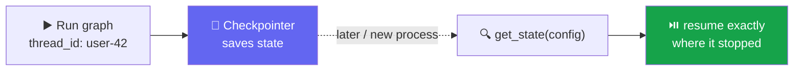

# 🕸️ Day 8 — Agentic Wrap-up + LangGraph Foundations

### From "for-loops over an LLM" to proper, debuggable **state machines**

> **Where we are:** Day 7 gave you a ReAct agent — an LLM in a hand-written loop. Today we finish Module 5 with the **planner-executor** pattern (separating *what to do* from *how to do it*), then step into **Module 6: LangGraph** — the framework that turns that loop into a real, inspectable graph you can pause, branch, and debug.
>
> **Modules:** M5 wrap-up (2h) + M6 start (4h) · **Total: 6 hours** · 3 hands-on sessions
> **LLM backend:** [Groq](https://console.groq.com) · model **`llama-3.3-70b-versatile`** · key stored in the variable **`API_KEY`**

> [!WARNING]
> ⏳ **Model note (read once):** Groq marked `llama-3.3-70b-versatile` **deprecated** on 17 Jun 2026 — it still runs today but has a scheduled shutdown. Every example below works right now. If you ever hit a *"model decommissioned"* error, change **one line** — swap the model name to `openai/gpt-oss-120b`. Nothing else changes.

---

## 📋 Table of Contents

1. [🎯 The big shift: why today matters](#-1--the-big-shift-why-today-matters)
2. [🗣️ Plain-English vocabulary](#️-2--plain-english-vocabulary)
3. [⚙️ Setup (Groq + LangGraph)](#️-3--setup-groq--langgraph)
4. [🧑‍✈️ Session 1 — Planner-Executor agents (M5 wrap-up)](#-4--session-1--planner-executor-agents-m5-wrap-up)
5. [🕸️ Session 2 — The LangGraph mental model (M6 start)](#️-5--session-2--the-langgraph-mental-model-m6-start)
6. [🔀 Session 3 — Conditional edges & cyclic graphs (M6)](#-6--session-3--conditional-edges--cyclic-graphs-m6)
7. [⚖️ Why a graph and not a chain?](#️-7--why-a-graph-and-not-a-chain)
8. [💾 State persistence demo (pause & resume)](#-8--state-persistence-demo-pause--resume)
9. [🧯 Common errors & fixes](#-9--common-errors--fixes)
10. [🎓 Recap, outcome & cheat sheet](#-10--recap-outcome--cheat-sheet)

---

## 🎯 1 · The big shift: why today matters

Yesterday's ReAct agent worked, but it was a **`while` loop**. When it misbehaved, you had a wall of print statements and no clean way to ask *"where exactly did it go wrong, and what did the state look like there?"*

Today's mental leap: **model your agent as a state machine.** 🧠



A **state machine** is just: *a set of steps (nodes), rules for moving between them (edges), and a shared memory (state) that flows through.* Once you can see your agent this way, every advanced pattern — self-correction, human-in-the-loop, multi-agent teams — becomes a small change to the graph instead of a rewrite of a tangled loop.

> 💡 **Day 8 outcome:** you'll be able to model an agentic workflow as a state machine. That conceptual shift unlocks everything that follows in the programme.

Two ideas, in order:
- 🧑‍✈️ **Planner-Executor** (Session 1) — the *pattern*: split the "thinking" from the "doing".
- 🕸️ **LangGraph** (Sessions 2–3) — the *framework* that makes that pattern (and much more) clean and debuggable.

---

## 🗣️ 2 · Plain-English vocabulary

Learn these 7 words and the rest of the day is easy. 🧩

| Term | Emoji | Plain meaning | Everyday analogy |
|------|:-----:|---------------|------------------|
| **Planner** | 🧑‍✈️ | Decides *what* sub-tasks are needed | A project manager |
| **Executor / Worker** | 🔧 | Actually *does* one sub-task | A team member |
| **State** | 📦 | Shared memory passed between steps | A clipboard everyone writes on |
| **Node** | ⚫ | One step of work (a Python function) | A workstation |
| **Edge** | ➡️ | A rule for which node runs next | An arrow / a corridor |
| **Conditional edge** | 🔀 | An edge that *decides* the next node from state | A fork in the road with a sign |
| **Checkpointer** | 💾 | Saves state so a graph can pause & resume | A save-game slot |

---

## ⚙️ 3 · Setup (Groq + LangGraph)

Everything below runs in **Google Colab** — nothing to install locally. In your **first cell**:

```python
!pip install -q langchain langchain-groq langgraph
```

Then set your key (get a free one at [console.groq.com](https://console.groq.com) → **API Keys**):

```python
# 🔐 Paste your Groq key
API_KEY = "gsk_your_key_here"

import os
os.environ["GROQ_API_KEY"] = API_KEY
print("✅ Ready.")
```

And create the shared model we'll reuse all day:

```python
from langchain_groq import ChatGroq

llm = ChatGroq(
    model="llama-3.3-70b-versatile",   # 👈 the one line to change if deprecated
    api_key=API_KEY,
    temperature=0,                     # 0 = predictable, best for agents
)
```

> 💡 **Why `temperature=0`?** Agents make decisions. You want those decisions **stable and repeatable**, not creative. Save high temperature for brainstorming, not routing.

---

## 🧑‍✈️ 4 · Session 1 — Planner-Executor agents (M5 wrap-up)

### 4.1 · The idea: separate *what* from *how*

A single agent that plans **and** executes in one breath gets confused on multi-part questions. The fix is a classic division of labour:



- 🧑‍✈️ The **planner** thinks once and outputs a *list of steps*.
- 🔧 The **workers** each handle one step, in isolation, without the distraction of the whole problem.

### 4.2 · Build a planner (get a plan as structured data)

We ask the LLM to return a **plan as JSON** so our code can loop over it. We use Pydantic (from Day 7) so the output is typed. 📦

```python
from pydantic import BaseModel, Field
from typing import List

# 📦 the exact shape of a plan
class Plan(BaseModel):
    steps: List[str] = Field(description="ordered list of sub-tasks to solve the query")

planner = llm.with_structured_output(Plan)

query = "Compare the populations of Ludhiana and Amritsar, then say which is bigger."
plan = planner.invoke(
    f"Break this request into 2-4 simple sub-tasks. Request: {query}"
)

print("🧑‍✈️ Plan:")
for i, step in enumerate(plan.steps, 1):
    print(f"  {i}. {step}")
```

**✅ What you'll see:** a numbered list of sub-tasks, e.g. *1. Find Ludhiana population · 2. Find Amritsar population · 3. Compare the two*.

### 4.3 · Add executors (a worker per step)

Each worker gets **one** sub-task and returns a short result. Then a final synthesis step combines them.

```python
def worker(subtask: str) -> str:
    """🔧 handle ONE sub-task in isolation."""
    result = llm.invoke(f"Complete this single task concisely: {subtask}")
    return result.content

# run each step
results = []
for step in plan.steps:
    answer = worker(step)
    results.append(f"- {step}\n  → {answer}")
    print(f"🔧 {step}\n   {answer}\n")

# 🧑‍✈️ planner synthesizes the final answer
combined = "\n".join(results)
final = llm.invoke(
    f"Using these sub-results, give a final answer to '{query}':\n{combined}"
)
print("✅ FINAL:\n", final.content)
```

**✅ What you'll see:** each worker's mini-answer, then one clean synthesized conclusion.

> 🎯 **Takeaway:** planner-executor is a *pattern*, not a library. You just built it with plain Python + Groq. But notice the pain: passing `results` around by hand, no easy way to inspect or branch. **That's exactly the problem LangGraph solves.** 👇

---

## 🕸️ 5 · Session 2 — The LangGraph mental model (M6 start)

### 5.1 · What LangGraph actually is

> **LangGraph** is a small library on top of LangChain for building agents as **graphs**: you define **nodes** (steps), **edges** (routing), and a **state** (shared memory) — and it runs them for you, with inspection at every transition. 🔍

Four concepts, that's the whole model:

| Piece | Emoji | What it is | In code |
|-------|:-----:|------------|---------|
| **State** | 📦 | A typed dict passed to every node | `class State(TypedDict): ...` |
| **Node** | ⚫ | A function `state → state-update` | `def my_node(state): return {...}` |
| **Edge** | ➡️ | "after A, go to B" | `builder.add_edge("A", "B")` |
| **START / END** | 🚦 | Where the graph begins & stops | `add_edge(START, "A")` |

### 5.2 · Build a 3-node graph, live

We'll build a tiny pipeline: **draft → add detail → polish.** Watch the state grow at each step.

```python
from typing import TypedDict
from langgraph.graph import StateGraph, START, END

# 📦 1. Define the shared state
class State(TypedDict):
    topic: str
    draft: str

# ⚫ 2. Define three nodes (each returns a state UPDATE)
def node_draft(state: State):
    text = llm.invoke(f"Write one plain sentence about {state['topic']}.").content
    print("⚫ node_draft →", text)
    return {"draft": text}

def node_detail(state: State):
    text = llm.invoke(f"Add one specific detail to this: {state['draft']}").content
    print("⚫ node_detail →", text)
    return {"draft": text}

def node_polish(state: State):
    text = llm.invoke(f"Make this sound friendly and clear: {state['draft']}").content
    print("⚫ node_polish →", text)
    return {"draft": text}

# 🔧 3. Wire the graph
builder = StateGraph(State)
builder.add_node("draft",  node_draft)
builder.add_node("detail", node_detail)
builder.add_node("polish", node_polish)

builder.add_edge(START,   "draft")   # 🚦 start here
builder.add_edge("draft",  "detail")
builder.add_edge("detail", "polish")
builder.add_edge("polish", END)      # 🚦 stop here

graph = builder.compile()

# ▶️ 4. Run it
result = graph.invoke({"topic": "the LangGraph library", "draft": ""})
print("\n✅ FINAL DRAFT:\n", result["draft"])
```

**✅ What you'll see:** each node prints its output as state flows through — draft, then enriched, then polished — proving the state is passed and updated at every hop.



> 🔍 **State inspection:** every node returns a *partial* update (`{"draft": ...}`) and LangGraph merges it into the shared state. Because each step is a named node, you always know exactly where you are — no guessing inside a loop.

---

## 🔀 6 · Session 3 — Conditional edges & cyclic graphs (M6)

This is the moment LangGraph becomes **more than a workflow engine.** So far edges were fixed arrows. A **conditional edge** picks the next node *by reading the state* — which lets the graph **branch** and even **loop back**. 🔁

### 6.1 · The router function

A router is a tiny function: it reads state and **returns a string** — the name of the next node. It does *no* other work.

```python
from typing import Literal

def quality_router(state) -> Literal["rewrite", "done"]:
    # 🔀 read state, decide the next node's name
    if state["approved"]:
        return "done"
    return "rewrite"
```

> 💡 **Golden rule:** routers only *read and decide*. All real work happens in nodes. Annotating the return with `Literal[...]` lets LangGraph draw every branch in the diagram automatically.

### 6.2 · Build a self-correcting answer pipeline

The classic payoff: **draft → review → (rewrite ↺ or finish).** It loops until a quality check passes. 🎯

```python
from typing import TypedDict, Literal
from langgraph.graph import StateGraph, START, END

# 📦 state carries the draft, a verdict, and a loop guard
class State(TypedDict):
    question: str
    answer: str
    approved: bool
    tries: int

# ⚫ write (or rewrite) an answer
def write(state: State):
    prompt = f"Answer clearly in 2 sentences: {state['question']}"
    if state.get("answer"):
        prompt = f"Improve this answer, make it clearer: {state['answer']}"
    ans = llm.invoke(prompt).content
    return {"answer": ans, "tries": state.get("tries", 0) + 1}

# ⚫ review: judge the draft, set approved True/False
def review(state: State):
    verdict = llm.invoke(
        f"Reply only YES if this is clear and correct, else NO:\n{state['answer']}"
    ).content.strip().upper()
    approved = verdict.startswith("YES") or state["tries"] >= 3   # 🛡️ loop guard
    print(f"🔎 review: verdict={verdict}  approved={approved}  (try {state['tries']})")
    return {"approved": approved}

# 🔀 router: loop back or finish
def route(state: State) -> Literal["rewrite", "done"]:
    return "done" if state["approved"] else "rewrite"

builder = StateGraph(State)
builder.add_node("write",  write)
builder.add_node("review", review)

builder.add_edge(START, "write")
builder.add_edge("write", "review")

# 🔀 THE conditional edge: from review, choose the next node by name
builder.add_conditional_edges(
    "review",              # after this node runs...
    route,                 # ...call this router...
    {                      # ...and map its return to a real node:
        "rewrite": "write",   # ↺ loop back
        "done": END,          # ✅ finish
    },
)

graph = builder.compile()

out = graph.invoke({"question": "Why is the sky blue?",
                    "answer": "", "approved": False, "tries": 0})
print("\n✅ APPROVED ANSWER:\n", out["answer"])
```

**✅ What you'll see:** the graph writes an answer, reviews it, and either loops back to improve it or exits — automatically stopping after approval (or 3 tries).



> ⚠️ **Always guard your loops.** A cyclic graph with no exit condition runs forever. The `tries >= 3` check is your seatbelt — every cycle needs one.

---

## ⚖️ 7 · Why a graph and not a chain?

A **chain** (`prompt | llm | parser` from Day 7) is a straight line: A → B → C, always. It's perfect when every input takes the same path. But the moment you need to **branch** or **loop**, a chain falls apart. 🧱

| Scenario | ⛓️ Chain (Day 7) | 🕸️ Graph (LangGraph) |
|----------|------------------|----------------------|
| Fixed A→B→C pipeline | ✅ Ideal | ✅ Works (overkill) |
| "Retry until good" loop | ❌ Can't loop | ✅ Conditional edge back |
| Branch on a condition | ❌ One path only | ✅ Router picks the node |
| Inspect state mid-run | 😐 Hard | ✅ Named nodes + checkpoints |
| Pause & resume later | ❌ No | ✅ Checkpointer |

> 🎯 **The rule:** if the flow is a **straight line**, use a chain. The moment it needs to **branch or loop**, reach for a graph. The self-correcting pipeline above is *impossible* as a plain chain — that's the whole point.

---

## 💾 8 · State persistence demo (pause & resume)

Because state is explicit, LangGraph can **save it** and pick up later — even in a new process. You add a **checkpointer** and give each run a `thread_id` (like a save-slot name). 💾

```python
from langgraph.checkpoint.memory import InMemorySaver

# 💾 attach a checkpointer at compile time
memory = InMemorySaver()
graph = builder.compile(checkpointer=memory)

# 🧵 a thread_id labels this conversation's saved state
config = {"configurable": {"thread_id": "user-42"}}

# run once — state is saved automatically after each node
graph.invoke({"question": "What is LangGraph?",
              "answer": "", "approved": False, "tries": 0}, config)

# 🔍 later (even after a restart) — read back exactly where it stopped
saved = graph.get_state(config)
print("💾 saved state:", saved.values)
```

**✅ What you'll see:** the saved state values printed back — proof the graph remembered its progress under that `thread_id`.

> 💡 **Why this is huge:** this is the foundation of **human-in-the-loop** (pause for approval, resume later) and long-running agents that survive crashes. In production you swap `InMemorySaver` for a database-backed saver — same code.



---

## 🧯 9 · Common errors & fixes

| 😱 Symptom | 🔎 Cause | ✅ Fix |
|-----------|----------|--------|
| Graph runs forever | Cycle with no exit | Add a loop guard (`tries >= N`) in the router |
| `KeyError` in a node | State key not initialized | Pass every key in the first `.invoke({...})` |
| Router has no effect | Return string not in the path map | Make the router's return match a key in `add_conditional_edges` map |
| State not saved | No checkpointer | Pass `checkpointer=...` to `.compile()` |
| `get_state` returns nothing | Missing/!wrong `thread_id` | Reuse the same `config` with the same `thread_id` |
| Node "overwrites" other data | Returned full state, not an update | Return only the keys you changed: `return {"draft": x}` |
| `model decommissioned` | Groq deprecated the model | Switch to `openai/gpt-oss-120b` |

> 💡 **Debugging tip:** print `state` at the top of each node while learning. Because nodes are named, you'll see exactly which step misbehaved — the thing a raw `while` loop never gave you.

---

## 🎓 10 · Recap, outcome & cheat sheet

You closed Module 5 and opened Module 6. Here's the whole day in one breath: 🏆

- 🧑‍✈️ **Planner-Executor** — split *what to do* (planner) from *how to do it* (workers).
- 📦 **State** — a typed dict that flows through every step; nodes return *partial updates*.
- ⚫ **Nodes & ➡️ edges** — steps and the arrows between them; `START` and `END` bound the graph.
- 🔀 **Conditional edges** — a router reads state and returns the next node's *name*: branching + loops.
- ↺ **Cyclic graphs** — self-correcting pipelines that loop until quality passes (always guarded).
- 💾 **Checkpointer** — save & resume state by `thread_id`; the basis of human-in-the-loop.
- ⚖️ **Graph vs chain** — straight line → chain; branch or loop → graph.

### 📋 Copy-paste skeleton (the shape of every LangGraph)

```python
from typing import TypedDict, Literal
from langgraph.graph import StateGraph, START, END

class State(TypedDict):
    ...                                   # 📦 shared memory

def node_a(state: State):
    return {...}                          # ⚫ return a partial update

def router(state: State) -> Literal["a", "done"]:
    return "done" if state[...] else "a"  # 🔀 read state, name next node

builder = StateGraph(State)
builder.add_node("a", node_a)
builder.add_edge(START, "a")
builder.add_conditional_edges("a", router, {"a": "a", "done": END})
graph = builder.compile()                 # add checkpointer=... to persist

graph.invoke({...})                       # ▶️ run
```

### 🎯 Day 8 Outcome
> **Faculty can now model an agentic workflow as a state machine** — nodes, edges, state, conditional routing, and persistence. This is the conceptual shift that unlocks every advanced pattern in the rest of the programme.

### 🚀 Next — Day 9: Multi-Agent Systems
> We give each node its *own* agent and let them collaborate: supervisor patterns, agent teams, and message-passing between specialists — all built on the graph foundation you just learned. 🤝
