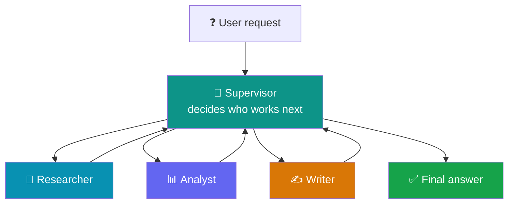
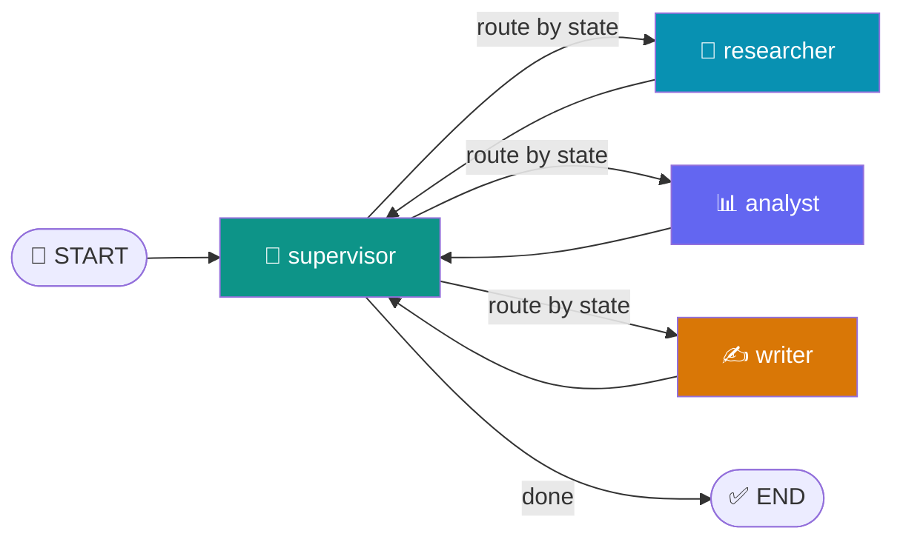
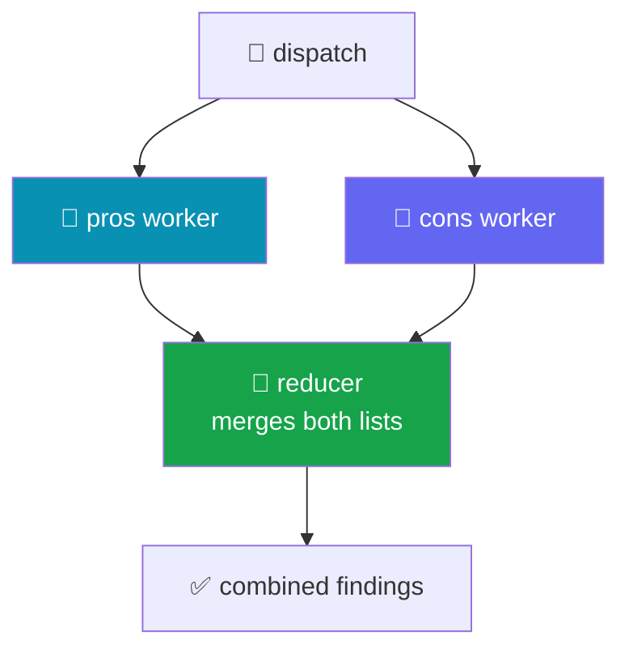
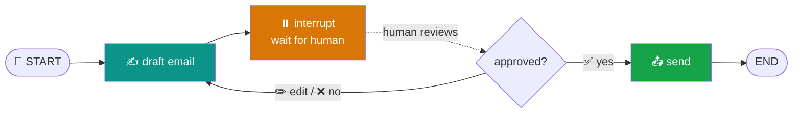
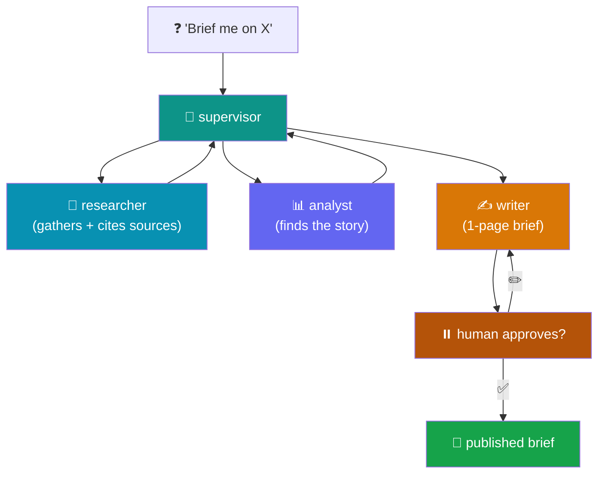

# 🎭 Day 9 — Multi-Agent Orchestration with LangGraph

### One supervisor, many specialists — collaborating without drowning in messages

> **Where we are:** Day 8 turned your agent into a **state machine** (nodes, edges, state, conditional routing, persistence). Today we put *multiple* agents inside that graph: a **supervisor** that delegates, **specialist workers** that each do one job, **parallel** execution that merges cleanly, and **human-in-the-loop** checkpoints that pause for approval. This is production-credible architecture — not a toy.
>
> **Module:** M6 · **Total: 6 hours** · 3 hands-on sessions
> **LLM backend:** [Groq](https://console.groq.com) · model **`llama-3.3-70b-versatile`** · key stored in the variable **`API_KEY`**

> [!WARNING]
> ⏳ **Model note (read once):** Groq marked `llama-3.3-70b-versatile` **deprecated** on 17 Jun 2026 — it still runs today but has a scheduled shutdown. Every example below works right now. If you ever hit a *"model decommissioned"* error, change **one line** — swap the model name to `openai/gpt-oss-120b`. Nothing else changes.

---

## 📋 Table of Contents

1. [🎯 Why multi-agent? (and when NOT to)](#-1--why-multi-agent-and-when-not-to)
2. [🗣️ Plain-English vocabulary](#️-2--plain-english-vocabulary)
3. [⚙️ Setup](#️-3--setup)
4. [👔 Session 1 — The supervisor–worker pattern](#-4--session-1--the-supervisorworker-pattern)
5. [⚡ Session 2 — Parallel execution & message reducers](#-5--session-2--parallel-execution--message-reducers)
6. [🙋 Session 3 — Human-in-the-loop (HITL)](#-6--session-3--human-in-the-loop-hitl)
7. [📄 Putting it together: research-and-report](#-7--putting-it-together-research-and-report)
8. [💰 Cost demo: 1 agent vs 4 agents](#-8--cost-demo-1-agent-vs-4-agents)
9. [🧯 Common errors & fixes](#-9--common-errors--fixes)
10. [🎓 Recap, outcome & cheat sheet](#-10--recap-outcome--cheat-sheet)

---

## 🎯 1 · Why multi-agent? (and when NOT to)

Yesterday one agent did everything in a loop. That works — until the job has **several different kinds of work** in it. Asking a single agent to research *and* analyze *and* write in one giant prompt makes it confused: it forgets instructions, mixes roles, and the prompt balloons. 🎈

The fix mirrors how a **real team** works: a manager who delegates, and specialists who each own one job. 👔



> 💡 **The core benefit:** each specialist gets a **short, focused prompt** and its **own tools**. Focused agents are more reliable than one overloaded generalist.

But be honest — multi-agent isn't free:

| ✅ Use multiple agents when… | ❌ Stick to one agent when… |
|------------------------------|------------------------------|
| The task has distinct sub-skills (research vs writing) | The task is one kind of work |
| Different steps need different tools | A single prompt handles it fine |
| You want parallel speed-ups | Latency & token cost matter more than structure |
| A step needs human sign-off | It's a quick, low-stakes answer |

> ⚠️ **We'll prove this with numbers in [§8](#-8--cost-demo-1-agent-vs-4-agents).** Four agents can cost 3–4× the tokens of one. Sometimes that's worth it; sometimes it's not. Knowing the difference is the skill.

---

## 🗣️ 2 · Plain-English vocabulary

Seven words unlock the whole day. 🧩

| Term | Emoji | Plain meaning | Analogy |
|------|:-----:|---------------|---------|
| **Supervisor** | 👔 | An agent whose only job is deciding *who works next* | A team manager |
| **Worker / Specialist** | 🧑‍🔧 | An agent that does one kind of task, with its own tools | A team member |
| **Handoff** | 🔀 | Passing control from one agent to another | "Over to you" |
| **Parallel / Fan-out** | ⚡ | Two workers run at the same time | Two people, two desks |
| **Reducer** | 🧲 | A rule for *merging* updates into shared state | A merge policy |
| **Interrupt** | ⏸️ | A pause that hands control back to a human | A "wait for sign-off" gate |
| **Resume** | ▶️ | Continuing a paused graph with the human's input | "Approved — proceed" |

---

## ⚙️ 3 · Setup

Everything runs in **Google Colab**. In your **first cell**:

```python
!pip install -q langchain langchain-groq langgraph
```

Set your key (free at [console.groq.com](https://console.groq.com) → **API Keys**) and build the shared model:

```python
import os
from langchain_groq import ChatGroq

API_KEY = "gsk_your_key_here"          # 🔐 paste your Groq key
os.environ["GROQ_API_KEY"] = API_KEY

llm = ChatGroq(
    model="llama-3.3-70b-versatile",   # 👈 the one line to change if deprecated
    api_key=API_KEY,
    temperature=0,                     # agents should be predictable
)
print("✅ Ready.")
```

> 💡 Everything today builds on Day 8's `StateGraph`, nodes, edges, and `checkpointer`. If those words feel fuzzy, skim yesterday's cheat sheet first.

---

## 👔 4 · Session 1 — The supervisor–worker pattern

### 4.1 · The idea

A **supervisor** doesn't do the work. It reads the state and decides **which worker runs next** — or that the job is done. Each worker does its one task and reports back to the supervisor. The graph loops supervisor → worker → supervisor until finished. 🔁



### 4.2 · Define the shared state

Everyone reads and writes one state object. We track the task, each specialist's output, and whose turn it is.

```python
from typing import TypedDict
from langgraph.graph import StateGraph, START, END

class State(TypedDict):
    task: str          # the user's request
    research: str      # 🔎 researcher fills this
    analysis: str      # 📊 analyst fills this
    report: str        # ✍️ writer fills this
    next: str          # 👔 supervisor sets who goes next
```

### 4.3 · Build the workers (each one specialized)

Each worker is a node with a **short, role-specific prompt**. That focus is the whole point.

```python
def researcher(state: State):
    facts = llm.invoke(
        f"You are a researcher. List 3 key facts about: {state['task']}"
    ).content
    print("🔎 researcher done")
    return {"research": facts}

def analyst(state: State):
    insight = llm.invoke(
        f"You are an analyst. Given these facts, give 2 insights:\n{state['research']}"
    ).content
    print("📊 analyst done")
    return {"analysis": insight}

def writer(state: State):
    brief = llm.invoke(
        f"You are a writer. Write a short brief using:\n"
        f"Facts: {state['research']}\nInsights: {state['analysis']}"
    ).content
    print("✍️ writer done")
    return {"report": brief}
```

### 4.4 · Build the supervisor (the router)

The supervisor decides the next worker by looking at **what's already filled in**. Here we use simple rules; in production the supervisor is often itself an LLM call that returns a name.

```python
from typing import Literal

def supervisor(state: State):
    # decide who hasn't worked yet
    if not state.get("research"): nxt = "researcher"
    elif not state.get("analysis"): nxt = "analyst"
    elif not state.get("report"): nxt = "writer"
    else: nxt = "done"
    print(f"👔 supervisor → {nxt}")
    return {"next": nxt}

def route(state: State) -> Literal["researcher", "analyst", "writer", "done"]:
    return state["next"]     # 🔀 read the decision, name the next node
```

### 4.5 · Wire the graph

```python
builder = StateGraph(State)
builder.add_node("supervisor", supervisor)
builder.add_node("researcher", researcher)
builder.add_node("analyst",    analyst)
builder.add_node("writer",     writer)

builder.add_edge(START, "supervisor")

# 🔀 supervisor routes to a worker (or ends)
builder.add_conditional_edges("supervisor", route, {
    "researcher": "researcher",
    "analyst":    "analyst",
    "writer":     "writer",
    "done":       END,
})

# every worker reports back to the supervisor
builder.add_edge("researcher", "supervisor")
builder.add_edge("analyst",    "supervisor")
builder.add_edge("writer",     "supervisor")

graph = builder.compile()

result = graph.invoke({"task": "the impact of AI on education",
                       "research": "", "analysis": "", "report": "", "next": ""})
print("\n✅ REPORT:\n", result["report"])
```

**✅ What you'll see:** the supervisor announcing each handoff, each specialist reporting in turn, and a final brief that combines all three.

> 🎯 **Takeaway:** the supervisor is just a router that loops back. Workers stay simple because each owns one job. This is the backbone of every multi-agent system.

---

## ⚡ 5 · Session 2 — Parallel execution & message reducers

### 5.1 · The problem parallel work creates

Sometimes two workers **don't depend on each other** — e.g. research the *pros* and the *cons* at the same time. Running them in parallel is faster ⚡. But there's a catch: if both write to the **same state key at the same time**, whose value wins? Without a rule, LangGraph raises an error to stop you losing data.

The fix is a **reducer** — a function that says *how* to merge concurrent updates instead of overwriting. 🧲



### 5.2 · A reducer with `Annotated`

You attach a reducer to a state field with `Annotated[type, reducer_fn]`. The built-in `operator.add` **appends** lists instead of replacing them — perfect for collecting parallel results.

```python
import operator
from typing import TypedDict, Annotated, List
from langgraph.graph import StateGraph, START, END

class State(TypedDict):
    topic: str
    # 🧲 the reducer: concurrent writes are ADDED, not overwritten
    findings: Annotated[List[str], operator.add]

def pros(state: State):
    r = llm.invoke(f"One upside of {state['topic']}, in a sentence.").content
    return {"findings": [f"👍 {r}"]}     # returns a 1-item list

def cons(state: State):
    r = llm.invoke(f"One downside of {state['topic']}, in a sentence.").content
    return {"findings": [f"👎 {r}"]}     # returns a 1-item list
```

### 5.3 · Fan out, then merge

To run nodes **in parallel**, give them the **same source edge**. LangGraph runs them together and merges via the reducer.

```python
builder = StateGraph(State)
builder.add_node("pros", pros)
builder.add_node("cons", cons)

# ⚡ both start from START → they run in parallel
builder.add_edge(START, "pros")
builder.add_edge(START, "cons")
# both feed END → LangGraph waits for BOTH, then merges
builder.add_edge("pros", END)
builder.add_edge("cons", END)

graph = builder.compile()

out = graph.invoke({"topic": "remote work", "findings": []})
print("🧲 merged findings:")
for f in out["findings"]:
    print("  ", f)
```

**✅ What you'll see:** both a 👍 and a 👎 finding in the merged list — proof the reducer combined two parallel writes instead of one clobbering the other.

> 💡 **Rule of thumb:** any state key that **multiple nodes might write at once** needs a reducer. Plain keys (written by only one node) don't. Forgetting this is the #1 parallel-execution error.

---

## 🙋 6 · Session 3 — Human-in-the-loop (HITL)

### 6.1 · Why pause for a human?

When an agent is about to do something **irreversible or high-stakes** — send an email, spend money, delete data — you want a human to approve first. LangGraph makes this a first-class feature with **`interrupt()`**: call it inside a node and the graph **pauses**, saves its state, and hands control back to you. When you're ready, **`Command(resume=...)`** continues from exactly that spot. ⏸️▶️

> ⚠️ **Golden rule:** interrupt only on **irreversible, high-blast-radius** actions — not every step. A human gate adds unbounded latency (the graph can sit frozen for hours), so gate the email-send, not the draft.



### 6.2 · Build a draft → approve → send graph

Two things are **required** for HITL: a **checkpointer** (so the paused state is saved) and a **`thread_id`** (so you resume the *same* run).

```python
from typing import TypedDict
from langgraph.graph import StateGraph, START, END
from langgraph.types import interrupt, Command
from langgraph.checkpoint.memory import InMemorySaver

class State(TypedDict):
    topic: str
    draft: str
    sent: bool

# ✍️ node 1: draft the email
def draft_email(state: State):
    text = llm.invoke(
        f"Write a short, friendly email about: {state['topic']}"
    ).content
    return {"draft": text}

# ⏸️ node 2: PAUSE for human approval
def approval(state: State):
    decision = interrupt({                 # graph freezes here
        "question": "Approve sending this email?",
        "draft": state["draft"],
    })
    # ▶️ resumes here with whatever the human sends back
    if decision == "approve":
        return {"sent": True}
    return {"sent": False}

# 📤 node 3: the irreversible action
def send_email(state: State):
    if state["sent"]:
        print("📤 EMAIL SENT:\n", state["draft"])
    else:
        print("🛑 Cancelled by human.")
    return {}

builder = StateGraph(State)
builder.add_node("draft",   draft_email)
builder.add_node("approval", approval)
builder.add_node("send",    send_email)
builder.add_edge(START, "draft")
builder.add_edge("draft", "approval")
builder.add_edge("approval", "send")
builder.add_edge("send", END)

# 💾 checkpointer is REQUIRED for interrupt() to work
graph = builder.compile(checkpointer=InMemorySaver())
```

### 6.3 · Run, pause, then resume

```python
config = {"configurable": {"thread_id": "email-1"}}   # 🧵 same id both times

# ▶️ run until the interrupt
result = graph.invoke({"topic": "our workshop next Friday",
                       "draft": "", "sent": False}, config)

print("⏸️ PAUSED. Draft for review:\n", result["__interrupt__"][0].value["draft"])

# 👤 a human decides... then we resume the SAME thread
final = graph.invoke(Command(resume="approve"), config)
```

**✅ What you'll see:** the graph drafts an email, **stops** and shows it for review, and only sends after you resume with `"approve"`. Resume with anything else and it cancels.

> 💡 **This is the production-credible part.** The graph can stay paused for minutes or months, on a different machine, and still resume correctly — because the checkpointer persisted every detail of the state.

---

## 📄 7 · Putting it together: research-and-report

The flagship example combines everything: a **supervisor** dispatches a **researcher**, **analyst**, and **writer** to produce a **1-page brief with cited sources**, and a **human approval gate** before the brief is "published".



You already have every piece: the supervisor router from §4, the specialist workers, and the `interrupt()` gate from §6. Assembling them is just wiring the nodes together — no new concepts. That's the payoff of the graph model: **complex systems are small compositions of things you already know.** 🎯

---

## 💰 8 · Cost demo: 1 agent vs 4 agents

Multi-agent is powerful, but every agent call spends tokens. Let's make the trade-off **visible** by timing and (roughly) counting tokens for the same task both ways.

```python
import time

task = "Summarize the benefits of electric vehicles."

# --- Single agent: one prompt does it all ---
t0 = time.time()
single = llm.invoke(f"Research, analyze, and write a brief on: {task}")
solo_time = time.time() - t0
solo_tokens = single.response_metadata["token_usage"]["total_tokens"]

print(f"1️⃣  single agent : {solo_tokens} tokens · {solo_time:.1f}s")

# --- Four agents: supervisor + 3 specialists (more calls) ---
# (run the §4 graph and sum token_usage across every llm.invoke)
# Typically 3–4× the tokens of the single agent.
```

**✅ What you'll see:** the single agent is cheaper and faster; the multi-agent version costs several times more tokens — but produces more structured, higher-quality output on complex tasks.

| | 1️⃣ Single agent | 🎭 Four agents |
|---|-----------------|----------------|
| 💵 Token cost | Low (1 call) | 3–4× higher |
| ⚡ Speed | Faster | Slower (more calls) |
| 🎯 Quality on complex tasks | Can get muddled | Cleaner, focused |
| 🧩 Best for | Simple, single-skill tasks | Multi-skill, high-value tasks |

> 🎯 **The judgment:** multi-agent earns its token bill when the task has **genuinely distinct sub-skills** or needs **human gating**. For a quick summary, one agent wins. Choose deliberately — don't reach for four agents by reflex.

---

## 🧯 9 · Common errors & fixes

| 😱 Symptom | 🔎 Cause | ✅ Fix |
|-----------|----------|--------|
| `InvalidUpdateError` on parallel nodes | Two nodes wrote one key with no reducer | Add `Annotated[list, operator.add]` to that key |
| `interrupt()` does nothing / errors | No checkpointer | Compile with `checkpointer=InMemorySaver()` |
| Resume starts the whole graph over | New/different `thread_id` | Reuse the exact same `config` with the same `thread_id` |
| Web search reruns on resume | Non-idempotent work before `interrupt()` | Move the search *after* the interrupt, or persist its result |
| Supervisor loops forever | Router never returns `"done"` | Add an explicit end condition in the supervisor |
| Worker overwrites others' data | Returned the full state, not a partial update | Return only the key you changed: `return {"research": x}` |
| `model decommissioned` | Groq deprecated the model | Switch to `openai/gpt-oss-120b` |

> 💡 **Debugging tip:** print the current worker at the top of each node. Because every agent is a named node, a multi-agent trace reads like a conversation log — exactly what you want when tracing production issues.

---

## 🎓 10 · Recap, outcome & cheat sheet

You built a real multi-agent system with human checkpoints. 🏆

- 👔 **Supervisor–worker** — a router that delegates to focused specialists and loops back.
- 🧑‍🔧 **Specialists** — short prompts, own tools; more reliable than one overloaded agent.
- ⚡ **Parallel / fan-out** — same source edge = concurrent nodes.
- 🧲 **Reducers** — `Annotated[list, operator.add]` merges concurrent writes instead of clobbering.
- ⏸️ **`interrupt()`** — pause for a human on irreversible actions (needs a checkpointer).
- ▶️ **`Command(resume=...)`** — continue the *same* `thread_id` from exactly where it paused.
- 💰 **Cost awareness** — four agents cost 3–4× the tokens; use them when the task earns it.

### 📋 Copy-paste skeletons

```python
# 👔 SUPERVISOR ROUTING
builder.add_conditional_edges("supervisor", route, {
    "researcher": "researcher", "analyst": "analyst",
    "writer": "writer", "done": END,
})
builder.add_edge("researcher", "supervisor")   # workers report back

# ⚡ PARALLEL + 🧲 REDUCER
class State(TypedDict):
    findings: Annotated[list, operator.add]     # merge, don't overwrite
builder.add_edge(START, "pros")
builder.add_edge(START, "cons")                 # both run in parallel

# ⏸️ HUMAN-IN-THE-LOOP
def approval(state):
    decision = interrupt({"question": "Approve?", "draft": state["draft"]})
    return {"sent": decision == "approve"}
graph = builder.compile(checkpointer=InMemorySaver())   # required!
graph.invoke(Command(resume="approve"), config)          # same thread_id
```

### 🎯 Day 9 Outcome
> **Faculty have built and traced a multi-agent system with human checkpoints** — a supervisor delegating to specialists, parallel workers merged with reducers, and an approval gate that pauses and resumes. This is production-credible architecture, not a toy.

### 🚀 Next — Day 10: Retrieval-Augmented Generation (RAG) at scale
> We give our agents *memory of documents* — connecting them to vector stores so specialists can cite real sources from your own knowledge base. 📚
