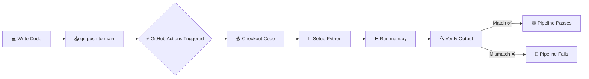
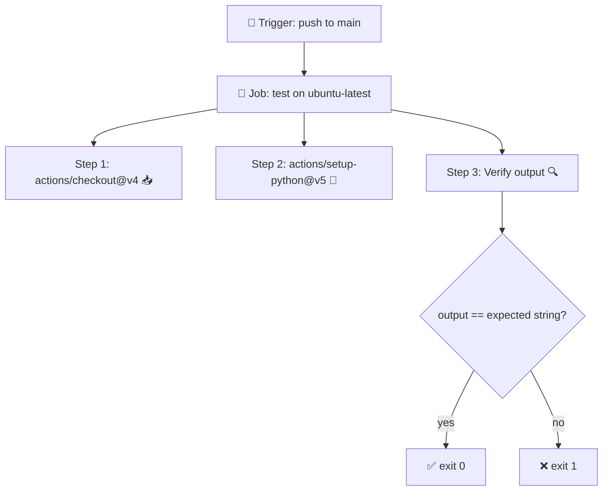

# 🚀 CI/CD Pipeline Basics with GitHub Actions

A minimal, hands-on demo to teach CI/CD fundamentals. Push code → a pipeline automatically runs and verifies your program's output. ✅

---

## 🧭 What You'll Build

A repo with **3 files** and one **GitHub Actions workflow** that triggers on every push to `main`, sets up Python, runs `main.py`, and checks its output.



---

## 📂 Repo Structure

```
devops-demo/
├── 📄 main.py
├── 📄 requirements.txt
└── 📁 .github/
    └── 📁 workflows/
        └── ⚙️ pipeline.yml
```

---

## 🛠️ Step-by-Step

### 1️⃣ Create the repo

```bash
mkdir devops-demo && cd devops-demo
git init
```

### 2️⃣ Add `main.py` 🐍

```python
print("Hello, this is coming from my main.py file")
```

### 3️⃣ Add `requirements.txt` 📦

Leave it empty for now (no dependencies needed). It's here so the pipeline pattern scales later.

```
```

### 4️⃣ Add the workflow ⚙️

Create the file `.github/workflows/pipeline.yml`:

```yaml
name: Check main.py Output

on:
  push:
    branches:
      - main

jobs:
  test:
    runs-on: ubuntu-latest

    steps:
      - uses: actions/checkout@v4

      - uses: actions/setup-python@v5
        with:
          python-version: "3.x"

      - name: Verify output
        run: |
          output=$(python main.py)
          test "$output" = "Hello, this is coming from my main.py file"
```

### 5️⃣ Push to GitHub 📤

```bash
git add .
git commit -m "Initial CI/CD demo"
git branch -M main
git remote add origin https://github.com/<your-username>/devops-demo.git
git push -u origin main
```

### 6️⃣ Watch it run 👀

Open your repo → **Actions** tab → see the workflow execute live. 🎬

---

## 🧩 How the Workflow Works



| Key | Meaning |
|-----|---------|
| 🔔 `on.push.branches` | Runs only when you push to `main` |
| 🏃 `runs-on` | The virtual machine (Ubuntu) that executes the job |
| 📥 `checkout@v4` | Pulls your repo code into the runner |
| 🐍 `setup-python@v5` | Installs Python 3.x |
| 🔍 `test "$output" = "..."` | Fails the build (exit ≠ 0) if output doesn't match |

---

## 🧪 Try It: Make It Fail on Purpose

Change the print string in `main.py`, push, and watch the pipeline go 🔴 — because the output no longer matches the expected value in `pipeline.yml`. This demonstrates how CI **catches unintended changes** automatically.

> 💡 To fix it: update either `main.py` or the expected string in the workflow so they match again.

---

## 🎯 Key Takeaways

- ✅ **CI = automation on every push** — no manual testing needed
- ⚙️ **Workflows live in `.github/workflows/`** as YAML
- 🧱 **Jobs → Steps** structure keeps pipelines readable
- 🔴🟢 **Exit codes decide pass/fail** — any non-zero exit fails the build
- 📈 **Scales easily** — add `pip install -r requirements.txt`, real tests, linting, or deployment later
