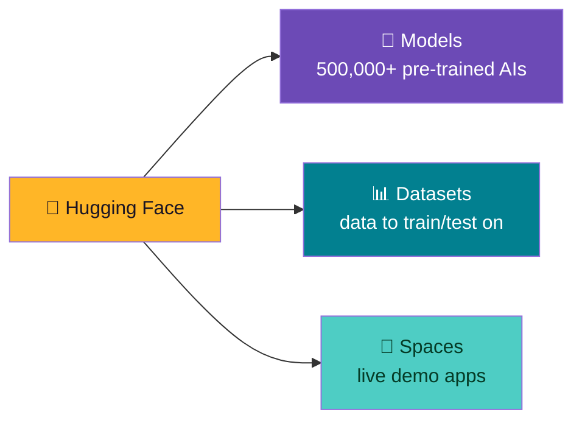
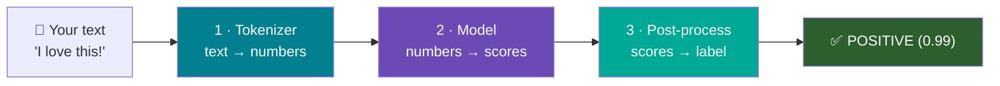
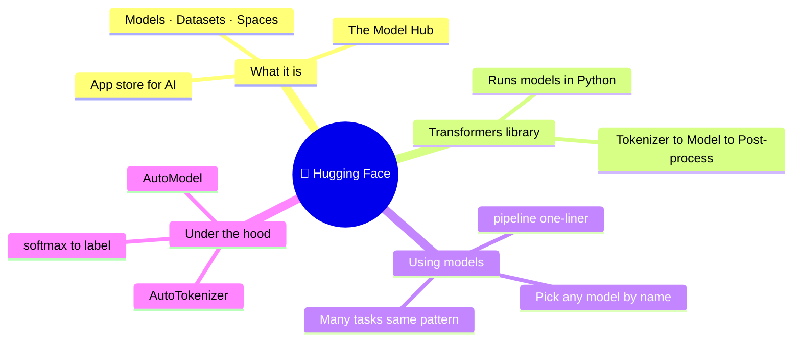

# 🤗 What is Hugging Face? A Beginner's Guide

### *Hugging Face, the Transformers library, and running your first models — all in Google Colab*

> **The one-line pitch:** Hugging Face is like an **app store for AI models** — thousands of ready-made models you can download and use in a few lines of Python. The **Transformers** library is the tool that runs them. This guide takes you from "never heard of it" to running real models yourself.

---

## 🧠 Part 0 — What is Hugging Face? (Zero assumptions)

**Hugging Face** 🤗 is a company and a website (`huggingface.co`) that has become the **home of open-source AI**. Think of it as a giant, free library where the world shares its AI models.

### 🍎 The app-store analogy

Your phone doesn't come with every app pre-installed — you open an app store and download the one you need. Hugging Face is the **app store for AI models**:

- Need to detect if a review is positive or negative? There's a model for that.
- Need to translate English to French? There's a model for that.
- Need to summarise an article, answer questions, generate images, transcribe audio? Models for all of it.

You don't *build* these models (that takes millions of dollars and huge datasets). You **download and use** ones other people already trained — for free.

### 🏗️ The three things Hugging Face gives you



| Part | What it is | Everyday equivalent |
|------|-----------|---------------------|
| 🧠 **Models** | Pre-trained AIs you can download | Apps in an app store |
| 📊 **Datasets** | Collections of data to train or test models | Sample content packs |
| 🚀 **Spaces** | Live, hosted demo apps anyone can try | Web demos |
| 🃏 **Model Hub** | The searchable catalogue of all of the above | The store's search page |

> 🔑 **The Model Hub** (`huggingface.co/models`) is where you browse. Each model has a "model card" — a page describing what it does, how to use it, and its size. You pick a model by its **name**, like `distilbert-base-uncased-finetuned-sst-2-english`.

---

## 🤖 Part 1 — What are "Transformers"?

Two meanings — don't mix them up:

1. **Transformer (the architecture)** — a type of neural network invented by Google in 2017. It's the breakthrough design behind almost all modern AI: ChatGPT, translation, image generation. The "T" in GPT stands for Transformer.
2. **🤗 Transformers (the library)** — Hugging Face's free Python package, literally called `transformers`, that lets you download and run those models in a few lines of code.

> 🧩 **Analogy:** if models are *apps*, the **Transformers library** is the *operating system* that installs and runs them. You'll spend today using the library (`transformers`) to run models from the Hub.

### 🖼️ How a model actually processes text (the 3 steps)

Every Transformers model follows the same three-step flow. You rarely write these by hand (the `pipeline` does it for you), but knowing them demystifies everything:



- **Tokenizer** — models can't read words, only numbers. The tokenizer chops text into pieces ("tokens") and maps each to a number.
- **Model** — does the actual thinking, outputting raw scores called *logits*.
- **Post-processing** — turns those scores into a friendly answer (a label, a translation, etc.).

---

## 🔧 Part 2 — Setup (Google Colab)

Everything here runs in a free **Google Colab** notebook (`colab.research.google.com` → New notebook). Run each cell with **Shift+Enter**.

```python
!pip install -q transformers torch
```

> 💡 `transformers` is the Hugging Face library; `torch` (PyTorch) is the engine it runs on. Colab already has both most of the time, but this guarantees it.
>
> 🔑 **No API key or account needed** to *use* public models — they download straight to your notebook. (You only need a free account to *upload* your own models or use private ones.)

---

## 🚀 Part 3 — The Easiest Way: `pipeline()`

The **`pipeline`** is the magic one-liner. It bundles tokenizer + model + post-processing into a single object. You name a **task**, it picks a good default model, and you're running AI in 2 lines.

### 3.1 — Sentiment analysis (is this text positive or negative?)

```python
from transformers import pipeline

# Name the task; pipeline downloads a sensible default model the first time.
classifier = pipeline("sentiment-analysis")

result = classifier("I absolutely love learning about Hugging Face!")
print(result)
# [{'label': 'POSITIVE', 'score': 0.9998}]
```

> 🎉 **That's it — you just ran a real AI model.** The first run downloads the model (a few seconds); after that it's instant. You can pass a whole list too:

```python
reviews = [
    "This course is fantastic and clear.",
    "I'm so confused and frustrated.",
    "It was okay, nothing special.",
]
for review, out in zip(reviews, classifier(reviews)):
    print(f"{out['label']:8} ({out['score']:.2f})  ←  {review}")
```

### 3.2 — More tasks, same pattern

The beauty of `pipeline` is that *every* task works the same way — change the task name, everything else stays familiar.

```python
# 🌍 Translation (English → French)
translator = pipeline("translation_en_to_fr")
print(translator("Hugging Face makes AI easy.")[0]["translation_text"])
# → "Hugging Face rend l'IA facile."

# 📝 Summarisation
summarizer = pipeline("summarization")
long_text = """Hugging Face is a company that builds tools for machine learning.
Its Transformers library gives developers easy access to thousands of pre-trained
models for text, vision, and audio. It has become the central hub of the open-source
AI community, letting anyone download and run powerful models for free."""
print(summarizer(long_text, max_length=30, min_length=10)[0]["summary_text"])

# ❓ Question answering
qa = pipeline("question-answering")
context = "The Eiffel Tower is located in Paris and was completed in 1889."
print(qa(question="When was the Eiffel Tower completed?", context=context)["answer"])
# → "1889"
```

### 3.3 — Common pipeline tasks (pick and try)

| Task string | What it does | Example use |
|-------------|-------------|-------------|
| `"sentiment-analysis"` | Positive / negative | Review monitoring |
| `"zero-shot-classification"` | Classify into *your own* labels | Tagging tickets |
| `"translation_en_to_fr"` | Translate languages | Localisation |
| `"summarization"` | Shorten long text | TL;DR of articles |
| `"question-answering"` | Answer from a passage | Doc search |
| `"text-generation"` | Continue/write text | Autocomplete, drafts |
| `"ner"` | Find names, places, dates | Extracting entities |
| `"fill-mask"` | Guess a blanked-out word | Language understanding |

### 3.4 — Zero-shot: classify into labels *you* invent

This one feels like magic — you give it categories on the spot, no training needed:

```python
zsc = pipeline("zero-shot-classification")
result = zsc(
    "I can't log into my account and the reset link is broken.",
    candidate_labels=["billing", "technical issue", "sales", "feedback"],
)
print(result["labels"][0], f"({result['scores'][0]:.2f})")
# → "technical issue (0.95)"
```

---

## 🎛️ Part 4 — Choosing a Specific Model

The default model isn't always what you want. Any model from the Hub can be dropped into a pipeline by name — just pass `model=`.

```python
# A model that rates sentiment 1–5 stars, and handles many languages
reviewer = pipeline("sentiment-analysis",
                    model="nlptown/bert-base-multilingual-uncased-sentiment")

print(reviewer("Ce film était absolument magnifique !"))   # French!
# → [{'label': '5 stars', 'score': 0.82}]
```

> 🔎 **How to find models:** go to `huggingface.co/models`, use the left-side filters (task, language, size), and copy the model's name from its page. Smaller models (like `distilbert`, anything with "small"/"tiny") download faster and run on Colab's free CPU.

---

## 🔬 Part 5 — Under the Hood: Tokenizer + Model by Hand

The `pipeline` hides three steps. Let's do them manually **once** — this is where "I use AI" becomes "I understand AI." We use the **AutoClasses**: `AutoTokenizer` and `AutoModelForSequenceClassification` automatically load the right pieces for any model name.

```python
from transformers import AutoTokenizer, AutoModelForSequenceClassification
import torch

model_name = "distilbert-base-uncased-finetuned-sst-2-english"

# Load the two pieces the pipeline normally hides
tokenizer = AutoTokenizer.from_pretrained(model_name)
model = AutoModelForSequenceClassification.from_pretrained(model_name)

text = "Hugging Face makes machine learning accessible to everyone."

# STEP 1 — Tokenize: text → numbers (as PyTorch tensors)
inputs = tokenizer(text, return_tensors="pt")
print("Token IDs:", inputs["input_ids"])
# e.g. tensor([[ 101, 17662, 2227, ... , 102]])  ← numbers the model understands

# STEP 2 — Model: numbers → raw scores (logits)
with torch.no_grad():                 # no training, just prediction → faster
    logits = model(**inputs).logits
print("Raw scores (logits):", logits)

# STEP 3 — Post-process: logits → probabilities → label
probs = torch.softmax(logits, dim=-1)          # turn scores into 0–1 probabilities
predicted_id = probs.argmax().item()           # pick the highest
label = model.config.id2label[predicted_id]    # the model tells us its label names
print(f"\n✅ Prediction: {label}  ({probs.max().item():.2f})")
# → ✅ Prediction: POSITIVE (0.99)
```

> 🧠 **What you just saw** is *exactly* what `pipeline("sentiment-analysis")` does internally. Tokenize → run model → softmax → read the label. No magic, just three tidy steps.

### 🔍 Peek at what the tokenizer actually did

```python
# Turn the numbers back into the pieces the model saw
print(tokenizer.convert_ids_to_tokens(inputs["input_ids"][0]))
# ['[CLS]', 'hugging', 'face', 'makes', 'machine', 'learning', ..., '[SEP]']
# [CLS] and [SEP] are special "start"/"end" markers the model expects.
```

---

## 💾 Part 6 — Saving & Reusing a Model

Downloaded models are cached automatically, but you can also save one to a folder and reload it — handy for offline use or sharing.

```python
# Save the tokenizer + model to a local folder
model.save_pretrained("./my_model")
tokenizer.save_pretrained("./my_model")

# Reload later from that folder (no internet needed)
reloaded_model = AutoModelForSequenceClassification.from_pretrained("./my_model")
reloaded_tok = AutoTokenizer.from_pretrained("./my_model")
print("✅ Reloaded from disk")
```

---

## ⚡ Part 7 — A Note on Speed (CPU vs GPU)

Models run faster on a GPU. In Colab: **Runtime → Change runtime type → T4 GPU** (free). Then tell the pipeline to use it:

```python
import torch
device = 0 if torch.cuda.is_available() else -1   # 0 = GPU, -1 = CPU
print("Using:", "GPU 🚀" if device == 0 else "CPU")

fast = pipeline("sentiment-analysis", device=device)
print(fast("Running on the GPU is much faster for big batches!"))
```

> 💡 For one sentence, CPU is fine. For hundreds of texts, a GPU makes a big difference.

---

## ✅ Wrap-Up — What You Learned



| Concept | One-liner |
|---------|-----------|
| **Hugging Face** | The "app store" and home of open-source AI |
| **Model Hub** | The searchable catalogue of 500,000+ models |
| **Transformers** | The Python library that downloads & runs models |
| **`pipeline()`** | The easiest way — task in, answer out |
| **Tokenizer** | Turns text into numbers the model understands |
| **AutoModel / AutoTokenizer** | Auto-load the right pieces for any model name |
| **logits → softmax** | Raw scores turned into probabilities and a label |

> 🎓 **You can now:** explain what Hugging Face is, run real AI models with `pipeline()` for many tasks, choose specific models from the Hub, and understand the tokenize → model → post-process flow underneath.

---

## 📝 Try It Yourself (Optional)

1. **Swap the task** — run `pipeline("text-generation")` and give it a prompt like `"In the future, AI will"`.
2. **Zero-shot your own labels** — classify a sentence into categories you invent.
3. **Find a model** — browse `huggingface.co/models`, filter by "summarization", and try a different one via `model=`.

---

## 🧰 Quick Reference Card

```python
# ── INSTALL ──
!pip install -q transformers torch

# ── EASIEST: pipeline (task in → answer out) ──
from transformers import pipeline
clf = pipeline("sentiment-analysis")
clf("I love this!")                       # [{'label':'POSITIVE','score':0.99}]

pipeline("summarization")                 # shorten text
pipeline("translation_en_to_fr")          # translate
pipeline("question-answering")            # answer from a passage
pipeline("zero-shot-classification")      # classify into YOUR labels
pipeline("sentiment-analysis", model="MODEL_NAME_FROM_HUB")   # specific model

# ── UNDER THE HOOD: tokenizer + model ──
from transformers import AutoTokenizer, AutoModelForSequenceClassification
import torch
tok = AutoTokenizer.from_pretrained(name)
mdl = AutoModelForSequenceClassification.from_pretrained(name)
inputs = tok("text", return_tensors="pt")
logits = mdl(**inputs).logits
label = mdl.config.id2label[torch.softmax(logits, -1).argmax().item()]

# ── SAVE / LOAD ──
mdl.save_pretrained("./folder"); tok.save_pretrained("./folder")

# ── GPU ──
pipeline("sentiment-analysis", device=0)  # 0 = GPU, -1 = CPU
```

| Where to go | Link |
|-------------|------|
| Browse models | `huggingface.co/models` |
| Browse datasets | `huggingface.co/datasets` |
| Try live demos | `huggingface.co/spaces` |
| Library docs | `huggingface.co/docs/transformers` |

---

*🔗 Next step: once you're comfortable running models, the natural follow-on is **fine-tuning** — taking a pre-trained model and teaching it your own data.*
